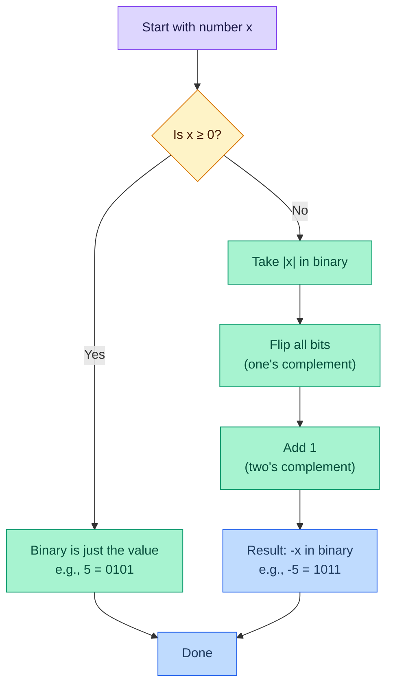
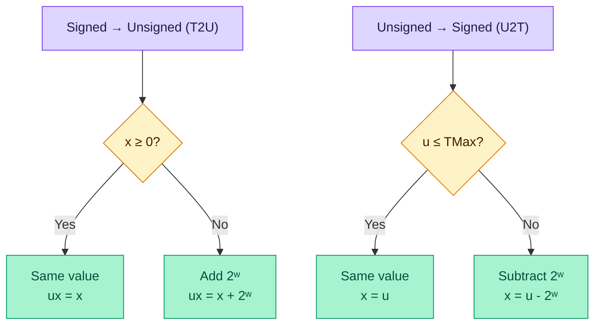
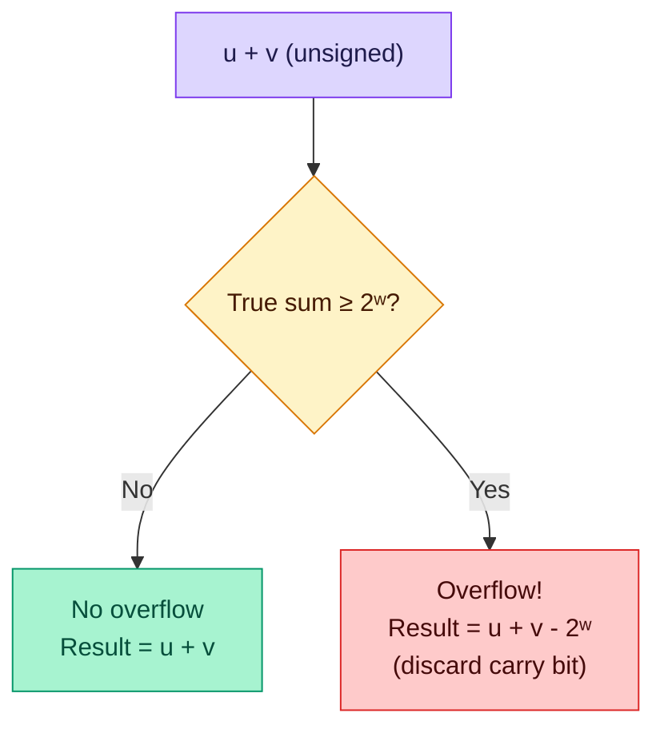

# Bits, Bytes, and Integers — Lecture 2 Notes

> **Course**: CMU 15-213 / 14-513 / 15-513: Introduction to Computer Systems
> **Lecture**: 2nd Lecture, Spring 2026
> **Source**: [YouTube](https://youtu.be/ADonnz9fCCk)
> **Slides**: `02-bits-bytes-ints.pptx` (77 slides)
> **Textbook**: Bryant & O'Hallaron (CSAPP), Chapters 2.1–2.3

---

## Table of Contents

- [1. Why Binary? — Analog vs. Digital](#1-why-binary--analog-vs-digital)
- [2. Binary Representation and Counting](#2-binary-representation-and-counting)
- [3. Hexadecimal and Octal](#3-hexadecimal-and-octal)
- [4. Data Type Sizes in C](#4-data-type-sizes-in-c)
- [5. Boolean Algebra](#5-boolean-algebra)
- [6. Bit-Level Operations in C](#6-bit-level-operations-in-c)
- [7. Logical Operations in C (&&, ||, !)](#7-logical-operations-in-c---)
- [8. Shift Operations](#8-shift-operations)
- [9. Unsigned Integer Representation](#9-unsigned-integer-representation)
- [10. Overflow and Modular Arithmetic](#10-overflow-and-modular-arithmetic)
- [11. Representing Negative Numbers — The Problem](#11-representing-negative-numbers--the-problem)
- [12. Two's Complement — The Trick](#12-twos-complement--the-trick)
- [13. Why Two's Complement Works — The Proof](#13-why-twos-complement-works--the-proof)
- [14. Visualizing Two's Complement](#14-visualizing-twos-complement)
- [15. Encoding Integers — Formal Definitions](#15-encoding-integers--formal-definitions)
- [16. Numeric Ranges — TMin, TMax, UMax](#16-numeric-ranges--tmin-tmax-umax)
- [17. Signed ↔ Unsigned Conversion](#17-signed--unsigned-conversion)
- [18. Casting Surprises in C](#18-casting-surprises-in-c)
- [19. Sign Extension](#19-sign-extension)
- [20. Truncation](#20-truncation)
- [21. Unsigned Addition](#21-unsigned-addition)
- [22. Two's Complement Addition](#22-twos-complement-addition)
- [23. Multiplication](#23-multiplication)
- [24. Multiply and Divide by Powers of 2](#24-multiply-and-divide-by-powers-of-2)
- [25. Division, Rounding, and Bias](#25-division-rounding-and-bias)
- [26. Byte Ordering — Big-Endian vs. Little-Endian](#26-byte-ordering--big-endian-vs-little-endian)
- [Key Takeaways](#key-takeaways)
- [Code Examples Summary](#code-examples-summary)
- [Formulas & Calculations Summary](#formulas--calculations-summary)
- [Glossary](#glossary)
- [References](#references)

---

## 1. Why Binary? — Analog vs. Digital

📊 **Slides 5–6** | ⏱️ **~00:00 – 05:30**

### The Problem with Analog

Before digital computers, there were **analog computers** — circuits that used continuously varying voltages to represent numbers. A network of adjustable resistors could compute sums and averages directly.

The fatal flaw? **Noise destroys accuracy.**

> 💡 **Professor's Analogy**: "It was much easier when we had normal light switches. Right now — are the lights on or off? *On.* Yes. And now? *Off.* OK. But what about 40%? 60%? 80%? We can't tell. It's much easier to distinguish between on and off. That's why we have digital logic."

Every time an analog signal is copied or transmitted:
- The wire acts as an antenna and **picks up noise**
- Some signal **leaks away**
- Each copy gets worse — like photocopying a photocopy

> 💡 **Professor's Analogy**: "Back in the day, music was stored on tape. Every copy got a little worse because you introduced more noise and lost more signal. There was no way to get it back."

### Why Digital Wins

A digital signal only needs to distinguish **two states**: high enough to be "on" (1), or low enough to be "off" (0).

```
Voltage
  ▲
  │   ┌─────────── "ON" zone ──────────┐
  │   │  Any voltage here → reset to 1  │
  │   └────────────────────────────────┘
  │   ┌── Error zone ──┐
  │   └─────────────────┘
  │   ┌─────────── "OFF" zone ─────────┐
  │   │  Any voltage here → reset to 0  │
  │   └────────────────────────────────┘
  ▼
```

As long as the signal stays out of the error zone, we can **perfectly reconstruct** it. This is why digital data can be copied infinitely without degradation.

**Key insight**: We sacrifice precision (only 2 states instead of infinite) to gain **robustness** against noise.

---

## 2. Binary Representation and Counting

📊 **Slides 7–8** | ⏱️ **~05:30 – 07:10**

### How Binary Works

Binary is a **base-2 positional number system**. Each place represents a power of two, just like decimal places represent powers of ten.

| Place Value | Binary (base 2) | Decimal (base 10) |
|-------------|------------------|--------------------|
| Rightmost   | 2⁰ = 1          | 10⁰ = 1           |
| Next        | 2¹ = 2          | 10¹ = 10          |
| Next        | 2² = 4          | 10² = 100         |
| Next        | 2³ = 8          | 10³ = 1000        |

### Counting in Binary (3 bits)

```
Binary  |  Calculation                        | Decimal
--------+------------------------------------+---------
  000   |  0×4 + 0×2 + 0×1                  |    0
  001   |  0×4 + 0×2 + 1×1                  |    1
  010   |  0×4 + 1×2 + 0×1                  |    2
  011   |  0×4 + 1×2 + 1×1                  |    3
  100   |  1×4 + 0×2 + 0×1                  |    4
  101   |  1×4 + 0×2 + 1×1                  |    5
  110   |  1×4 + 1×2 + 0×1                  |    6
  111   |  1×4 + 1×2 + 1×1                  |    7
```

> 💡 **Professor**: "It works just like math did in kindergarten — the ones place, the tens place, the hundreds place. Same idea, just powers of 2 instead of powers of 10."

---

## 3. Hexadecimal and Octal

📊 **Slides 9–10** | ⏱️ **~07:02 – 10:05**

### Why Hexadecimal?

Binary is **too verbose** for humans. The number 255 is `11111111` in binary — eight digits! We need a denser representation that still makes it easy to extract individual bits.

**Any power-of-two base** gives us this property because groups of bits map cleanly to single digits:
- **Octal** (base 8): groups of **3 bits** → 1 digit
- **Hexadecimal** (base 16): groups of **4 bits** → 1 digit

Hex wins because:
1. It's denser than octal (fewer digits)
2. 16 symbols is still comfortable for human brains
3. One hex digit = exactly one **nibble** (4 bits)

> 💡 **Professor**: "You could imagine a numbering system with 32 characters — most of the alphabet plus 0–9. But at a certain point it gets really hard to remember what exactly 'J' represents. 16 is still comfortable for us."

### Hex Digits Reference Table

| Hex | Binary | Decimal | | Hex | Binary | Decimal |
|-----|--------|---------|---|-----|--------|---------|
| 0   | 0000   | 0       | | 8   | 1000   | 8       |
| 1   | 0001   | 1       | | 9   | 1001   | 9       |
| 2   | 0010   | 2       | | A   | 1010   | 10      |
| 3   | 0011   | 3       | | B   | 1011   | 11      |
| 4   | 0100   | 4       | | C   | 1100   | 12      |
| 5   | 0101   | 5       | | D   | 1101   | 13      |
| 6   | 0110   | 6       | | E   | 1110   | 14      |
| 7   | 0111   | 7       | | F   | 1111   | 15      |

### Worked Example: Hex → Decimal

```
Convert 0x1A2B to decimal:

  1    ×  16³  =  1 × 4096  =  4096
  A(10)×  16²  = 10 ×  256  =  2560
  2    ×  16¹  =  2 ×   16  =    32
  B(11)×  16⁰  = 11 ×    1  =    11
                              ------
                               6699
```

### Worked Example: Binary → Hex

```
Convert 1111 1010 0001 1101 0011 0111 1011 to hex:

  1111  1010  0001  1101  0011  0111  1011
    F     A     1     D     3     7     B

  = 0xFA1D37B
```

In C, hex literals are prefixed with `0x` (case-insensitive): `0xFA1D37B` or `0xfa1d37b`.

---

## 4. Data Type Sizes in C

📊 **Slide 4 (implicit)** | ⏱️ **~10:05 – 12:06**

| Data Type      | 32-bit System | 64-bit System |
|----------------|---------------|---------------|
| `char`         | 1 byte (8 bits)  | 1 byte (8 bits) |
| `short`        | 2 bytes (16 bits) | 2 bytes (16 bits) |
| `int`          | 4 bytes (32 bits) | 4 bytes (32 bits) |
| `long`         | 4 bytes (32 bits) | **8 bytes (64 bits)** |
| `long long`    | 8 bytes (64 bits) | 8 bytes (64 bits) |
| `float`        | 4 bytes (32 bits) | 4 bytes (32 bits) |
| `double`       | 8 bytes (64 bits) | 8 bytes (64 bits) |
| `long double`  | 8 or 10/12 bytes | 10 or 16 bytes |
| pointer        | 4 bytes (32 bits) | **8 bytes (64 bits)** |

⚠️ **Key difference**: `long` and pointers change size between 32-bit and 64-bit systems. This is a major source of portability bugs.

> 💡 **Professor**: "What does it mean when we say we have a 64-bit system? It means the register size is 64 bits, the data path is 64 bits — the basic size of data that the system deals with easily is 64 bits."

---

## 5. Boolean Algebra

📊 **Slides 12–14** | ⏱️ **~12:06 – 17:00**

### The Four Operations

Developed by **George Boole** in the 19th century. Encode True as **1**, False as **0**.

| A | B | A & B (AND) | A \| B (OR) | A ^ B (XOR) | ~A (NOT) |
|---|---|-------------|-------------|-------------|----------|
| 0 | 0 |      0      |      0      |      0      |    1     |
| 0 | 1 |      0      |      1      |      1      |    1     |
| 1 | 0 |      0      |      1      |      1      |    0     |
| 1 | 1 |      1      |      1      |      0      |    0     |

> 💡 **Professor's Analogies**:
> - **AND**: "You can eat dinner if you have a fork **and** a knife. You can't cut your food with one or the other."
> - **OR**: "You can leave the class when the class is over **or** the fire alarm rings."
> - **NOT**: "Opposite day! Everything that's true is false, everything false is true."
> - **XOR**: "Your father said you can have an ice cream sandwich **or** a cookie — what he meant is one or the other but not both. As a computer scientist, your father might have said 'exclusive-or'."

### Bitwise Operations on Multi-Bit Values

Operations apply **bit by bit** to corresponding positions:

```
  01101001       01101001       01101001         01010101
& 01010101     | 01010101     ^ 01010101       ~ --------
----------     ----------     ----------         10101010
  01000001       01111101       00111100
```

### Representing Sets with Bit Vectors

A width-*w* bit vector represents subsets of {0, 1, …, w−1}. Bit *j* is 1 if *j* ∈ A.

```
A = 01101001 → { 0, 3, 5, 6 }     (reading right to left)
B = 01010101 → { 0, 2, 4, 6 }

A & B = 01000001 → { 0, 6 }           ← Intersection
A | B = 01111101 → { 0, 2, 3, 4, 5, 6 } ← Union
A ^ B = 00111100 → { 2, 3, 4, 5 }     ← Symmetric Difference
  ~B  = 10101010 → { 1, 3, 5, 7 }     ← Complement
```

> 💡 **Professor's Example (Attendance)**: "Say you're bit 3. I `#define JOSH (1 << 3)`. To mark you present: `attendance |= JOSH`. To check if you were there: `josh_present = attendance & JOSH`. If Josh's bit is set, the result is nonzero (true)."

---

## 6. Bit-Level Operations in C

📊 **Slides 15–17** | ⏱️ **~17:00 – 18:30**

The operators `&`, `|`, `~`, `^` apply to any **integral** data type (`long`, `int`, `short`, `char`, `unsigned`). They operate bit by bit.

### Worked Examples (char data type)

```
~0x41  → ~0100 0001₂ → 1011 1110₂ → 0xBE
~0x00  → ~0000 0000₂ → 1111 1111₂ → 0xFF

0x69 & 0x55:         0x69 | 0x55:
    0110 1001            0110 1001
  & 0101 0101          | 0101 0101
  -----------          -----------
    0100 0001            0111 1101
  = 0x41               = 0x7D
```

---

## 7. Logical Operations in C (&&, ||, !)

📊 **Slide 18** | ⏱️ **~18:30 – 22:00**

⚠️ **Critical distinction**: Logical operators are **NOT** the same as bitwise operators!

| Feature | Bitwise (`&`, `\|`, `~`, `^`) | Logical (`&&`, `\|\|`, `!`) |
|---------|-------------------------------|----------------------------|
| Operates on | Each bit individually | Whole value as true/false |
| Returns | Bit pattern result | Always 0 or 1 |
| Short-circuit? | No | **Yes** |

```c
!0x41  → 0x00    // nonzero → false → 0
!0x00  → 0x01    // zero → true → 1
!!0x41 → 0x01    // double negation normalizes to 1

0x69 && 0x55 → 0x01   // both nonzero → true
0x69 || 0x55 → 0x01   // at least one nonzero → true
```

### Short-Circuit Evaluation — The Null Pointer Guard

```c
p && *p    // Safe! Avoids null pointer dereference
```

**Why this works**: If `p` is NULL (zero → false), C **stops evaluating** — it never touches `*p`. False AND anything is always false, so there's no need to check the second operand.

> 💡 **Professor**: "If `p` is false, is there any way this expression can be true? No — because false AND anything is false. So C stops there, never looking at `*p`. You never get the seg fault."

⚠️ **Super common C pitfall**: Confusing `&&` with `&`, or `||` with `|`. They behave completely differently!

---

## 8. Shift Operations

📊 **Slide 19** | ⏱️ **~23:20 – 30:00**

### Left Shift: `x << y`

Shift bit-vector *x* left by *y* positions. Discard bits that fall off the left; fill with **0s** on the right.

**Effect**: Multiplies by 2^y (when no significant bits are lost).

### Right Shift: `x >> y`

Two varieties:

| Type | Behavior | Fill bits | Used for |
|------|----------|-----------|----------|
| **Logical** | Always fill with 0s | `0` | Unsigned values |
| **Arithmetic** | Replicate MSB (sign bit) | Copy of MSB | Signed values |

### Worked Example

```
Argument:  0110 0010

Left shift by 3:
  011 | 00010 → 0001 0000   (top 3 bits lost, 3 zeros added right)
       ^^^                    ^^^

Logical right shift by 2:
  00 | 011000 | 10 → 0001 1000   (bottom 2 bits lost, 2 zeros added left)

Arithmetic right shift by 2 (MSB = 0):
  Same as logical in this case → 0001 1000

Argument:  1001 0010
Arithmetic right shift by 2 (MSB = 1):
  11 | 100100 | 10 → 1110 0100   (1s inserted because MSB was 1)
```

### Undefined Behavior

- Shift amount **< 0** → undefined (not equivalent to opposite shift!)
- Shift amount **≥ word size** → undefined (may not produce 0!)

> 💡 **Professor on why**: "Part of the philosophy of C was that basic operations should match the hardware. They didn't want a C shift to require multiple processor operations. Since processors don't necessarily handle these edge cases, C doesn't require it either."

---

## 9. Unsigned Integer Representation

📊 **Slides 21–25, 34** | ⏱️ **~30:00 – 33:00**

### The Number Line

With *w* bits, we get 2^w points on the number line. For unsigned integers, we assign them the simplest meaning: 0 through 2^w − 1.

```
3-bit unsigned number line:

  000    001    010    011    100    101    110    111
   0      1      2      3      4      5      6      7
```

### Formal Encoding (B2U — Binary to Unsigned)

For a *w*-bit number with bits x_(w-1), x_(w-2), ..., x_0:

```
B2U(X) = Σ(i=0 to w-1) xᵢ × 2ⁱ
```

**In plain English**: Walk from bit 0 to the highest bit. If bit *i* is 1, add 2^i to a running sum.

### Worked Example

```
B2U(0110 1001) = 0×128 + 1×64 + 1×32 + 0×16 + 1×8 + 0×4 + 0×2 + 1×1
               = 64 + 32 + 8 + 1
               = 105
```

---

## 10. Overflow and Modular Arithmetic

📊 **Slides 23–24** | ⏱️ **~33:00 – 34:30**

### What Happens When We Run Out of Bits?

With 3 bits, the maximum unsigned value is 111₂ = 7. What happens when we add 1?

```
  111      (7)
+ 001      (1)
------
 1000      (8) — but we only have 3 bits!
  ^^^
  000      The leading 1 is lost → result is 0!
```

This is **overflow** — the result wraps around. Arithmetic becomes **modular**:

```
111 + 001 = 1000 → 000    (7 + 1 = 0 mod 8)
111 + 010 = 1001 → 001    (7 + 2 = 1 mod 8)
111 + 011 = 1010 → 010    (7 + 3 = 2 mod 8)
111 + 100 = 1011 → 011    (7 + 4 = 3 mod 8)
111 + 111 = 1110 → 110    (7 + 7 = 6 mod 8)
```

> Arithmetic "wraps around" when it gets too positive. With *w* bits, all arithmetic is performed **mod 2^w**.

---

## 11. Representing Negative Numbers — The Problem

📊 **Slide 26** | ⏱️ **~34:30 – 36:00**

### Naïve Approach: Sign-Magnitude

Use the leading bit as a sign: 0 = positive, 1 = negative.

```
3-bit sign-magnitude:
  000=0   001=1   010=2   011=3   100=-0   101=-1   110=-2   111=-3
```

**Problems**:
1. **Two zeros**: Both `000` (+0) and `100` (−0) represent zero — wasteful!
2. **Addition breaks**: 1 + (−1) should equal 0, but `001 + 101 = 110` = −2. Wrong!

We need a scheme where addition "just works" with simple binary addition.

---

## 12. Two's Complement — The Trick

📊 **Slides 27–29** | ⏱️ **~36:00 – 45:00**

### Starting from Three Ideas

1. `1` should be represented as `001`
2. `-1 + 1 = 0`
3. We want addition to work with simple, familiar rules

### The Discovery

What bit pattern, added to `001`, gives `000`?

```
  001
+ ???
------
  000
```

Answer: `111`! Because `001 + 111 = 1000`, and the leading 1 is lost to overflow → `000`.

So `111` = **−1**. Let's verify:

```
−1 + 1:   111 + 001 = 1000 → 000 ✓  (equals 0)
−2 + 2:   110 + 010 = 1000 → 000 ✓  (equals 0)
−2 + 5:   110 + 101 = 1011 → 011 ✓  (equals 3)
```

**It works!** Negative numbers "fall out" of overflow naturally.

### The Complement-and-Increment Method

To find −x from x:
1. **Flip all the bits** (one's complement)
2. **Add 1** (two's complement)

```
Finding -5 in 4-bit two's complement:

   5 =  0101
  ~5 =  1010     (flip every bit — one's complement)
  +1 =  1011     (add 1 — two's complement)

Verify: 0101 + 1011 = 1 0000 → 0000 ✓  (equals 0)
```

**Formula**: **`-x = ~x + 1`**

---

## 13. Why Two's Complement Works — The Proof

📊 **Slides 30–31** | ⏱️ **~41:00 – 46:00**

### The Core Insight

Take any number and its one's complement — they have **complementary bits** (every position where one has a 1, the other has a 0):

```
  x     = 0101
  ~x    = 1010

  x + ~x = 1111    (always all ones — every bit is covered)
```

Now add 1:

```
  (x + ~x) + 1 = 1111 + 1 = 1 0000 = 0000   (overflow!)
```

Therefore: `x + (~x + 1) = 0`

If `x + y = 0`, then `y = -x`. So:

> **~x + 1 = -x**

### Another Way to See It

```
If x + (~x + 1) = 0
Then x + ~x = -1        (subtract 1 from both sides)
Then x = -1 - ~x
Then -x = 1 + ~x = ~x + 1   ✓
```



---

## 14. Visualizing Two's Complement

📊 **Slide 32** | ⏱️ **~46:00 – 52:00**

### The Number Line Wraps Around

Numbers "wrap around" with −1 at the very end:

```
3-bit two's complement number line:

  000    001    010    011    100    101    110    111
   0      1      2      3     -4     -3     -2     -1
  ◄── non-negative ──►  ◄──── negative ────►

      ... → 2 → 3 → -4 → -3 → -2 → -1 → 0 → 1 → ...
                ↑ overflow!
```

### Key Observations

1. **All negative numbers start with a 1** — the MSB is the sign bit
2. **The MSB introduces a negative weight**: for `100`, the leading 1 contributes **−4** (not +4)
   - `101` = 1×(−4) + 0×2 + 1×1 = **−3**
   - `010` = 0×(−4) + 1×2 + 0×1 = **+2**
3. **−4 has no positive partner** — the range is asymmetric!

> 💡 **Professor**: "A lot of people memorize this stuff. There's no reason to memorize it — if you think about it, it makes sense. If I know I'm using the MSB as the sign bit, everything else follows. Don't memorize it. **Understand why.**"

### Why TMin Has No Positive Partner

Zero comes from the non-negative side (starts with 0), so the non-negative range is **0 to TMax**, while the negative range is **−1 to TMin**. Since zero "uses up" one non-negative slot, |TMin| = TMax + 1.

> 💡 **Professor**: "Zero comes out of the positive side of the number line. It's 0 through something. The negative side goes from −1 to something. Same number of bits, so the greatest negative number is one larger in absolute value."

---

## 15. Encoding Integers — Formal Definitions

📊 **Slide 34** | ⏱️ **~52:00 – 54:00**

### Unsigned (B2U)

```
B2U(X) = Σ(i=0 to w-1) xᵢ × 2ⁱ
```

Every bit contributes its **positive** power-of-two weight.

### Two's Complement (B2T)

```
B2T(X) = -x_(w-1) × 2^(w-1) + Σ(i=0 to w-2) xᵢ × 2ⁱ
```

Identical to unsigned, **except** the MSB contributes a **negative** weight.

### Worked Example (16-bit short)

```
x = 15213 → binary: 0011 1011 0110 1101
  Sign bit = 0 → non-negative
  B2T = 0×(-32768) + ... = 15213 ✓

y = -15213 → two's complement:
  15213  = 0011 1011 0110 1101
  ~15213 = 1100 0100 1001 0010
  +1     = 1100 0100 1001 0011
  
  Verify: B2T = 1×(-32768) + 1×16384 + ... = -15213 ✓
```

---

## 16. Numeric Ranges — TMin, TMax, UMax

📊 **Slide 35** | ⏱️ **~54:00 – 59:00**

### Formulas

| Value | Formula | Bit Pattern | Meaning |
|-------|---------|-------------|---------|
| **UMin** | 0 | `000...0` | Smallest unsigned |
| **UMax** | 2^w − 1 | `111...1` | Largest unsigned |
| **TMin** | −2^(w−1) | `100...0` | Most negative signed |
| **TMax** | 2^(w−1) − 1 | `011...1` | Most positive signed |
| **−1** | N/A | `111...1` | All ones (signed) |

### Concrete Values by Bit Width

| Width | UMax | TMax | TMin |
|-------|------|------|------|
| 4     | 15   | 7    | −8   |
| 8     | 255  | 127  | −128 |
| 16    | 65,535 | 32,767 | −32,768 |
| 32    | 4,294,967,295 | 2,147,483,647 | −2,147,483,648 |
| 64    | 18,446,744,073,709,551,615 | 9,223,372,036,854,775,807 | −9,223,372,036,854,775,808 |

### Key Relationships

- |TMin| = TMax + 1 (asymmetric range!)
- UMax = 2 × TMax + 1
- −1 and UMax have the **same bit pattern** (all ones)

> 📝 **Exam tip from professor**: "Don't do this math by hand. Use the `#define`s! Use `ULONG_MAX`, `INT_MIN`, etc. That way when you compile on the next generation 128-bit processors 10 years from now, it still works."

---

## 17. Signed ↔ Unsigned Conversion

📊 **Slides 38–42** | ⏱️ **~59:00 – 1:02:00**

### The Rule: Bit Pattern is Preserved

When you cast between signed and unsigned, the **bits do not change** — only the **interpretation** changes.

```c
unsigned int u = 0xFFFFFFFF;
int i = (int) u;
printf("%d\n", i);   // prints -1
```

The bit pattern `0xFFFFFFFF` = all ones. As unsigned: 4,294,967,295. As signed: −1.

### 4-Bit Mapping Table

| Bits  | Signed (B2T) | Unsigned (B2U) |
|-------|-------------|----------------|
| 0000  |   0         |   0            |
| 0001  |   1         |   1            |
| 0010  |   2         |   2            |
| 0011  |   3         |   3            |
| 0100  |   4         |   4            |
| 0101  |   5         |   5            |
| 0110  |   6         |   6            |
| 0111  |   7         |   7            |
| 1000  |  **−8**     |   8            |
| 1001  |  **−7**     |   9            |
| 1010  |  **−6**     |  10            |
| 1011  |  **−5**     |  11            |
| 1100  |  **−4**     |  12            |
| 1101  |  **−3**     |  13            |
| 1110  |  **−2**     |  14            |
| 1111  |  **−1**     |  15            |

### Conversion Visualized

```
         Two's Complement              Unsigned
              Range                     Range

           TMax (7)  ◄──────────►  TMax (7)
              ...                    ...
              0      ◄──────────►    0
                                  
             -1      ─ ─ ─ ─ ─ ►  UMax (15)
             -2      ─ ─ ─ ─ ─ ►  UMax-1 (14)
              ...                    ...
          TMin (-8)  ─ ─ ─ ─ ─ ►  TMax+1 (8)
```

**Non-negative values** map identically. **Negative values** map to large positive values (add 2^w).



---

## 18. Casting Surprises in C

📊 **Slides 43–45** | ⏱️ **~1:02:00 – 1:04:30**

### The Implicit Casting Rule

⚠️ **If an expression mixes signed and unsigned, the signed value is implicitly cast to unsigned!**

```c
// Constants are signed by default
// Append U for unsigned: 0U, 4294967259U
int tx, ty;
unsigned ux, uy;
tx = (int) ux;       // explicit cast
uy = (unsigned) ty;   // explicit cast
tx = ux;              // implicit cast!
uy = ty;              // implicit cast!
```

### Casting Puzzles (W = 32)

| Expression | Type Evaluated | Result | Why |
|-----------|---------------|--------|-----|
| `0 == 0U` | unsigned | **true** | Both are 0 |
| `-1 < 0` | signed | **true** | Normal comparison |
| `-1 < 0U` | unsigned | **false** ⚠️ | −1 cast to unsigned → `0xFFFFFFFF` = 4 billion > 0 |
| `2147483647 > -2147483648` | signed | **true** | TMax > TMin |
| `2147483647U > -2147483648` | unsigned | **false** ⚠️ | TMin cast to unsigned = 2147483648 > 2147483647 |
| `-1 > -2` | signed | **true** | Normal |
| `(unsigned)-1 > -2` | unsigned | **true** | Both big unsigned; -1 → UMax, -2 → UMax-1 |

> 💡 **Professor**: "The first thing you do with mixed mode: convert signed values to unsigned values, then do the interpretation. The bit pattern is maintained but reinterpreted."

---

## 19. Sign Extension

📊 **Slides 47–51** | ⏱️ **~1:05:00 – 1:09:00**

### The Problem

When casting a narrow type to a wider type (e.g., `int8_t` → `int16_t`), we need to fill the new high-order bits. The value must be preserved.

### The Rule

- **Unsigned**: fill with **0s** (zero extension)
- **Signed**: replicate the **sign bit** (sign extension)

### Why Sign Extension Works

```
Unsigned: 0x01 → 0x0001  (add zeros — value stays 1) ✓

Signed positive: 0x0A (10) → 0x000A (10)  
  0000 1010 → 0000 0000 0000 1010    ✓

Signed negative: 0xFF (-1) → 0xFFFF (-1)
  1111 1111 → 1111 1111 1111 1111    ✓
```

### Worked Example: 5-bit → 6-bit Sign Extension

**Positive number** (10):

| -16 | 8 | 4 | 2 | 1 |
|-----|---|---|---|---|
|  0  | 1 | 0 | 1 | 0 |

→ Extend with 0:

| -32 | 16 | 8 | 4 | 2 | 1 |
|-----|----|----|---|---|---|
|  0  |  0 | 1  | 0 | 1 | 0 |

Value: −32×0 + 16×0 + 8×1 + 4×0 + 2×1 + 1×0 = 10 ✓

**Negative number** (−10):

| -16 | 8 | 4 | 2 | 1 |
|-----|---|---|---|---|
|  1  | 0 | 1 | 1 | 0 |

→ Extend sign bit (1):

| -32 | 16 | 8 | 4 | 2 | 1 |
|-----|----|----|---|---|---|
|  1  |  1 | 0  | 1 | 1 | 0 |

Value: −32 + 16 + 0 + 4 + 2 + 0 = −10 ✓

> 💡 **Professor**: "Does it matter if I have two ones or three ones or ten ones? What's the value? Negative one. Always. If I have all ones except the last bit being zero — that's always −2. It doesn't matter how many ones because I'm adding back to the most negative number."

> 💡 **Connection to right shift**: Sign extension is exactly what **arithmetic right shift** does — it preserves the sign bit. This is why arithmetic right shift exists!

---

## 20. Truncation

📊 **Slides 52–56** | ⏱️ **~1:09:00 – 1:11:30**

### The Rule

When narrowing (e.g., `int16_t` → `int8_t`), simply **drop the top bits**. The result is the original value **mod 2^w** (for unsigned) or the signed reinterpretation of that mod.

### Worked Examples (5-bit → 4-bit truncation)

```
10 (5-bit) = 0 1010 → truncate → 1010 (4-bit) = -6 (signed)
  Check: 10 mod 16 = 10 as unsigned → reinterpret as signed → -6  ✓

-10 (5-bit) = 1 0110 → truncate → 0110 (4-bit) = 6 (signed)
  Check: -10 → 22 unsigned mod 16 = 6 → reinterpret → 6  ✓

2 (5-bit) = 0 0010 → truncate → 0010 (4-bit) = 2  ✓  (no change)

-6 (5-bit) = 1 1010 → truncate → 1010 (4-bit) = -6  ✓ (no change)
```

⚠️ Truncation preserves the value **only** if the number fits in the smaller type. Otherwise the value changes — potentially even changing sign!

### Summary: Expanding and Truncating

| Operation | Unsigned | Signed |
|-----------|----------|--------|
| **Expand** | Zero extend | Sign extend |
| **Truncate** | Keep low bits (mod 2^w) | Keep low bits (reinterpret) |

---

## 21. Unsigned Addition

📊 **Slides 58, 61** | ⏱️ **~1:11:30 – 1:11:45** (covered more in next lecture)

### The Rule

Unsigned addition simply discards the carry-out. The result is:

```
UAdd_w(u, v) = (u + v) mod 2^w
```

### Worked Example (8-bit unsigned char)

```
   0xE9    =  233  =  1110 1001
 + 0xD5    =  213  =  1101 0101
 --------             ----------
 0x1BE     =  446  = 1 1011 1110   (true sum — 9 bits)
                       ↓ discard carry
   0xBE    =  190  =   1011 1110   (8-bit result)
   
Check: (233 + 213) mod 256 = 446 mod 256 = 190  ✓
```

### Overflow Detection

Unsigned overflow occurs when `UAdd_w(u, v) < u` (or `< v`). The result "wrapped around" to a smaller number.



---

## 22. Two's Complement Addition

📊 **Slides 59, 62** | ⏱️ **~1:11:45 – 1:11:50**

### The Beautiful Truth

**TAdd and UAdd have identical bit-level behavior.** The hardware doesn't know or care whether the bits are signed or unsigned — it just adds.

```c
int s, t, u, v;
s = (int)((unsigned)u + (unsigned)v);
t = u + v;
// s == t  ALWAYS
```

### Same Example, Signed Interpretation

```
   0xE9    = -23 (signed)  =  1110 1001
 + 0xD5    = -43 (signed)  =  1101 0101
 --------                     ----------
   0xBE    = -66 (signed)  =  1011 1110

Check: -23 + (-43) = -66  ✓  (no overflow — result fits in range)
```

### Two Types of Overflow

| Condition | What happens | Example (4-bit) |
|-----------|-------------|-----------------|
| **Positive overflow** | Two positive numbers → negative result | 5 + 4 = 9 → −7 |
| **Negative overflow** | Two negative numbers → positive result | −5 + (−4) = −9 → +7 |

⚠️ Adding a positive and negative number **can never overflow** — the result is always between the two operands.

---

## 23. Multiplication

📊 **Slide 63** | ⏱️ **(covered in next lecture)**

### The Problem

Multiplying two *w*-bit numbers can produce a result up to **2w bits** wide.

- **Unsigned worst case**: (2^w − 1) × (2^w − 1) = 2^(2w) − 2^(w+1) + 1 (needs 2w bits)
- **Signed worst case**: TMin × TMin (but TMax² < TMin² so TMin is the limit)

### The Solution: Truncate

C keeps only the **lower w bits** of the product. This is equivalent to:

```
u *_w v = (u × v) mod 2^w
```

The same truncation rule works for **both** signed and unsigned multiplication (same bit-level result).

---

## 24. Multiply and Divide by Powers of 2

📊 **Slides 64–65** | ⏱️ **(covered in next lecture)**

### Multiplication by Shifting Left

`u << k` = u × 2^k

The compiler replaces multiplication by constants with shifts and adds:

```c
u << 3             // u * 8
(u << 5) - (u << 3)  // u * 32 - u * 8 = u * 24
```

> 💡 Most machines shift and add **faster** than multiply. The compiler generates this code automatically.

### Division by Shifting Right

`u >> k` = ⌊u / 2^k⌋ (for unsigned, using logical shift)

```
4 / 2:   0100 >> 1 = 0010 = 2  ✓
4 / 4:   0100 >> 2 = 0001 = 1  ✓
```

---

## 25. Division, Rounding, and Bias

📊 **Slides 66–72** | ⏱️ **(covered in next lecture)**

### The Problem with Negative Division

Right shift always rounds **toward negative infinity** (floor), not toward zero:

```
 5 / 2:   0101 >> 1 = 0010 = 2     (wanted 2.5 → 2, correct!)
-5 / 2:   1011 >> 1 = 1101 = -3    (wanted -2.5 → -2, got -3!)
```

C specifies that integer division rounds **toward zero**. So we need to fix this for negative numbers.

### The Fix: Add a Bias Before Shifting

For negative numbers dividing by 2^k, add a bias of **(2^k − 1)** before shifting:

```
Formula: (x + (1 << k) - 1) >> k    (rounds toward zero)

Example: -5 / 2  (k=1, bias = 2¹ - 1 = 1)
  -5 + 1 = -4:   1011 + 0001 = 1100
  1100 >> 1 = 1110 = -2  ✓

Example: -5 / 4  (k=2, bias = 2² - 1 = 3)
  -5 + 3 = -2:   1011 + 0011 = 1110
  1110 >> 2 = 1111 = -1  ✓  (rounds -1.25 toward 0)
```

### Why the Bias Works

- **Case 1 — No rounding needed** (x is divisible by 2^k): The low *k* bits are all zeros. Adding 2^k − 1 only affects the low bits; it doesn't change the upper bits. The shift discards these, so the result is the same.

- **Case 2 — Rounding needed**: The low *k* bits are nonzero. Adding 2^k − 1 causes a carry into the upper bits, incrementing the quotient by 1 — exactly what's needed to round toward zero.

---

## 26. Byte Ordering — Big-Endian vs. Little-Endian

📊 **Slides 74–76** | ⏱️ **(covered in next lecture)**

### The Question

A 4-byte integer `0x01234567` occupies addresses 0x100–0x103. But which byte goes where?

### Two Conventions

| Convention | Description | Used by |
|-----------|-------------|---------|
| **Big-Endian** | MSB at lowest address | Sun SPARC, PPC Mac, **Internet protocols** |
| **Little-Endian** | LSB at lowest address | **x86**, ARM (Android, iOS, Linux) |

```
Variable x = 0x01234567 at address 0x100

Big-Endian (most significant byte first):
  Addr:   0x100  0x101  0x102  0x103
  Data:    01     23     45     67

Little-Endian (least significant byte first):
  Addr:   0x100  0x101  0x102  0x103
  Data:    67     45     23     01
```

### When It Matters

- **Network communication** — Internet uses big-endian ("network byte order"). x86 machines must convert.
- **Reading binary files** — A file written on a big-endian machine will look byte-reversed on little-endian.
- **Reading disassembly** — multi-byte values appear reversed.

### When It Does NOT Matter

- **Single-byte data** (`char`, strings) — only one byte, no ordering issue.
- **Bits within a byte** — bits are NOT reversed; the low-order bit is always the reference.

### Reading Byte-Reversed Disassembly

```
Address    Instruction Code          Assembly
8048366:   81 c3 ab 12 00 00        add  $0x12ab, %ebx

Deciphering the immediate value:
  Byte sequence: ab 12 00 00     (as stored in memory, little-endian)
  Reverse bytes: 00 00 12 ab
  Value:         0x000012ab  =  0x12ab
```

---

## Key Takeaways

1. **Binary exists because of noise** — distinguishing ON from OFF is far more robust than measuring exact voltages.

2. **Hexadecimal is programmer-friendly binary** — each hex digit maps to exactly 4 bits.

3. **Two's complement is elegant** — negation is just "complement and add 1", and addition works identically for signed and unsigned at the bit level.

4. **Don't memorize, understand** — TMin = `1000...0`, TMax = `0111...1`, −1 = `1111...1` all follow from the sign bit having a negative weight.

5. **Implicit casting kills** — mixing signed and unsigned in C silently casts signed → unsigned, causing `-1 > 0U` to be **true**.

6. **Sign extension preserves value** — padding with the sign bit keeps the number's value when widening.

7. **Shifting is fast multiply/divide** — compilers use this heavily. But right-shifting negative numbers rounds toward −∞, not zero.

8. **Byte ordering matters for communication** — x86 is little-endian; the Internet is big-endian. Always convert.

---

## Code Examples Summary

### Bitwise Set Operations

```c
#define JOSH (1 << 3)       // Josh is bit 3
attendance |= JOSH;         // Mark Josh present (set bit)
int here = attendance & JOSH;  // Check if Josh was present (test bit)
```

### Null Pointer Guard (Short-Circuit Evaluation)

```c
p && *p    // Safe: if p is NULL, *p is never evaluated
```

### Signed vs. Unsigned Addition (Identical Bits)

```c
int s, t, u, v;
s = (int)((unsigned)u + (unsigned)v);
t = u + v;
// s == t   (always — same bit-level operation)
```

### Explicit and Implicit Casting

```c
int tx;
unsigned ux;
tx = (int) ux;      // Explicit: bits reinterpreted
ux = (unsigned) tx;  // Explicit
tx = ux;             // Implicit cast — same effect!
```

### Shift-Based Multiply and Divide

```c
u << 3                     // u * 8
(u << 5) - (u << 3)       // u * 24
u >> k                     // u / 2^k (unsigned, rounds down)
(x + (1 << k) - 1) >> k   // x / 2^k (signed negative, rounds toward 0)
```

### Sign Extension Example

```c
int8_t su = -1;       // 0xFF
int16_t bu = su;       // 0xFFFF — sign extended, still -1
```

---

## Formulas & Calculations Summary

### Binary to Unsigned (B2U)

```
B2U_w(X) = Σ(i=0 to w-1) xᵢ × 2ⁱ
```

### Binary to Two's Complement (B2T)

```
B2T_w(X) = -x_(w-1) × 2^(w-1) + Σ(i=0 to w-2) xᵢ × 2ⁱ
```

### Two's Complement Negation

```
-x = ~x + 1
```

### Signed ↔ Unsigned Conversion

```
T2U:  if x ≥ 0 → ux = x;       if x < 0 → ux = x + 2^w
U2T:  if u ≤ TMax → x = u;     if u > TMax → x = u - 2^w
```

### Numeric Ranges

```
UMax =  2^w - 1          TMax =  2^(w-1) - 1          TMin = -2^(w-1)
```

### Unsigned Addition with Overflow

```
UAdd_w(u, v) = (u + v) mod 2^w
Overflow when: u + v ≥ 2^w  (result < u)
```

### Two's Complement Addition Overflow

```
TAdd_w(u, v) = (u + v) mod 2^w, interpreted as signed
Positive overflow: u > 0, v > 0, result < 0
Negative overflow: u < 0, v < 0, result ≥ 0
```

### Shift-Based Arithmetic

```
u << k  =  u × 2^k
u >> k  =  ⌊u / 2^k⌋           (unsigned — logical shift)
x >> k  =  ⌊x / 2^k⌋           (signed — arithmetic shift, rounds toward -∞)
(x + (1<<k) - 1) >> k = ⌈x / 2^k⌉  (biased — rounds toward 0 for negative)
```

---

## Glossary

| Term | Definition |
|------|-----------|
| **Analog computer** | A computer that uses continuously varying physical quantities (voltage, current) to represent data |
| **Digital** | A system that represents data using discrete states (typically 0 and 1) |
| **Binary** | Base-2 number system using only digits 0 and 1 |
| **Bit** | A single binary digit — the smallest unit of information (0 or 1) |
| **Byte** | 8 bits — the standard unit of memory addressing |
| **Nibble** | 4 bits — one hexadecimal digit |
| **Word** | The natural data unit of a processor (32 or 64 bits on modern systems) |
| **Hexadecimal (hex)** | Base-16 number system using digits 0–9 and A–F; prefix `0x` in C |
| **Octal** | Base-8 number system using digits 0–7; prefix `0` in C |
| **MSB** | Most Significant Bit — the leftmost bit, highest positional value |
| **LSB** | Least Significant Bit — the rightmost bit, lowest positional value |
| **Boolean algebra** | Algebraic system for logic with AND, OR, NOT, XOR operations |
| **AND (`&`)** | Bitwise: result is 1 only where both inputs are 1 |
| **OR (`\|`)** | Bitwise: result is 1 where either input is 1 |
| **XOR (`^`)** | Bitwise: result is 1 where inputs differ |
| **NOT (`~`)** | Bitwise: flips every bit (0→1, 1→0) |
| **Logical AND (`&&`)** | Evaluates entire values as true/false; short-circuits |
| **Logical OR (`\|\|`)** | Evaluates entire values as true/false; short-circuits |
| **Short-circuit evaluation** | Stops evaluating a logical expression as soon as the result is determined |
| **Left shift (`<<`)** | Shifts bits left, fills right with 0s; multiplies by 2^k |
| **Logical right shift** | Shifts bits right, fills left with 0s; used for unsigned |
| **Arithmetic right shift** | Shifts bits right, fills left with copies of sign bit; used for signed |
| **Unsigned integer** | An integer type that represents only non-negative values (0 to 2^w − 1) |
| **Signed integer** | An integer type that represents both negative and positive values using two's complement |
| **Two's complement** | Encoding scheme for signed integers where negation = complement + 1 |
| **One's complement** | The bitwise NOT of a number; all bits flipped |
| **Sign bit** | The MSB in a two's complement number (0 = non-negative, 1 = negative) |
| **Overflow** | When an arithmetic result exceeds the representable range and wraps around |
| **Modular arithmetic** | Arithmetic where results wrap around upon reaching a maximum (mod 2^w for w-bit values) |
| **TMin** | The minimum value in two's complement: −2^(w−1) = `100...0` |
| **TMax** | The maximum value in two's complement: 2^(w−1) − 1 = `011...1` |
| **UMax** | The maximum unsigned value: 2^w − 1 = `111...1` |
| **Sign extension** | Widening a signed integer by replicating the sign bit into new high-order positions |
| **Zero extension** | Widening an unsigned integer by padding with zeros |
| **Truncation** | Narrowing an integer by discarding high-order bits; equivalent to mod 2^w |
| **Implicit casting** | Automatic type conversion by the compiler (e.g., signed → unsigned in mixed expressions) |
| **Big-endian** | Byte ordering where the MSB is stored at the lowest memory address |
| **Little-endian** | Byte ordering where the LSB is stored at the lowest memory address |
| **Undefined behavior** | Behavior not specified by the C standard; result is unpredictable (e.g., shifting by ≥ word size) |

---

## References

- 🔗 **Textbook**: Bryant & O'Hallaron, *Computer Systems: A Programmer's Perspective* (CSAPP)
  - Section 2.1: Information Storage (bits, hex, byte ordering)
  - Section 2.2: Integer Representations (unsigned, two's complement, conversions)
  - Section 2.3: Integer Arithmetic (addition, negation, multiplication, shifting)
- 🔗 **YouTube**: [Lecture 2 — Bits, Bytes, and Integers](https://youtu.be/ADonnz9fCCk)
- 🔗 **Practice exercises**: [Bit Twiddling Learning Exercises](https://wiredream.com/learning-to-bit-twiddle/)
- 🔗 **Voltage Summer Calculator**: [daycounter.com](https://www.daycounter.com/Calculators/Voltage-Summer/Voltage-Summer-Calculator.phtml) (analog computing demo from slide 5)

---

*Notes generated from lecture transcript and 77 slides. Cross-reference with `02-bits-bytes-ints.pptx` for diagrams and visual aids.*
