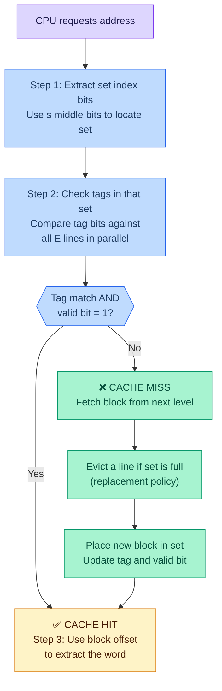
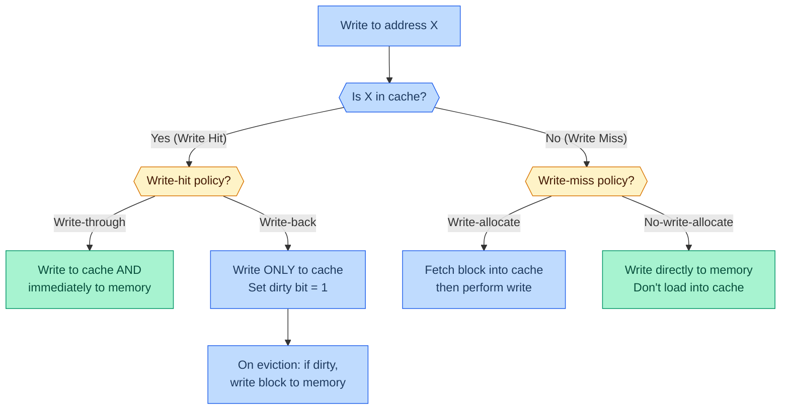
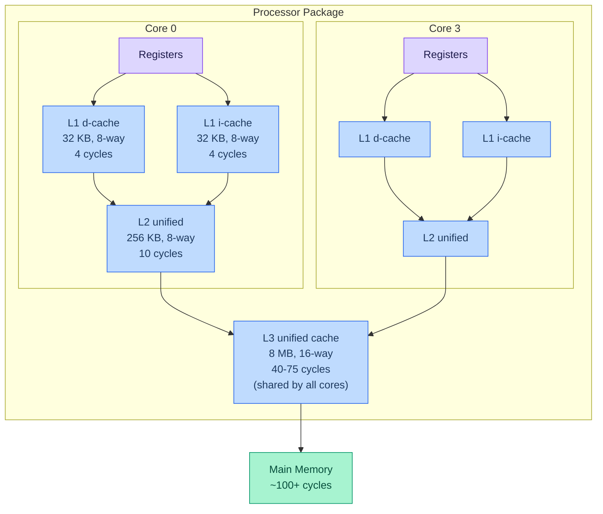

# Cache Memories — Lecture 10 Notes

> **Course**: CMU 15-213 / 14-513 / 15-513: Introduction to Computer Systems
> **Lecture**: 10 — Cache Memories (February 12, 2026)
> **Source**: [YouTube](https://youtu.be/EGv1SEGV87c)
> **Slides**: `10-cache-memories.pptx` (72 slides)
> **Reading**: Bryant & O'Hallaron (CS:APP) §6.4–6.6

---

## Table of Contents

- [1. Review — Locality & Cache Concepts](#1-review--locality--cache-concepts)
- [2. General Cache Organization (S, E, B)](#2-general-cache-organization-s-e-b)
- [3. Cache Read — The 3-Step Process](#3-cache-read--the-3-step-process)
- [4. Direct-Mapped Cache (E = 1)](#4-direct-mapped-cache-e--1)
- [5. Direct-Mapped Cache Simulation](#5-direct-mapped-cache-simulation)
- [6. E-Way Set Associative Cache](#6-e-way-set-associative-cache)
- [7. Set Associative Cache Simulation](#7-set-associative-cache-simulation)
- [8. What About Writes?](#8-what-about-writes)
- [9. Intel Core i7 Cache Hierarchy](#9-intel-core-i7-cache-hierarchy)
- [10. Cache Performance Metrics](#10-cache-performance-metrics)
- [11. Writing Cache-Friendly Code](#11-writing-cache-friendly-code)
- [12. The Memory Mountain](#12-the-memory-mountain)
- [13. Matrix Multiplication & Loop Orderings](#13-matrix-multiplication--loop-orderings)
- [14. Blocking (Tiling)](#14-blocking-tiling)
- [15. Cache Summary](#15-cache-summary)
- [Key Takeaways](#key-takeaways)
- [Code Examples Summary](#code-examples-summary)
- [Formulas & Calculations Summary](#formulas--calculations-summary)
- [Glossary](#glossary)
- [References](#references)

---

## 1. Review — Locality & Cache Concepts

📊 **Slides 4–8** | ⏱️ **~00:09 – 07:08**

### Why Caches Exist

The fundamental problem: processors are *fast*, memory is *slow*. The gap is enormous — a CPU can execute instructions in < 1 ns, but fetching from DRAM takes ~50–100 ns. Caches exist to **trick the system into thinking you have a really large, fast memory** by keeping a small, fast copy of the data you're using right now.

> 💡 **Professor's Analogy**: "The idea is to trick the system into thinking that you have a really really large fast memory."

### The Memory Hierarchy

At the top: small, fast, expensive (registers, L1 cache). At the bottom: large, slow, cheap (disk, network). Every level caches data from the level below it:

| Level | Storage | Typical Size | Access Time |
|-------|---------|-------------|-------------|
| L0 | Registers | ~hundreds of bytes | 0 cycles |
| L1 | SRAM cache | 32 KB | ~4 cycles |
| L2 | SRAM cache | 256 KB | ~10 cycles |
| L3 | SRAM cache | 8 MB | 40–75 cycles |
| Main Memory | DRAM | 8–64 GB | ~100+ cycles |
| Disk / SSD | Flash / Magnetic | TBs | millions of cycles |

### Principle of Locality

Programs don't access memory randomly. They exhibit two kinds of patterns:

- **Temporal locality**: If you accessed address A recently, you'll probably access A again soon. Think of your stack frame — you save `%rbp` at the start of a function and restore it at the end.
- **Spatial locality**: If you accessed address A, you'll probably access A+1, A+2, etc. Think of iterating through an array element by element.

These two phenomena are **why caches work**. The small, fast subset can serve most requests because programs keep reusing the same data (temporal) and accessing nearby data (spatial).

### Cache Hit vs. Cache Miss

📊 **Slides 5–7**

- **Cache Hit**: The requested block is in the cache → return it immediately. Fast.
- **Cache Miss**: The requested block is NOT in the cache → fetch from the next level down, copy it into the cache, then return it. Slow.

### Three Types of Cache Misses

📊 **Slide 8** | ⏱️ **~05:14 – 07:08**

| Miss Type | What Causes It | Can You Fix It? |
|-----------|---------------|-----------------|
| **Cold (compulsory)** miss | First-ever access to a block. Cache is "cold." | No — unavoidable. Happens during cache warm-up. |
| **Conflict** miss | Two addresses map to the same cache set and keep evicting each other, even though the cache has empty space elsewhere. | Partially — increase associativity, or restructure data. |
| **Capacity** miss | Working set is simply too large for the cache. | Yes — reduce working set size (e.g., blocking/tiling). |

> 💡 **Key Insight**: Cold misses happen once per block. Conflict misses are the sneaky ones — your cache might be half empty but still missing because of the placement policy. Capacity misses mean you need to rethink your algorithm.

---

## 2. General Cache Organization (S, E, B)

📊 **Slide 9** | ⏱️ **~10:56 – 12:50**

### Why This Structure?

A cache needs to answer one question *extremely fast* (in ~1–4 cycles): **"Is address X stored here?"** The (S, E, B) organization makes this lookup efficient by using part of the address as a direct index.

### The Three Parameters

```
┌────────────────────────────────────────────────────────┐
│                      CACHE                             │
│                                                        │
│  Set 0:  [v|tag|B₀ B₁ B₂ ... B_{B-1}] ← Line 0      │
│          [v|tag|B₀ B₁ B₂ ... B_{B-1}] ← Line 1      │
│          ...                            (E lines)      │
│                                                        │
│  Set 1:  [v|tag|B₀ B₁ B₂ ... B_{B-1}] ← Line 0      │
│          [v|tag|B₀ B₁ B₂ ... B_{B-1}] ← Line 1      │
│          ...                            (E lines)      │
│                                                        │
│  ...                                                   │
│                                                        │
│  Set S-1: [v|tag| ...]                                 │
│           [v|tag| ...]                                  │
└────────────────────────────────────────────────────────┘
```

| Parameter | Symbol | Meaning |
|-----------|--------|---------|
| **S** = 2ˢ | Number of sets | How many "buckets" the cache has |
| **E** = 2ᵉ | Lines per set (associativity) | How many slots per bucket |
| **B** = 2ᵇ | Bytes per block | How much data each line holds |

**Total cache data capacity**: **C = S × E × B** bytes

> 💡 **Professor's Analogy (Hash Table)**: "If you think about a hash table — you apply some function to a string to get a bucket number, then you look in the bucket to see whether it's that particular string. The hash of that string is the ID. So every cache item has a tag or an ID."

### Example Calculation

```
Given: C = 32 KB, E = 8-way, B = 64 bytes
━━━━━━━━━━━━━━━━━━━━━━━━━━━━━━━━━━━━━━━
S = C / (E × B)
  = 32,768 / (8 × 64)
  = 32,768 / 512
  = 64 sets

Bit fields (47-bit address, as on Core i7):
  b = log₂(64)  = 6 bits   (block offset)
  s = log₂(64)  = 6 bits   (set index)
  t = 47 - 6 - 6 = 35 bits  (tag)
```

---

## 3. Cache Read — The 3-Step Process

📊 **Slide 10** | ⏱️ **~12:00 – 13:20**

### Address Decomposition

Every memory address is split into three fields:

```
┌──────────────────┬───────────────┬──────────────┐
│    Tag (t bits)  │ Set Index     │ Block Offset  │
│                  │  (s bits)     │   (b bits)    │
└──────────────────┴───────────────┴──────────────┘
  MSB ◄──────────────────────────────────────► LSB
```

- **t** = m − s − b (where m is the address width)
- **s** = log₂(S)
- **b** = log₂(B)

### The 3-Step Lookup



1. **Locate the set** — the set index bits directly select which set to look in (like a hash table bucket).
2. **Check tags** — compare the tag bits of the address against the tag stored in each line of that set. If any line has a matching tag AND its valid bit is 1 → **hit**.
3. **Extract the word** — the block offset bits tell us where in the data block the requested byte(s) start.

---

## 4. Direct-Mapped Cache (E = 1)

📊 **Slides 11–13** | ⏱️ **~13:27 – 16:06**

### Why Start Here?

A direct-mapped cache is the simplest possible design: **one line per set**. Every address maps to exactly one location in the cache. No choices to make on placement or eviction — just overwrite.

### How It Works

Given block size B = 8 bytes and S sets:

```
Address:  [ t bits | s bits | 3 bits (b) ]
                               └── block offset (8 bytes = 2³)

Step 1: Use s bits to index into exactly one set
Step 2: Compare tag — only ONE line to check
Step 3: If match + valid → hit; use offset to get bytes
        If no match → miss; evict this line, load new block
```

**Hit**: Tag matches AND valid → return bytes starting at block offset.

**Miss**: Tag doesn't match (or valid = 0) → **old line is evicted and replaced**. No choice to make — every address maps to exactly one set.

> ⚠️ **Pitfall**: Direct-mapped caches are fast (only one tag comparison) but vulnerable to **conflict misses**. Two addresses that map to the same set will keep evicting each other, even if the rest of the cache is empty.

### Tag Bits Calculation Example

```
Given: 32-bit address, S = 16 sets, B = 8 bytes/block
━━━━━━━━━━━━━━━━━━━━━━━━━━━━━━━━━━━━━━━━━━━━━━━━━━━━
b = log₂(8)  = 3 bits
s = log₂(16) = 4 bits
t = 32 - 3 - 4 = 25 bits

Each line stores: 1 valid bit + 25 tag bits + 64 data bits = 90 bits
```

---

## 5. Direct-Mapped Cache Simulation

📊 **Slide 14** | ⏱️ **~17:16 – 21:50**

### Setup

This is a tiny toy system to trace through step by step:

```
Memory size:     M = 16 bytes → 4-bit addresses
Cache:           S = 4 sets, E = 1 (direct-mapped), B = 2 bytes/block
Address format:  [t=1 | s=2 | b=1]

Address trace (reads, 1 byte each):
  0 [0000₂],  1 [0001₂],  7 [0111₂],  8 [1000₂],  0 [0000₂]
```

### Step-by-Step Trace

**Access 0 (address = 0000₂):**
- Set index = `00` → Set 0
- Valid = 0 → **MISS** (cold miss)
- Load block: M[0], M[1] into Set 0; tag = `0`
- Return M[0]

```
Set 0:  [v=1 | tag=0 | M[0] M[1] ]
Set 1:  [v=0 |       |            ]
Set 2:  [v=0 |       |            ]
Set 3:  [v=0 |       |            ]
```

**Access 1 (address = 0001₂):**
- Set index = `00` → Set 0
- Valid = 1, stored tag = `0`, address tag = `0` → **match → HIT** ✅
- Block offset = 1 → return M[1]

> 💡 This hit demonstrates **spatial locality** — we accessed address 0, and the cache pulled in both M[0] and M[1]. Now address 1 is already there.

**Access 7 (address = 0111₂):**
- Set index = `11` → Set 3
- Valid = 0 → **MISS** (cold miss)
- Load block: M[6], M[7] into Set 3; tag = `0`

```
Set 0:  [v=1 | tag=0 | M[0] M[1] ]
Set 1:  [v=0 |       |            ]
Set 2:  [v=0 |       |            ]
Set 3:  [v=1 | tag=0 | M[6] M[7] ]
```

**Access 8 (address = 1000₂):**
- Set index = `00` → Set 0
- Valid = 1, stored tag = `0`, address tag = `1` → **no match → MISS** ⚠️
- This is a **conflict miss**! The cache has empty space (Sets 1 and 2), but address 8 maps to Set 0.
- Evict M[0], M[1]; load M[8], M[9]; tag = `1`

```
Set 0:  [v=1 | tag=1 | M[8] M[9] ]  ← replaced!
Set 1:  [v=0 |       |            ]
Set 2:  [v=0 |       |            ]
Set 3:  [v=1 | tag=0 | M[6] M[7] ]
```

**Access 0 (address = 0000₂):**
- Set index = `00` → Set 0
- Valid = 1, stored tag = `1`, address tag = `0` → **no match → MISS** ⚠️
- Another **conflict miss**! Address 0 and address 8 keep fighting over Set 0.

```
Set 0:  [v=1 | tag=0 | M[0] M[1] ]  ← replaced again!
```

> 📝 **Exam Insight**: The professor pauses here to emphasize: "M[0] and M[8] have nothing to do with one another, but they interfere with one another's existence in the cache." This is the fundamental problem with direct-mapped caches — the cache is only **half utilized** but we're already getting conflict misses.

### Result Summary

| Access | Address | Binary | Tag | Set | Offset | Hit/Miss | Type |
|--------|---------|--------|-----|-----|--------|----------|------|
| 1 | 0 | 0000 | 0 | 00 | 0 | Miss | Cold |
| 2 | 1 | 0001 | 0 | 00 | 1 | Hit | — |
| 3 | 7 | 0111 | 0 | 11 | 1 | Miss | Cold |
| 4 | 8 | 1000 | 1 | 00 | 0 | Miss | Conflict |
| 5 | 0 | 0000 | 0 | 00 | 0 | Miss | Conflict |

---

## 6. E-Way Set Associative Cache

📊 **Slides 15–17** | ⏱️ **~21:51 – 28:56**

### Why Associativity Helps

Direct-mapped caches suffer from conflict misses because each address has only ONE place it can go. The fix: give each set **multiple lines**. Now an address has E places it can live within its set.

### How It Works (E = 2)

```
Address:  [ t bits | s bits | b bits ]

Step 1: Use s bits to find the set (same as direct-mapped)
Step 2: Compare tag against ALL E lines in that set — in PARALLEL
Step 3: If any line matches + valid → hit; extract with offset
        If no match → miss; must evict one line → replacement policy
```

### The Replacement Policy Problem

With E > 1, on a miss you must **choose which line to evict**. Options:

| Policy | How It Works | Pros | Cons |
|--------|-------------|------|------|
| **LRU** (Least Recently Used) | Evict the line that hasn't been accessed the longest | Exploits temporal locality | Expensive for large E (need per-line timestamps) |
| **Random** | Pick a random victim | Simple hardware, works surprisingly well | May evict useful data |
| **LFU** (Least Frequently Used) | Evict the line accessed fewest times | Intuitive | Hard to implement; doesn't adapt to phase changes |
| **Invalid first** | If any line is invalid, use that slot | No data loss | Only helps during cold start |

> 💡 **Professor's Insight**: "With just two lines, LRU is easy to implement — just one bit. But with sixteen lines you'd have to keep data on each one and decide which to throw out. Random works fairly well." Modern processors generally use random or pseudo-LRU for higher associativity levels.

### Trade-offs of Associativity

```
More associativity (higher E):
  ✅ Fewer conflict misses
  ❌ Slower hit time (more tag comparisons)
  ❌ More hardware (comparators, muxes)
  ❌ Larger tags (fewer set bits → more tag bits)

Fully associative (E = S, only 1 set):
  ✅ Zero conflict misses
  ❌ Must compare against EVERY line — very expensive
  ❌ Only practical for very small caches (e.g., TLB)
```

> 💡 **Professor**: "There's a trade-off between how associative it is — which increases the hit time — and what I'm willing to pay in terms of conflict misses. Early caches were almost all direct-mapped but that has too many conflict misses and we figured out how to do things."

### Why Use Middle Bits for Set Index?

📊 **Slides 59–62** (Supplemental)

Using **high-order bits** for set indexing would be disastrous: consecutive addresses would all map to the same set, causing massive conflicts during sequential access (which is the most common pattern). Middle bits ensure that adjacent blocks in memory go to **different** sets, exploiting spatial locality.

```
Middle-bit indexing:          High-bit indexing:
Addr 0000xx → Set 0          Addr 00xxxx → Set 0
Addr 0001xx → Set 1          Addr 01xxxx → Set 1
Addr 0010xx → Set 2          Addr 10xxxx → Set 2
Addr 0011xx → Set 3          Addr 11xxxx → Set 3

Adjacent addresses spread     Adjacent addresses CLUSTER
across sets — GOOD!           in same set — BAD!
```

---

## 7. Set Associative Cache Simulation

📊 **Slide 18** | ⏱️ **~25:19 – 27:28**

### Setup

Same address trace, but now with 2-way associativity:

```
Memory: M = 16 bytes → 4-bit addresses
Cache:  S = 2 sets, E = 2 lines/set, B = 2 bytes/block
        (Same total data: 2 × 2 × 2 = 8 bytes)

Address format: [t=2 | s=1 | b=1]

Trace: 0 [0000], 1 [0001], 7 [0111], 8 [1000], 0 [0000]
```

### Step-by-Step Trace

**Access 0 (0000₂):** tag=`00`, set=`0`, offset=`0`
- Set 0: both lines invalid → **MISS** (cold)
- Load M[0], M[1] into Set 0, Line 0; tag = `00`

```
Set 0:  Line 0: [v=1 | tag=00 | M[0] M[1] ]
        Line 1: [v=0 |        |            ]
Set 1:  Line 0: [v=0 |        |            ]
        Line 1: [v=0 |        |            ]
```

**Access 1 (0001₂):** tag=`00`, set=`0`, offset=`1`
- Set 0, Line 0: tag matches `00`, valid → **HIT** ✅

**Access 7 (0111₂):** tag=`01`, set=`1`, offset=`1`
- Set 1: both invalid → **MISS** (cold)
- Load M[6], M[7] into Set 1, Line 0; tag = `01`

**Access 8 (1000₂):** tag=`10`, set=`0`, offset=`0`
- Set 0, Line 0: tag=`00` ≠ `10`; Line 1: invalid → **MISS** (cold)
- Load M[8], M[9] into Set 0, **Line 1** (it's invalid — no eviction needed!); tag = `10`

```
Set 0:  Line 0: [v=1 | tag=00 | M[0] M[1] ]  ← still here!
        Line 1: [v=1 | tag=10 | M[8] M[9] ]  ← new
```

**Access 0 (0000₂):** tag=`00`, set=`0`, offset=`0`
- Set 0, Line 0: tag matches `00`, valid → **HIT** ✅ 🎉

### The Payoff

| Access | Direct-Mapped | 2-Way Associative |
|--------|--------------|-------------------|
| 0 | Miss | Miss |
| 1 | Hit | Hit |
| 7 | Miss | Miss |
| 8 | **Miss (conflict)** | Miss (cold — used empty line!) |
| 0 | **Miss (conflict)** | **Hit** ✅ |

The 2-way cache eliminated **both conflict misses** from the direct-mapped version by providing a second slot in Set 0 for address 8 to live alongside address 0.

---

## 8. What About Writes?

📊 **Slides 19–20** | ⏱️ **~29:10 – 32:28**

### The Problem with Writes

When you write to an address, copies of that data may exist at multiple levels (L1, L2, L3, main memory). The cache must decide: **when do I propagate the write downward?**

### Write-Hit Policies



| Policy | On Write-Hit | Advantage | Disadvantage |
|--------|-------------|-----------|-------------|
| **Write-through** | Immediately write to all levels | Simple; memory always consistent | Generates heavy bus traffic |
| **Write-back** | Write only to cache; set dirty bit | Much less traffic; exploits temporal locality | More complex; memory temporarily stale |

| Policy | On Write-Miss | Advantage | Disadvantage |
|--------|-------------|-----------|-------------|
| **Write-allocate** | Load block into cache, then write | Future reads/writes will hit | Extra read on first write |
| **No-write-allocate** | Write straight to memory | Simple | Miss on every subsequent access |

### Typical Combinations

- **Write-back + Write-allocate** — used by most modern systems. Lazy is better!
- **Write-through + No-write-allocate** — simpler, used for special cases (e.g., concurrency).

> 💡 **Professor's Quip**: "The best programmers are lazy programmers. Just like the best hardware is often lazy hardware. If you have 10 lines of code and you're going to repeat it, a non-lazy programmer types it again. A lazy programmer makes a function. It pays to be lazy — don't quote me on that."

### Practical Write-Back Write-Allocate Flow

📊 **Slide 20**

1. **Write hit**: Update block in cache, set dirty bit = 1 (sticky — only cleared on eviction)
2. **Write miss**: Fetch block from memory (like a read miss), then perform the write (like a write hit)
3. **Eviction of dirty line**: Write the entire block (2ᵇ bytes) back to memory, clear dirty bit

---

## 9. Intel Core i7 Cache Hierarchy

📊 **Slides 21, 57–58** | ⏱️ **~32:30 – 34:12**

### Real-World Cache Design



| Cache | Size | Associativity | Access Time | Block Size | Scope |
|-------|------|---------------|-------------|------------|-------|
| L1 i-cache | 32 KB | 8-way | 4 cycles | 64 B | Per-core |
| L1 d-cache | 32 KB | 8-way | 4 cycles | 64 B | Per-core |
| L2 unified | 256 KB | 8-way | 10 cycles | 64 B | Per-core |
| L3 unified | 8 MB | 16-way | 40–75 cycles | 64 B | Shared |

**Key design decisions**:
- **Separate L1 i-cache and d-cache**: Avoids structural hazards — instruction fetch and data access don't compete.
- **Per-core L1 and L2**: Keeps most accesses local to a core, avoiding contention.
- **16-way L3**: High associativity because independent cores make independent accesses — you don't want conflict misses between cores. The longer hit time is acceptable because L3 is already far from the CPU.
- **All blocks 64 bytes** = 8 doubles.

> 💡 **Professor**: "Between the L1 and L2 cache, more than 99% of the memory accesses are hits. Only one in a hundred get to L3. Locality is very powerful."

### Core i7 L1 Data Cache Address Decomposition

📊 **Slides 63–64**

```
Given: 32 KB, 8-way set associative, 64 bytes/block, 47-bit address
━━━━━━━━━━━━━━━━━━━━━━━━━━━━━━━━━━━━━━━━━━━━━━━━━━━━━━━━━━━━━━━━━━
B = 64 = 2⁶   →  b = 6 bits
S = C/(E×B) = 32768/(8×64) = 64 = 2⁶  →  s = 6 bits
t = 47 - 6 - 6 = 35 bits

Example: Stack address 0x00007f7262a1e010
  Full binary of last 12 bits: ... 0000 0001 0000
  Block offset (6 bits):  0x10 = 010000₂  → byte 16 within block
  Set index   (6 bits):  0x00 = 000000₂  → Set 0
  Tag         (35 bits): 0x7f7262a1e
```

---

## 10. Cache Performance Metrics

📊 **Slides 22–23** | ⏱️ **~34:43 – 37:20**

### The Key Metrics

| Metric | Definition | Typical Values |
|--------|-----------|----------------|
| **Miss rate** | Fraction of accesses that miss = misses / accesses | L1: 3–10%, L2: < 1% |
| **Hit time** | Time to deliver data on a hit (includes tag check) | L1: 4 cycles, L2: 10 cycles |
| **Miss penalty** | *Additional* time for a miss (fetching from next level) | 50–200 cycles (main mem) |

### Average Memory Access Time (AMAT)

```
AMAT = hit_time + miss_rate × miss_penalty
```

### The 97% vs 99% Hit Rate Calculation

📊 **Slide 23**

This is the most important calculation in the lecture. It seems like 97% and 99% are close — they're NOT.

```
Assume:  hit_time = 1 cycle,  miss_penalty = 100 cycles

97% hit rate (3% miss rate):
  AMAT = 1 + 0.03 × 100 = 1 + 3 = 4 cycles

99% hit rate (1% miss rate):
  AMAT = 1 + 0.01 × 100 = 1 + 1 = 2 cycles

99% hits is TWICE AS FAST as 97% hits!
```

> 📝 **Exam Tip**: Always think in terms of **miss rate**, not hit rate. The difference between 3% and 1% miss rate (a 3× improvement) is far more intuitive than "97% vs 99% hit rate."

> 💡 **Professor**: "If you're hitting 99 percent of the time you run essentially twice as fast as if you're hitting 97 percent of the time."

---

## 11. Writing Cache-Friendly Code

📊 **Slide 24** | ⏱️ **~37:36 – 39:44**

### Practical Guidelines

The professor distills cache optimization into a few simple rules:

1. **Focus on inner loops** — that's where 90%+ of execution time is spent. Don't optimize prematurely.

2. **Maximize temporal locality** — reuse data as much as possible once it's in cache. Use local variables; access the same data repeatedly before moving on.

3. **Maximize spatial locality** — access memory sequentially (stride-1). In C, this means iterating through arrays row-by-row, not column-by-column.

```c
// GOOD: stride-1 access (spatial locality)
for (int i = 0; i < N; i++)
    for (int j = 0; j < N; j++)
        sum += a[i][j];  // a[i][j] and a[i][j+1] are adjacent

// BAD: stride-N access (no spatial locality)
for (int j = 0; j < N; j++)
    for (int i = 0; i < N; i++)
        sum += a[i][j];  // a[i][j] and a[i+1][j] are N elements apart
```

> 💡 **Professor**: "Cache-friendly code not only improves performance but on mobile systems will decrease the energy used, so your battery lasts longer. A win in every direction."

---

## 12. The Memory Mountain

📊 **Slides 30–32, 65–69** | ⏱️ **~39:48 – 46:53**

### What Is the Memory Mountain?

The memory mountain is a 3D visualization of a system's memory throughput as a function of **two variables**:
- **Working set size** (x-axis) — how much data you're repeatedly accessing
- **Stride** (y-axis) — how far apart your accesses are
- **Read throughput** (z-axis) — MB/s achieved

It reveals the entire memory hierarchy in one picture.

### The Test Function

📊 **Slide 31**

```c
long data[MAXELEMS];  /* Global array to traverse */

/* Iterate over first "elems" elements with given stride */
int test(int elems, int stride) {
    long i, sx2=stride*2, sx3=stride*3, sx4=stride*4;
    long acc0 = 0, acc1 = 0, acc2 = 0, acc3 = 0;
    long length = elems, limit = length - sx4;

    /* 4x4 loop unrolling for accurate measurement */
    for (i = 0; i < limit; i += sx4) {
        acc0 = acc0 + data[i];
        acc1 = acc1 + data[i+stride];
        acc2 = acc2 + data[i+sx2];
        acc3 = acc3 + data[i+sx3];
    }
    for (; i < length; i++)
        acc0 = acc0 + data[i];

    return ((acc0 + acc1) + (acc2 + acc3));
}
```

For each combination of `elems` and `stride`:
1. Call `test()` once to **warm up** the cache
2. Call `test()` again and **measure** throughput (MB/s)

### Reading the Memory Mountain

```
                         READ THROUGHPUT (MB/s)
                              ▲
                    ~14 GB/s  │  ████  ← L1 region (stride-1, small working set)
                              │  ████
                              │  ████
                     ~6 GB/s  │  ████  ████
                              │  ████  ████  ← L2 region
                              │  ████  ████
                     ~2 GB/s  │  ████  ████  ████
                              │  ████  ████  ████  ← L3 region
                    ~200 MB/s │  ████  ████  ████  ████  ← Main memory (floor)
                              └──────────────────────────►
                              1K    32K   256K   8M   64M
                                   Working Set Size
                                   
          stride-1 ──►  (front of mountain — highest peaks)
          stride-8 ──►  (back of mountain — flat plateau)
```

### Two Kinds of Ridges

**Temporal locality ridges** (slicing along the working-set-size axis at fixed stride):
- Working set < 32 KB → fits in L1 → highest throughput
- 32 KB < working set < 256 KB → fits in L2 → good throughput
- 256 KB < working set < 8 MB → fits in L3 → moderate
- Working set > 8 MB → main memory → throughput drops dramatically

> 💡 **Why the dip at exactly 32 KB?** The professor explains: it's not that the cache is only 16 KB — it's that your program's stack variables and other data also occupy cache space, so a 32 KB array in a 32 KB cache causes some conflict misses. At 31 KB, performance would be up at the L1 level.

**Spatial locality slopes** (slicing along the stride axis at fixed working set):
- Stride 1: every element accessed → maximum spatial locality → Miss rate = sizeof(elem) / B
- Stride 2: every other element → half the spatial locality
- Stride 8 (= block size / sizeof(double)): one element per cache line → **every access is a miss** → miss rate = 1.0
- Stride > 8: no further degradation (already missing every time)

### Throughput Calculation from Stride

```
Block size = 64 bytes,  Element size = 8 bytes (double)
Elements per block = 64 / 8 = 8

Stride 1: miss rate = 1/8 = 12.5%  (miss, hit, hit, hit, hit, hit, hit, hit)
Stride 2: miss rate = 2/8 = 25%
Stride 4: miss rate = 4/8 = 50%
Stride 8: miss rate = 8/8 = 100%   (every access misses)
```

---

## 13. Matrix Multiplication & Loop Orderings

📊 **Slides 34–45, 70–72** | ⏱️ **~47:01 – 57:13**

### Why This Matters

Matrix multiplication is the classic case study for cache optimization because:
- It's O(n³) computation on O(n²) data — every element is used O(n) times
- The loop order dramatically changes the access pattern
- There are 6 possible loop orderings (3! = 6), but only 3 distinct cache behaviors

### C Array Layout — Row-Major Order

📊 **Slide 37**

```
Memory layout of a[M][N]:

  a[0][0]  a[0][1]  a[0][2] ... a[0][N-1]  a[1][0]  a[1][1] ...
  ◄──────────── Row 0 ─────────────────►  ◄──── Row 1 ────...

Stepping through columns in one row (stride-1):     GOOD spatial locality
  miss rate = sizeof(double) / B = 8/32 = 0.25

Stepping through rows in one column (stride-N):     NO spatial locality
  miss rate = 1.0  (100% misses)
```

### Assumptions for Analysis

📊 **Slide 36**

```
Block size B = 32 bytes (holds 4 doubles)
Matrix dimension N is very large (rows don't fit in cache)
Approximate 1/N ≈ 0.0
Cache too small to hold multiple rows
Analysis method: look at access pattern of inner loop ONLY
```

### The Three Distinct Loop Orderings

#### Ordering 1: ijk (and jik)

📊 **Slides 38–39**

```c
/* ijk */
for (i = 0; i < n; i++)
  for (j = 0; j < n; j++) {
    sum = 0.0;
    for (k = 0; k < n; k++)
      sum += a[i][k] * b[k][j];
    c[i][j] = sum;
  }
```

**Inner loop** (k varies, i and j fixed): `sum += a[i][k] * b[k][j]`

```
A: access a[i][k] — i fixed, k varies → scan along row → ROW-WISE
   miss rate = 0.25  (1 miss per 4 elements)

B: access b[k][j] — j fixed, k varies → scan down column → COLUMN-WISE
   miss rate = 1.0   (miss every time!)

C: access c[i][j] — fixed for entire inner loop
   miss rate = 0.0

Total: 2 loads, 0 stores, 1.25 misses/iteration
```

```
  A matrix           B matrix          C matrix
  ┌─────────┐       ┌─────────┐       ┌─────────┐
  │ →→→→→→  │  i    │ ↓       │  j    │ ●       │ (i,j)
  │         │ fixed │ ↓       │ fixed │         │ fixed
  │         │       │ ↓       │       │         │
  └─────────┘       └─────────┘       └─────────┘
   Row-wise          Column-wise        Fixed
```

#### Ordering 2: kij (and ikj)

📊 **Slides 40–41**

```c
/* kij */
for (k = 0; k < n; k++)
  for (i = 0; i < n; i++) {
    r = a[i][k];
    for (j = 0; j < n; j++)
      c[i][j] += r * b[k][j];
  }
```

**Inner loop** (j varies, i and k fixed): `c[i][j] += r * b[k][j]`

```
A: access a[i][k] — loaded into register r BEFORE inner loop
   miss rate = 0.0

B: access b[k][j] — k fixed, j varies → scan along row → ROW-WISE
   miss rate = 0.25

C: access c[i][j] — i fixed, j varies → scan along row → ROW-WISE
   miss rate = 0.25

Total: 2 loads, 1 store, 0.5 misses/iteration  ← BEST!
```

```
  A matrix           B matrix          C matrix
  ┌─────────┐       ┌─────────┐       ┌─────────┐
  │ ●       │(i,k)  │ →→→→→→  │  k    │ →→→→→→  │  i
  │         │ fixed │         │ fixed │         │ fixed
  │         │       │         │       │         │
  └─────────┘       └─────────┘       └─────────┘
   Fixed              Row-wise          Row-wise
```

#### Ordering 3: jki (and kji)

📊 **Slides 42–43**

```c
/* jki */
for (j = 0; j < n; j++)
  for (k = 0; k < n; k++) {
    r = b[k][j];
    for (i = 0; i < n; i++)
      c[i][j] += a[i][k] * r;
  }
```

**Inner loop** (i varies, j and k fixed): `c[i][j] += a[i][k] * r`

```
A: access a[i][k] — k fixed, i varies → scan down column → COLUMN-WISE
   miss rate = 1.0

B: access b[k][j] — loaded into register r
   miss rate = 0.0

C: access c[i][j] — j fixed, i varies → scan down column → COLUMN-WISE
   miss rate = 1.0

Total: 2 loads, 1 store, 2.0 misses/iteration  ← WORST!
```

### Complete Comparison

📊 **Slides 44–45**

| Ordering | Loads | Stores | A miss rate | B miss rate | C miss rate | **Total misses/iter** |
|----------|-------|--------|-------------|-------------|-------------|----------------------|
| **ijk** (jik) | 2 | 0 | 0.25 | 1.0 | 0.0 | **1.25** |
| **kij** (ikj) | 2 | 1 | 0.0 | 0.25 | 0.25 | **0.50** ✅ |
| **jki** (kji) | 2 | 1 | 1.0 | 0.0 | 1.0 | **2.00** ❌ |

> 💡 **Key Insight**: kij has MORE total memory operations (2 loads + 1 store vs 2 loads + 0 stores for ijk) but FEWER misses. **Miss rate matters far more than the number of memory references.** The kij ordering is ~2.5× better than ijk and 4× better than jki.

### Performance Results

📊 **Slide 45**

On an actual Core i7, measuring cycles per inner loop iteration:
- **kij/ikj**: Nearly flat performance regardless of matrix size — spatial locality keeps misses low
- **ijk/jik**: Degrades sharply once matrix exceeds cache → column-wise B access kills performance
- **jki/kji**: Worst by far — both A and C accessed column-wise → 2 misses per iteration

> 💡 **Professor**: "The important thing is to pay attention to spatial locality. The miss rate is really way more important than the number of memory references."

---

## 14. Blocking (Tiling)

📊 **Slides 47–53** | ⏱️ **~57:43 – 1:05:28**

### Why Blocking?

Loop reordering exploits **spatial** locality. But what about **temporal** locality? In standard matrix multiply, each element of B is loaded n times total — but each time it's immediately evicted because the matrix is too large. Blocking restructures the computation to reuse data while it's still in cache.

### The Problem with Standard ijk

📊 **Slides 47–49**

```c
/* Standard matrix multiply — using 1D array for C compatibility */
void mmm(double *a, double *b, double *c, int n) {
    int i, j, k;
    for (i = 0; i < n; i++)
        for (j = 0; j < n; j++)
            for (k = 0; k < n; k++)
                c[i*n + j] += a[i*n + k] * b[k*n + j];
}
```

**Assume**: cache block = 8 doubles, cache size C << n

**First iteration** (computing one element c[0][0]):
- A: scan one row → n/8 misses (spatial locality, stride-1)
- B: scan one column → n misses (no spatial locality, stride-n)
- Total: n/8 + n = **9n/8 misses**

After this iteration, the cache holds only the last cache line of each scan:

```
 In cache after first iteration:
 ┌───────────────────────────────────────────┐
 │  A: last 8 elements of row i             │
 │  B: last 8 elements of column j          │
 │  (everything else evicted — WASTED!)     │
 └───────────────────────────────────────────┘
```

**Second iteration** (computing c[0][1]):
- Same row of A → **must re-read entirely** (9n/8 misses again)
- Different column of B → also all misses

**Total misses**: 9n/8 × n² = **(9/8)n³** misses

### Blocked Matrix Multiply

📊 **Slide 50**

```c
/* Blocked matrix multiply */
void mmm(double *a, double *b, double *c, int n) {
    int i, j, k, i1, j1, k1;
    for (i = 0; i < n; i += B)
        for (j = 0; j < n; j += B)
            for (k = 0; k < n; k += B)
                /* B x B mini matrix multiplication */
                for (i1 = i; i1 < i+B; i1++)
                    for (j1 = j; j1 < j+B; j1++)
                        for (k1 = k; k1 < k+B; k1++)
                            c[i1*n+j1] += a[i1*n+k1] * b[k1*n+j1];
}
```

> ⚠️ **Note**: The `B` here is the **block size for tiling** (e.g., 8×8 sub-matrices), NOT the cache block size. Confusing notation — the professor calls this out explicitly.

### The Key Idea

Instead of computing one element of C at a time (dot product of full row × full column), compute a **B×B sub-block** of C at a time using B×B sub-blocks of A and B:

```
 Standard:                    Blocked:
 ┌─────────┐                 ┌──┬──┬──┬──┐
 │ compute  │                │██│  │  │  │  ← B×B mini
 │ one dot  │                │──│  │  │  │    matrix multiply
 │ product  │                │  │  │  │  │
 │ at a time│                │  │  │  │  │
 └─────────┘                 └──┴──┴──┴──┘
 
 Uses entire row of A         Uses B×B chunk of A
 and column of B              and B×B chunk of B
 (too big for cache)          (fits in cache!)
```

### Miss Analysis for Blocked Multiply

📊 **Slides 51–52**

```
Assumptions:
  Cache block = 8 doubles
  Cache size C << n
  THREE B×B blocks must fit in cache: 3B² < C
  (Two source blocks + one destination block)

Per block iteration:
━━━━━━━━━━━━━━━━━━━
  Each B×B block requires B²/8 misses to read
  (B rows, each with B/8 cache-line misses)

  Number of block pairs per iteration: 2 × (n/B)
  Misses per iteration: 2 × (n/B) × (B²/8) = nB/4

Total misses:
━━━━━━━━━━━━
  Number of block iterations: (n/B)²
  Total = nB/4 × (n/B)² = n³/(4B)
```

### Blocking: Before vs After

📊 **Slide 53**

```
┌──────────────────────────────────────────────────┐
│  No blocking:    (9/8) × n³  misses              │
│  With blocking:  n³ / (4B)   misses              │
│                                                   │
│  Improvement factor: (9/8) / (1/(4B))            │
│                     = (9/2) × B                   │
│                                                   │
│  Example with B = 8:                              │
│    Factor = (9/2) × 8 = 36× fewer misses!       │
└──────────────────────────────────────────────────┘
```

### Choosing the Block Size

The constraint is that three B×B blocks must fit in cache simultaneously:

```
3B² × sizeof(double) < C
3B² × 8 < C
B < √(C / 24)

Example: C = 32 KB = 32768 bytes
  B < √(32768 / 24) = √1365 ≈ 36
  Use B = 32 (power of 2, or nearest practical value)
```

### Why Blocking Works — The Deep Reason

📊 **Slide 53**

> 💡 **Professor**: "The key difference is — matrix multiplication has inherent temporal locality: 3n² input data, 2n³ computation. Every array element is used O(n) times! But the program has to be written properly."

Blocking converts **potential** temporal locality (data that *could* be reused) into **actual** temporal locality (data that *is* reused while still in cache). Standard ijk wastes the reuse opportunity because the working set overflows the cache between reuses.

---

## 15. Cache Summary

📊 **Slide 54** | ⏱️ **~1:05:28 – 1:05:56**

The professor closes with three actionable rules:

1. **Focus on inner loops** — that's where the bulk of computations and memory accesses occur.
2. **Maximize spatial locality** — read data objects sequentially with stride 1.
3. **Maximize temporal locality** — use a data object as often as possible once it's read from memory.

> 💡 **Professor (final words)**: "You can get a factor of a thousand sometimes. Any questions?"

---

## Key Takeaways

- **Cache organization**: S sets × E lines/set × B bytes/block. Address split into tag | set index | block offset.
- **Direct-mapped (E=1)** is fast but conflict-prone. **Set-associative (E>1)** reduces conflicts at cost of hit time.
- **Always think in miss rates**, not hit rates: 99% hit ≈ 2× faster than 97% hit.
- **AMAT = hit_time + miss_rate × miss_penalty** — misses dominate because penalties are 100×+ the hit time.
- **Writes**: modern systems use write-back + write-allocate (be lazy — defer writes).
- **Memory mountain**: throughput depends on working set size (temporal locality) and stride (spatial locality).
- **Matrix multiply**: kij ordering (0.5 misses/iter) crushes jki (2.0 misses/iter) — a 4× difference from just reordering loops.
- **Blocking** converts potential temporal locality into actual temporal locality: reduces misses from (9/8)n³ to n³/(4B).
- **The golden rule**: stride-1 access patterns + small working sets + data reuse = cache-friendly code.

---

## Code Examples Summary

### Memory Mountain Test Function

```c
long data[MAXELEMS];

int test(int elems, int stride) {
    long i, sx2=stride*2, sx3=stride*3, sx4=stride*4;
    long acc0 = 0, acc1 = 0, acc2 = 0, acc3 = 0;
    long length = elems, limit = length - sx4;
    for (i = 0; i < limit; i += sx4) {
        acc0 = acc0 + data[i];
        acc1 = acc1 + data[i+stride];
        acc2 = acc2 + data[i+sx2];
        acc3 = acc3 + data[i+sx3];
    }
    for (; i < length; i++)
        acc0 = acc0 + data[i];
    return ((acc0 + acc1) + (acc2 + acc3));
}
```

### Matrix Multiply — ijk (traditional)

```c
for (i = 0; i < n; i++)
  for (j = 0; j < n; j++) {
    sum = 0.0;
    for (k = 0; k < n; k++)
      sum += a[i][k] * b[k][j];
    c[i][j] = sum;
  }
// Misses/iter: A=0.25, B=1.0, C=0.0 → total 1.25
```

### Matrix Multiply — kij (best spatial locality)

```c
for (k = 0; k < n; k++)
  for (i = 0; i < n; i++) {
    r = a[i][k];
    for (j = 0; j < n; j++)
      c[i][j] += r * b[k][j];
  }
// Misses/iter: A=0.0, B=0.25, C=0.25 → total 0.5
```

### Matrix Multiply — jki (worst)

```c
for (j = 0; j < n; j++)
  for (k = 0; k < n; k++) {
    r = b[k][j];
    for (i = 0; i < n; i++)
      c[i][j] += a[i][k] * r;
  }
// Misses/iter: A=1.0, B=0.0, C=1.0 → total 2.0
```

### Blocked Matrix Multiply

```c
for (i = 0; i < n; i += B)
  for (j = 0; j < n; j += B)
    for (k = 0; k < n; k += B)
      for (i1 = i; i1 < i+B; i1++)
        for (j1 = j; j1 < j+B; j1++)
          for (k1 = k; k1 < k+B; k1++)
            c[i1*n+j1] += a[i1*n+k1] * b[k1*n+j1];
// Total misses: n³/(4B) vs (9/8)n³ without blocking
```

---

## Formulas & Calculations Summary

### Cache Parameter Formulas

| Formula | Meaning |
|---------|---------|
| C = S × E × B | Total cache data capacity |
| S = C / (E × B) | Number of sets |
| b = log₂(B) | Block offset bits |
| s = log₂(S) | Set index bits |
| t = m − s − b | Tag bits (m = address width) |

### Average Memory Access Time

```
AMAT = hit_time + miss_rate × miss_penalty

Example: hit_time = 1 cycle, miss_penalty = 100 cycles
  97% hit → AMAT = 1 + 0.03 × 100 = 4 cycles
  99% hit → AMAT = 1 + 0.01 × 100 = 2 cycles
```

### Stride Miss Rate

```
miss_rate = min(stride × sizeof(element) / B, 1.0)

Examples (B = 64, doubles = 8 bytes):
  Stride 1: miss_rate = 8/64 = 1/8 = 0.125
  Stride 4: miss_rate = 32/64 = 0.5
  Stride 8: miss_rate = 64/64 = 1.0
```

### Row-Wise vs Column-Wise Miss Rates

```
Row-wise (stride-1):    miss_rate = sizeof(element) / B
Column-wise (stride-N): miss_rate = 1.0  (when N > B/sizeof(element))
```

### Matrix Multiply Miss Counts

```
Standard ijk:
  Per inner loop scan: n/8 + n = 9n/8 misses
  Total: 9n/8 × n² = (9/8)n³

Blocked (block size B):
  Per block pair: B²/8 misses
  Per block iteration: 2(n/B) × B²/8 = nB/4
  Total: nB/4 × (n/B)² = n³/(4B)
```

### Block Size Constraint

```
3B² × sizeof(element) ≤ C

For doubles: B ≤ √(C / 24)
For C = 32 KB: B ≤ √(32768/24) ≈ 36 → use B = 32
```

---

## Glossary

| Term | Definition |
|------|-----------|
| **Address decomposition** | Splitting a memory address into tag, set index, and block offset fields |
| **Associativity (E)** | Number of cache lines per set; higher E = fewer conflicts, slower hit time |
| **AMAT** | Average Memory Access Time = hit_time + miss_rate × miss_penalty |
| **Block (cache line data)** | The chunk of data (B bytes) stored in one cache line |
| **Block offset** | The b low-order bits of an address, selecting a byte within a cache block |
| **Blocking (tiling)** | Restructuring a computation to operate on sub-blocks that fit in cache, improving temporal locality |
| **Cache** | A small, fast memory that stores copies of frequently accessed data from a larger, slower memory |
| **Cache hit** | Requested data is found in the cache |
| **Cache line** | One entry in the cache: valid bit + tag + data block |
| **Cache miss** | Requested data is not in the cache; must fetch from next level |
| **Capacity miss** | Miss caused by working set exceeding cache size |
| **Cold (compulsory) miss** | Miss on the first-ever access to a block |
| **Conflict miss** | Miss caused by placement policy, even when cache has empty space |
| **D-cache** | Data cache (stores data values, separate from instruction cache) |
| **Direct-mapped cache** | Cache with E = 1 (one line per set); fastest hit time, most conflict misses |
| **Dirty bit** | Flag indicating a cache line has been modified and must be written back on eviction |
| **Eviction** | Removing a cache line to make room for a new block |
| **Fully associative** | Cache with one set (S = 1); all lines checked for every access |
| **Hit rate** | Fraction of accesses that are cache hits (= 1 − miss rate) |
| **Hit time** | Time to deliver data from cache to processor on a hit |
| **I-cache** | Instruction cache (stores program instructions) |
| **LRU** | Least Recently Used — replacement policy that evicts the oldest-accessed line |
| **Memory mountain** | 3D plot of throughput vs working set size vs stride; visualizes cache behavior |
| **Miss penalty** | Additional time required to service a cache miss |
| **Miss rate** | Fraction of accesses that are misses (= misses / total accesses) |
| **No-write-allocate** | On a write miss, write directly to memory without loading into cache |
| **Row-major order** | C's memory layout for 2D arrays: elements of one row are contiguous |
| **Set** | A group of E cache lines; an address maps to exactly one set |
| **Set index** | The s middle bits of an address, selecting which set to look in |
| **Spatial locality** | Tendency to access addresses near recently accessed addresses |
| **Stride** | The distance (in elements) between consecutive memory accesses in a loop |
| **Tag** | The t high-order bits of an address stored in each cache line for identification |
| **Temporal locality** | Tendency to re-access the same addresses in the near future |
| **Unified cache** | A cache that holds both instructions and data |
| **Valid bit** | Flag indicating whether a cache line contains meaningful data |
| **Working set** | The set of data actively being accessed by a program |
| **Write-allocate** | On a write miss, load the block into cache first, then perform the write |
| **Write-back** | On a write hit, update only the cache; write to memory later on eviction |
| **Write-through** | On a write hit, update the cache and immediately write to memory |

---

## References

- 🔗 **CS:APP** Chapter 6.4 — Cache Memories
- 🔗 **CS:APP** Chapter 6.5 — Writing Cache-Friendly Code
- 🔗 **CS:APP** Chapter 6.6.1 — The Memory Mountain
- 🔗 **CS:APP** Chapter 6.6.2 — Rearranging Loops to Improve Spatial Locality
- 🔗 **CS:APP** Chapter 6.6.3 — Exploiting Locality in Your Programs (Blocking)
- 🔗 [Lecture Video](https://youtu.be/EGv1SEGV87c) — CMU 15-213 Lecture 10
- 📝 **Cache Lab (cachelab)** — upcoming lab assignment; professor recommends the C bootcamp run by TAs
- 📝 **Amdahl's Law** — "concentrate your effort where the program spends most of its time" (referenced during inner-loop optimization discussion)

---

*Notes generated from lecture transcript and slides. Cross-reference with `10-cache-memories.pptx` for diagrams and visual aids.*
