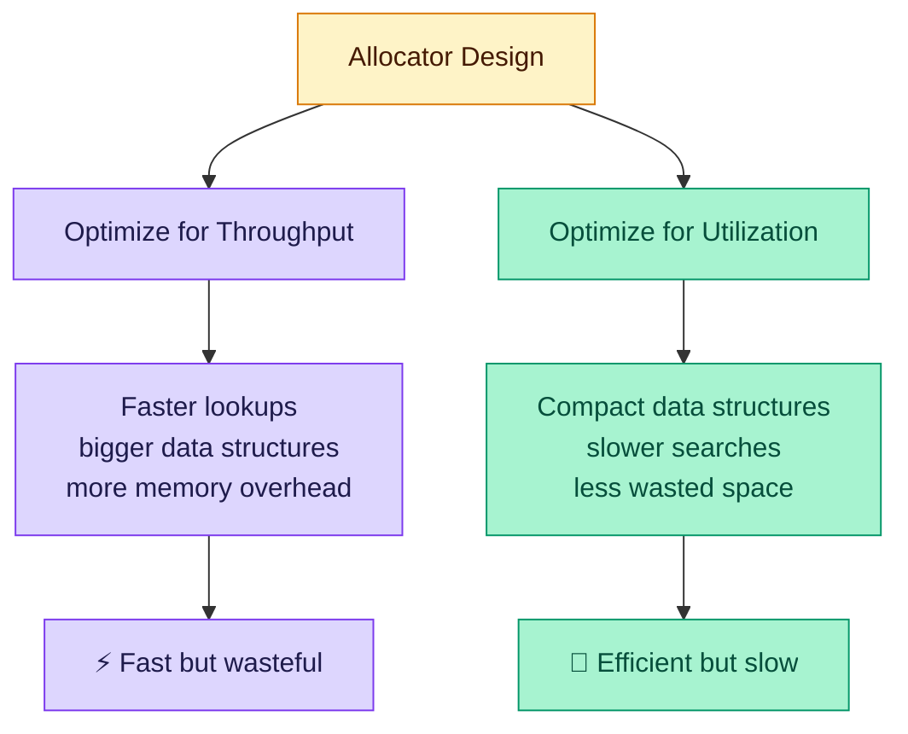
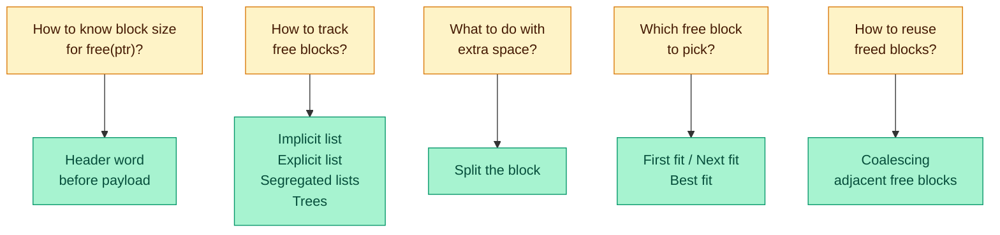
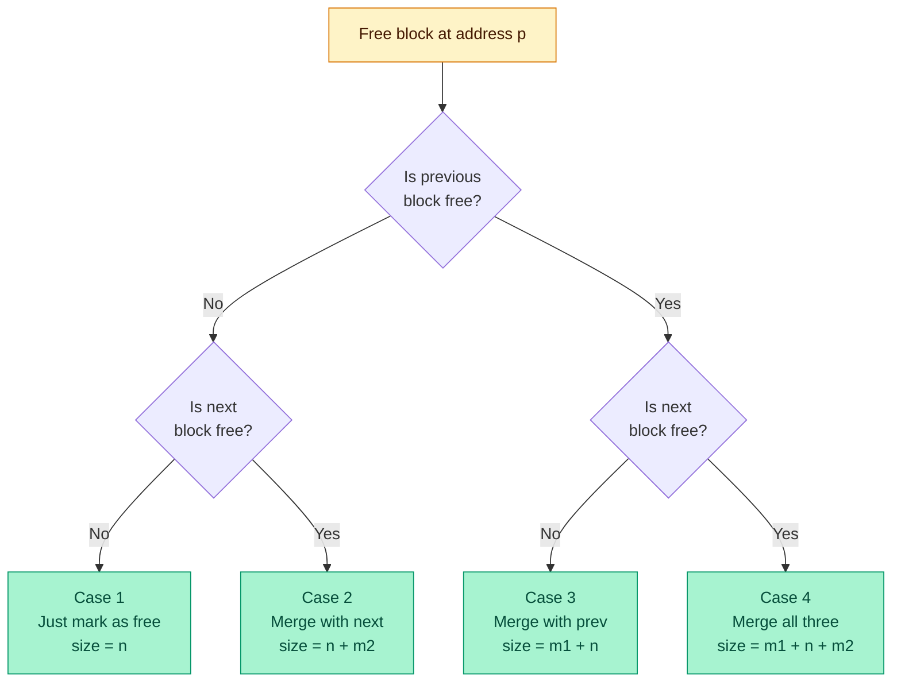

# Dynamic Memory Allocation: Basic Concepts — Lecture 13 Notes

> **CMU 15-213/15-513/14-513: Introduction to Computer Systems** | 13th Lecture, Oct 7, 2025
> [YouTube](https://youtu.be/CFNhqg2hchM)

## Table of Contents

1. [Why Dynamic Memory Allocation?](#1-why-dynamic-memory-allocation) · 2. [The Heap](#2-the-heap--where-dynamic-memory-lives) · 3. [The malloc/free API](#3-the-mallocfree-api) · 4. [malloc Example](#4-malloc-example--typical-usage-pattern) · 5. [Heap Visualization](#5-heap-visualization-convention) · 6. [Allocation Example](#6-allocation-example-conceptual) · 7. [Allocator Constraints](#7-allocator-constraints) · 8. [Throughput](#8-performance-goal-throughput) · 9. [Utilization](#9-performance-goal-memory-utilization-minimize-overhead) · 10. [Benchmark](#10-benchmark-example--visualization) · 11. [Fragmentation](#11-fragmentation--internal-vs-external) · 12. [Implementation Issues](#12-implementation-issues-overview) · 13. [The Header](#13-knowing-how-much-to-free--the-header) · 14. [Tracking Free Blocks](#14-keeping-track-of-free-blocks--four-methods) · 15. [Block Format](#15-implicit-free-lists--block-format) · 16. [Implicit List Example](#16-implicit-free-list--detailed-example) · 17. [Data Structures in C](#17-implicit-list--data-structures-in-c) · 18. [Header Access](#18-implicit-list--header-access-functions) · 19. [Traversal](#19-implicit-list--traversal) · 20. [Finding Free Blocks](#20-finding-a-free-block--first-fit-next-fit-best-fit) · 21. [Comparing Strategies](#21-comparing-fit-strategies) · 22. [Splitting](#22-allocating-in-a-free-block--splitting) · 23. [Coalescing Problem](#23-freeing-a-block--the-coalescing-problem) · 24. [Boundary Tags](#24-boundary-tags-footers) · 25. [4 Coalescing Cases](#25-constant-time-coalescing--the-4-cases) · 26. [Heap Sentinels](#26-heap-structure-with-sentinel-blocks) · 27. [malloc/free Code](#27-top-level-malloc-and-free-code) · 28. [Footer Optimization](#28-optimizing-boundary-tags--eliminating-footers-for-allocated-blocks) · 29. [Allocator Policies](#29-summary-of-key-allocator-policies) · 30. [Summary](#30-implicit-lists--final-summary) · [Key Takeaways](#key-takeaways) · [Glossary](#glossary) · [References](#references)

---

## 1. Why Dynamic Memory Allocation?

📊 **Slides 4–5** | ⏱️ **~00:00–02:15**

**The problem:** Many data structures have sizes that are only known at runtime. You can't always declare a fixed-size array at compile time — you need a way to request memory on the fly.

**The solution:** Dynamic memory allocators like `malloc` let programs acquire virtual memory (VM) at run time. The allocator manages an area of process VM called the **heap**.

> "You call malloc, you get memory. You call free, you give it back. And then there's all the fun stuff like — don't give back things you haven't gotten, don't give back half of things." — Professor

**Two kinds of allocators:**

| Type | Allocate | Free | Example |
|------|----------|------|---------|
| **Explicit** | App calls `malloc` | App calls `free` | C |
| **Implicit** | App calls `new` | Runtime auto-frees | Java (GC) |

> "In C it's an explicit allocator — we ask when we want something new and we explicitly ask when we want to give it back. Different than like Ruby or Python or Java with their garbage-collected languages."

---

## 2. The Heap — Where Dynamic Memory Lives

📊 **Slides 4–5** | ⏱️ **~00:49–01:06**

The heap sits between the BSS/data segment and the stack in the process address space. The stack grows **down**; the heap grows **up**.

```
High Address  ┌──────────────────────┐
              │       Stack          │  ← grows downward
              │         ↓            │
              ├──────────────────────┤
              │                      │
              │    (unmapped gap)    │
              │                      │
              ├──────────────────────┤
              │         ↑            │
              │       Heap           │  ← grows upward (via brk/sbrk)
              ├──────────────────────┤  ← "break" (brk)
              │   BSS / Data         │
              ├──────────────────────┤
              │       Text           │
Low Address   └──────────────────────┘
```

The **break** (`brk`) is the current top of the heap. `brk(addr)` sets it absolutely; `sbrk(increment)` adjusts by offset.

> "Back in the day... `brk` and `sbrk` were actually system calls. These days they're wrappers around `mmap`."

---

## 3. The malloc/free API

📊 **Slide 6** | ⏱️ **~02:22–16:30**

### Core Functions

```c
#include <stdlib.h>

void *malloc(size_t size);   // Allocate at least 'size' bytes
void  free(void *p);         // Return block at 'p' to the pool
void *calloc(size_t n, size_t size);  // malloc + zero-initialize
void *realloc(void *p, size_t size);  // Resize an existing block
```

### malloc Details

- Returns a pointer to a block of **at least** `size` bytes
- On x86-64, the returned pointer is **16-byte aligned**
- If `size == 0`, returns `NULL`
- On failure: returns `NULL` and sets `errno`

> "Dear malloc, please give me a pointer to a block of memory that I can use that is at least this size large — at least — it can be bigger."

**Why "at least"?** The allocator may give you more memory than requested for alignment or internal bookkeeping reasons. You'll never know — and you must never depend on the extra bytes.

> "If you ask for something yay big and they give you something yay big, you're still only gonna use the amount you think you have."

### free Details

- The pointer `p` **must** come from a previous `malloc`, `calloc`, or `realloc`
- You cannot free half an allocation or pass a pointer into the middle of a block

> "The memory allocator is using the address of a block as the name of the block and nothing more. Trying to pass in a pointer into the middle of a block is sort of like taking your name and adding three letters to every letter and it means the upper half of you — it doesn't work that way."

### calloc — Clear and Allocate

`calloc(count, size)` allocates `count × size` bytes **and zeros them**. **Important:** `malloc` does NOT guarantee zeroed memory!

> "The operating system zeroes pages when it gives them to malloc, but malloc is a caching allocator — after it gets these pages it holds on to them... you can get your own data [dirty pages] back."

### realloc — Resize a Block

`realloc(ptr, new_size)` tries to resize in place (fast path: extend if space after block is free). Otherwise, allocates new block, copies data, frees old. The returned pointer **may differ** — always use: `ptr = realloc(ptr, new_size);`

### Student Q&A — Segfaults and malloc

**Q:** If malloc sometimes returns a bigger block, why do we "always" get a segfault going past?
**A:** You don't always! That's what makes memory bugs truly insidious.

> "Your program can run for years and you can upgrade your tool chain... the allocator policy can change and now your program suddenly crashing... you could be dead and buried and then one day they upgrade the malloc library."

> "Segfaults are proof — conclusive proof — that in fact there is a God and he loves you. Because if you get a segfault you should say thank God... God is helping me find my bug."

---

## 4. malloc Example — Typical Usage Pattern

📊 **Slide 7** | ⏱️ **~19:36–20:18**

```c
#include <stdio.h>
#include <stdlib.h>

void foo(long n) {
    long i, *p;

    /* Allocate a block of n longs */
    p = (long *) malloc(n * sizeof(long));  // 1. Request memory
    if (p == NULL) {                         // 2. ALWAYS check for failure
        perror("malloc");
        exit(0);
    }

    /* Initialize allocated block */
    for (i = 0; i < n; i++)
        p[i] = i;                           // 3. Use the memory

    /* Do something with p */
    . . .

    /* Return allocated block to the heap */
    free(p);                                 // 4. Free when done
}
```

**Line-by-line:**
- **`malloc(n * sizeof(long))`** — Always use `sizeof`; never hardcode sizes. It's clearer and portable.
- **`if (p == NULL)`** — Always check. A NULL return means the system is out of memory.
- **Cast `(long *)`** — `malloc` returns `void *`; cast documents intent.

---

## 5. Heap Visualization Convention

📊 **Slide 8** | ⏱️ **~20:20–20:28**

Throughout this lecture: **1 square = 1 word = 8 bytes** (on x86-64). Shaded = allocated, unshaded = free. Lowest heap address at left, highest at right (the "break").

---

## 6. Allocation Example (Conceptual)

📊 **Slide 9** | ⏱️ **~20:28–20:53**

```c
p1 = malloc(32);    // Allocate 32 bytes
p2 = malloc(40);    // Allocate 40 bytes
p3 = malloc(48);    // Allocate 48 bytes
free(p2);           // Free p2 — leaves a "hole"
p4 = malloc(16);    // Reuses part of p2's old space
```

```
After malloc(32), malloc(40), malloc(48):
┌──────────┬──────────────┬────────────────┐
│ p1 (32B) │  p2 (40B)    │   p3 (48B)     │
│ ████████ │ ████████████ │ ██████████████ │
└──────────┴──────────────┴────────────────┘

After free(p2):
┌──────────┬──────────────┬────────────────┐
│ p1 (32B) │  FREE (40B)  │   p3 (48B)     │
│ ████████ │ ░░░░░░░░░░░░ │ ██████████████ │
└──────────┴──────────────┴────────────────┘

After p4 = malloc(16):  (p4 fits inside the hole left by p2)
┌──────────┬──────┬───────┬────────────────┐
│ p1 (32B) │p4 16B│ free  │   p3 (48B)     │
│ ████████ │ ████ │░░░░░░ │ ██████████████ │
└──────────┴──────┴───────┴────────────────┘
```

> "This is an example of where whatever I'd scribbled in the bytes [of p2's old space] are still going to be there when malloc returns the pointer we're calling p4. So that won't be initialized to zero."

---

## 7. Allocator Constraints

📊 **Slide 10** | ⏱️ **~24:03–28:33**

### What the application can do:
- Issue **any arbitrary sequence** of `malloc` and `free` requests
- `free` must be called on a pointer returned by `malloc`

### What the allocator **must** do:
- Respond **immediately** — no buffering or reordering
- Allocate from **free memory** only
- **Align** blocks (16-byte on x86-64) — malloc doesn't know the stored type
- **Never move** allocated blocks — programmer holds actual pointer

### Why can't malloc compact memory?

In C, the programmer holds the **actual pointer**. Moving a block would invalidate it. Java uses references (indices into a table), allowing compaction.

> "In Java, you get back a reference, not a pointer... it's an index into a reference table. Malloc can't do that because you actually have the pointer."

---

## 8. Performance Goal: Throughput

📊 **Slide 11** | ⏱️ **~28:42–30:30**

**Throughput** = number of malloc/free operations completed per unit time. Higher is better — means less time wasted on bookkeeping.

> "Programmers don't want to allocate memory, they don't want to free memory — they want to solve some problem. We want the time spent solving the problem, not on utility work like malloc and free."

---

## 9. Performance Goal: Memory Utilization (Minimize Overhead)

📊 **Slide 12** | ⏱️ **~30:36–35:24**

**Peak Memory Utilization** = (peak aggregate payload) / (heap size). It measures what fraction of the heap is actually holding user data.

> "Think about this: do you want your banker to be really rich? Where is she getting that money from? ... Well, think about malloc — malloc's job is to manage memory, but like any other part of a program, it uses memory."

**The fundamental tradeoff:**



---

## 10. Benchmark Example & Visualization

📊 **Slides 13–15** | ⏱️ **~29:46–30:30**

The benchmark `syn-array-short` demonstrates utilization tracking across 20 steps (10 blocks):

| Step | Command | Delta | Allocated | Peak |
|------|---------|------:|----------:|-----:|
| 1 | a 0 9904 | +9904 | 9,904 | 9,904 |
| 2 | a 1 50084 | +50084 | 59,988 | 59,988 |
| 4 | a 3 16784 | +16784 | 76,792 | 76,792 |
| 5 | f 3 | −16784 | 60,008 | 76,792 |
| 8 | f 0 | −9904 | 54,188 | 76,792 |
| **11** | **a 7 33856** | **+33856** | **90,036** | **90,036** |
| 12 | f 1 | −50084 | 39,952 | 90,036 |
| 20 | f 9 | −20 | 0 | 90,036 |

*(Selected rows — full 20-step trace in slides 13–14)*

**Key observation:** Peak payload is **90,036 bytes** (hit at step 11). An ideal allocator would need only this much heap. Any extra is overhead.

---

## 11. Fragmentation — Internal vs External

📊 **Slides 16–20** | ⏱️ **~31:37–39:25**

Fragmentation is the root cause of poor memory utilization. There are two types:

### Internal Fragmentation

**What:** The allocated block is **larger** than the payload the user requested.

```
┌──────────────────────────────────────┐
│ Header │ ██ Payload ██ │ Padding/Unused │
│ (meta) │  (user data)  │  (wasted!)     │
└──────────────────────────────────────┘
          ← internal fragmentation →
```

**Causes:**
1. **Allocator overhead** — headers, footers, metadata
2. **Alignment padding** — 16-byte boundaries on x86-64
3. **Policy decisions** — minimum block sizes, power-of-two rounding

Depends only on **past** requests → **easy to measure**. For the benchmark, internal fragmentation adds ~1.5% overhead.

### External Fragmentation

**What:** Enough **total** free memory exists, but no single contiguous block is large enough.

```c
p1 = malloc(32);  p2 = malloc(40);  p3 = malloc(48);
free(p2);              // 40 bytes freed
p4 = malloc(64);       // FAILS! Only 40 contiguous bytes available
```

```
┌──────────┬──────────────┬────────────────┐
│ p1 (32B) │  FREE (40B)  │   p3 (48B)     │  ← 40B free but need 64!
└──────────┴──────────────┴────────────────┘
```

Depends on **future** requests → **hard to measure**.

> "For me to tell you definitively this is a wasted fragment, I would have to see the program run to completion, never having used it."

### Fragmentation Overhead Comparison (Benchmark)

| Metric | Overhead |
|--------|----------|
| Perfect fit (theoretical) | 1.6% |
| Best fit | 8.3% |
| First fit | 11.9% |
| Next fit | 21.6% |

## 12. Implementation Issues Overview

📊 **Slide 21** | ⏱️ **~39:34–42:57**

Five key questions any allocator must answer:



---

## 13. Knowing How Much to Free — The Header

📊 **Slide 22** | ⏱️ **~43:01–44:38**

**Problem:** `free(p)` receives only a pointer — how does it know the block size?

**Solution:** Store the block size in a **header word** just before the payload.

```
        ┌──────────┐
        │  Header   │  ← block size (including header itself)
        │  (48)     │
        ├──────────┤  ← p0 (pointer returned by malloc)
        │          │
        │ Payload  │  (user's 32 bytes)
        │ (aligned)│
        │          │
        ├──────────┤
        │ Padding  │  (for alignment)
        └──────────┘
              Total block = 48 bytes
```

When `free(p0)` is called, the allocator backs up by the header size to find the block metadata.

> "We allocate more memory than the user asks for to ensure that we have at least room for a header. We write the size into the header and give the user a pointer after the header."

---

## 14. Keeping Track of Free Blocks — Four Methods

📊 **Slide 23** | ⏱️ **~44:38–51:06**

| Method | Description | Search Cost |
|--------|-------------|-------------|
| **1. Implicit list** | Size links all blocks | O(total blocks) |
| **2. Explicit list** | Pointers link free blocks only | O(free blocks) |
| **3. Segregated lists** | Multiple lists by size class | O(free blocks in class) |
| **4. Balanced tree** | Red-Black tree keyed by size | O(log n) |

> "It makes no sense to search through all the itsy-bitsy little things if I need something really big."

This lecture: **Method 1**. Methods 2–4 in Lecture 14.

---

## 15. Implicit Free Lists — Block Format

📊 **Slide 25** | ⏱️ **~51:06–53:40**

### The Clever Bit-Stealing Trick

Each block needs **both** a size and an allocated/free flag. Storing them separately wastes a word. The trick: since blocks are aligned (e.g., 16-byte), the **low-order bits of the size are always 0**. We steal the lowest bit!

```
Header word layout (64 bits):
┌─────────────────────────────────────────────────────────────────┬───┐
│                    Block Size (bytes)                            │ a │
│              (always a multiple of 16, so bits 0-3 = 0)         │   │
└─────────────────────────────────────────────────────────────────┴───┘
 63                                                               1   0

    a = 1 → Allocated block
    a = 0 → Free block
```

**Full block layout:**

```
┌──────────────────┐
│  Header          │  ← 1 word: [size | a]
│  (size | alloc)  │
├──────────────────┤
│                  │
│  Payload         │  ← Application data (allocated blocks only)
│                  │
├──────────────────┤
│  Optional        │
│  Padding         │  ← For alignment
└──────────────────┘
```

> "Hypothesize my block size is at minimum 2. Am I ever gonna have a block that starts at an odd address? No... 64-bit alignment means it's gonna have to begin at a multiple of 8 bytes... those three bits will always be zero. So I can just steal a low-order bit or two or three for accounting purposes."

---

## 16. Implicit Free List — Detailed Example

📊 **Slide 26** | ⏱️ **~53:40–54:15**

```
heap_start                                                    heap_end
    ↓                                                             ↓
    ┌────────┬──────────────┬──────────────┬──────────────────────┬──────┐
    │ 16/0   │    32/1      │    32/1      │       64/0           │  8/1 │
    │ (free) │ (allocated)  │ (allocated)  │      (free)          │(term)│
    │ 2 words│   4 words    │   4 words    │     8 words          │1 word│
    └────────┴──────────────┴──────────────┴──────────────────────┴──────┘
     ░░░░░░░  ████████████  ████████████  ░░░░░░░░░░░░░░░░░░░░░  ████

    Labels: "size_in_bytes / allocated_bit"
```

**Key observations:**
- Headers are at non-aligned positions; payloads are 16-byte aligned
- Traversal: jump header-to-header using the size field
- Terminator block (8/1) has size 0 logically and is marked allocated

---

## 17. Implicit List — Data Structures in C

📊 **Slide 27** | ⏱️ **~51:15–53:00**

### Block Declaration

```c
typedef uint64_t word_t;

typedef struct block {
    word_t header;
    unsigned char payload[0];   // Zero-length array — flexible array member
} block_t;
```

- `header` stores size + alloc bit
- `payload[0]` is a zero-length array — it marks where the payload begins without adding size to `sizeof(block_t)`

### Getting Payload from Block Pointer

```c
return (void *)(block->payload);  // Address right after header
```

### Getting Header from Payload

```c
return (block_t *)((unsigned char *)bp
                    - offsetof(block_t, payload));
// offsetof returns byte offset of payload within block_t (= 8)
```

---

## 18. Implicit List — Header Access Functions

📊 **Slide 28** | ⏱️ **~01:03:14–01:04:58**

### Getting the Allocated Bit

```c
// Extract the lowest bit
return header & 0x1;
// Result: 1 = allocated, 0 = free
```

### Getting the Block Size

```c
// Mask out the low 4 bits (for 16-byte alignment)
return header & ~0xfL;
// ~0xfL = 0xFFFFFFFFFFFFFF0 — all 1s except lowest 4 bits
```

**Why `~0xfL`?** With 16-byte alignment, the lowest 4 bits are always 0 in a valid size, so we mask them to extract the pure size. (We could also use `~0x1L` if only 1 bit is used, but `~0xfL` is future-proof for using multiple flag bits.)

### Writing a Header

```c
// Combine size and alloc bit with bitwise OR
block->header = size | alloc;
// e.g., 48 | 1 = 0x31 → size=48, allocated
```

---

## 19. Implicit List — Traversal

📊 **Slide 29** | ⏱️ **~57:06–57:19**

```c
static block_t *find_next(block_t *block) {
    return (block_t *)((unsigned char *)block
                        + get_size(block));
}
```

**How it works:**

```
  block (current)                    find_next(block)
    ↓                                       ↓
    ┌────────┬───────────────────────┬──────────┬──────────┐
    │ Header │       Payload         │  Header  │ Payload  │
    │(size=48)│                      │          │          │
    └────────┴───────────────────────┴──────────┴──────────┘
    |←────── block size (48 bytes) ──→|

    next_block = (char *)block + 48
```

We cast to `unsigned char *` (byte pointer) to do byte-level arithmetic, then add the block size to jump to the next header.

---

## 20. Finding a Free Block — First Fit, Next Fit, Best Fit

📊 **Slides 30–31** | ⏱️ **~54:34–01:00:15**

### First Fit Implementation

```c
static block_t *find_fit(size_t asize) {
    block_t *block;
    for (block = heap_start;
         block != heap_end;
         block = find_next(block))
    {
        if (!(get_alloc(block))          // Is it free?
            && (asize <= get_size(block))) // Is it big enough?
            return block;
    }
    return NULL;  // No fit found
}
```

**Line-by-line:**
1. Start at `heap_start`, walk until `heap_end`
2. For each block: check if free AND large enough
3. Return the **first** block that satisfies both conditions
4. If we reach the end, return NULL (need to extend the heap)

### Three Strategies Compared

| Strategy | How It Works | Throughput | Utilization |
|----------|-------------|------------|-------------|
| **First fit** | First match from start | Good | Medium (splinters at start) |
| **Next fit** | First match from last position | Better | Worse (more fragmentation) |
| **Best fit** | Smallest adequate block | Bad (full scan) | Best |

### The First-Fit Splinter Problem

> "If I always start at the beginning, I'm gonna take the big chunks out... all the small chunks find their way to the beginning and I'm just walking past them longer and longer."

**Next fit's fix:** Make it circular — leave the pointer where the last search ended, wrapping around when reaching the end.

---

## 21. Comparing Fit Strategies

📊 **Slide 32** | ⏱️ **~55:46–01:00:15**

| Strategy | Overhead | Notes |
|----------|----------|-------|
| Perfect fit (theoretical) | 1.6% | Lower bound — impossible in practice |
| **Best fit** | **8.3%** | Scans entire list; best real strategy |
| **First fit** | **11.9%** | Good throughput/utilization compromise |
| **Next fit** | **21.6%** | Fastest but most fragmentation |

> "Best fit: still a greedy algorithm. No guarantee of optimality."

---

## 22. Allocating in a Free Block — Splitting

📊 **Slides 33, 42** | ⏱️ **~01:05:48–01:06:27**

When we find a free block **larger** than needed, we **split** it into two parts:

```
BEFORE split_block(p, 32):
┌──────────────────────────────────────────────────────┐
│  Header: 64/0  │           Free space (64 bytes)     │
└──────────────────────────────────────────────────────┘

AFTER split_block(p, 32):
┌──────────────────────────┬───────────────────────────┐
│  Header: 32/1 │ Payload  │  Header: 32/0  │  Free    │
│  (allocated)  │ (user's) │  (new free blk)│          │
└──────────────────────────┴───────────────────────────┘
```

### Splitting Code (Full Version with Boundary Tags)

```c
static void split_block(block_t *block, size_t asize) {
    size_t block_size = get_size(block);

    if ((block_size - asize) >= min_block_size) {
        // Shrink the allocated block to asize
        write_header(block, asize, true);
        write_footer(block, asize, true);

        // Create a new free block from the remainder
        block_t *block_next = find_next(block);
        write_header(block_next, block_size - asize, false);
        write_footer(block_next, block_size - asize, false);
    }
    // else: don't split — remainder too small (internal fragmentation)
}
```

**Key decision:** Only split if the remainder ≥ `min_block_size`. Otherwise, just give the whole block to the user (accepting some internal fragmentation).

**Worked example:**
- Free block = 64 bytes. User requests 32 bytes.
- Remainder = 64 − 32 = 32 bytes ≥ `min_block_size` → **split**
- Result: 32-byte allocated block + 32-byte free block

---

## 23. Freeing a Block — The Coalescing Problem

📊 **Slides 34–38** | ⏱️ **~01:06:27–01:08:15**

### Naïve free — Just Clear the Alloc Bit

```c
// Simplest possible free:
set_alloc(block, 0);  // Mark as free
```

**Problem:** This creates **false fragmentation**!

```
BEFORE freeing middle block:
┌──────────┬──────────┬──────────┐
│  4/0     │  4/1     │  2/0     │
│  (free)  │(allocd)  │  (free)  │
└──────────┴──────────┴──────────┘

AFTER naïve free (just clear alloc bit):
┌──────────┬──────────┬──────────┐
│  4/0     │  4/0     │  2/0     │
│  (free)  │  (free)  │  (free)  │
└──────────┴──────────┴──────────┘
    Three separate free blocks! Total = 10 bytes free
    But no single block ≥ 10... external fragmentation!

AFTER proper coalescing:
┌────────────────────────────────┐
│            10/0                │
│         (one big free block)   │
└────────────────────────────────┘
    One block = 10 bytes free — much better!
```

**Coalescing** = merging adjacent free blocks into one larger block.

### The Problem with Headers Only

With only a header, we can move **forward** (header → next block) but **not backward**. To coalesce with the *previous* block, we need to look left — impossible with only headers.

---

## 24. Boundary Tags (Footers)

📊 **Slides 39–41** | ⏱️ **~01:07:36–01:09:28**

**Solution:** Add a **footer** (boundary tag) at the end of each block — a copy of the header.

```
┌──────────┐
│  Header   │  size | alloc
├──────────┤
│           │
│  Payload  │
│           │
├──────────┤
│  Footer   │  size | alloc  (copy of header)
└──────────┘
```

**Why this works for backward traversal:**
```
  Previous block                  Current block
┌────────┬─────────┬────────┐┌────────┬─────────┬────────┐
│ Header │ Payload │ Footer ││ Header │ Payload │ Footer │
│ (m1|a) │         │ (m1|a) ││ (n|a)  │         │ (n|a)  │
└────────┴─────────┴────────┘└────────┴─────────┴────────┘
                         ↑    ↑
   Back up 1 word ───────┘    Current pointer
   Read footer → prev size (m1) → back up m1 → prev header!
```

> "To move forward I use my size gotten by backing up to my header. To move backward I back up by the size of my header plus the other one's footer — that gives me the size of my predecessor and now I back up by that size."

**Cost:** The footer is internal fragmentation — extra overhead per block. But it enables **constant-time coalescing**.

---

## 25. Constant-Time Coalescing — The 4 Cases

📊 **Slides 43–47** | ⏱️ **~01:08:23–01:09:02**

When freeing a block, check both neighbors. There are exactly **4 cases**:

```
   Case 1              Case 2              Case 3              Case 4
┌──────────┐       ┌──────────┐       ┌──────────┐       ┌──────────┐
│ prev: A  │       │ prev: A  │       │ prev: F  │       │ prev: F  │
│  (m1|1)  │       │  (m1|1)  │       │  (m1|0)  │       │  (m1|0)  │
├──────────┤       ├──────────┤       ├──────────┤       ├──────────┤
│ curr: F  │       │ curr: F  │       │ curr: F  │       │ curr: F  │
│  (n|0)   │       │  (n|0)   │       │  (n|0)   │       │  (n|0)   │
├──────────┤       ├──────────┤       ├──────────┤       ├──────────┤
│ next: A  │       │ next: F  │       │ next: A  │       │ next: F  │
│  (m2|1)  │       │  (m2|0)  │       │  (m2|1)  │       │  (m2|0)  │
└──────────┘       └──────────┘       └──────────┘       └──────────┘

  Result:            Result:            Result:            Result:
  Just free          Merge curr+next    Merge prev+curr    Merge all three
  curr block.        New size=n+m2      New size=m1+n      New size=m1+n+m2
```

### Case-by-Case Details

- **Case 1** (both alloc): Just mark current as free. Size = n.
- **Case 2** (next free): Merge current + next. Size = n + m2.
- **Case 3** (prev free): Merge prev + current. Size = m1 + n. Start at prev's header.
- **Case 4** (both free): Merge all three. Size = m1 + n + m2. Start at prev's header.

> "As long as I coalesce at every opportunity, I can do it in constant time — left, right, done."



---

## 26. Heap Structure with Sentinel Blocks

📊 **Slide 48** | ⏱️ **~54:18–54:30**

To avoid special-casing edges during coalescing, add **dummy sentinel blocks**:

```
heap_start                                                         heap_end
  ↓                                                                    ↓
┌───────┬────────┬──────────────┬──────────────┬────────────────┬───────┐
│Dummy  │ 16/0   │    32/1      │    32/1      │     64/0       │Dummy  │
│Footer │ (free) │ (allocated)  │ (allocated)  │    (free)      │Header │
│ 8/1   │        │              │              │                │ 8/1   │
└───────┴────────┴──────────────┴──────────────┴────────────────┴───────┘
  ↑ Marked allocated                            Marked allocated ↑
    (prevents coalescing off left)     (prevents coalescing off right)
```

---

## 27. Top-Level malloc and free Code

📊 **Slides 49–50** | ⏱️ **~01:05:24–01:06:27**

### mm_malloc

```c
const size_t dsize = 2 * sizeof(word_t);  // 16 bytes (header + footer)

void *mm_malloc(size_t size) {
    // 1. Round up: user's size + overhead, aligned to dsize
    size_t asize = round_up(size + dsize, dsize);

    // 2. Find a free block that fits
    block_t *block = find_fit(asize);
    if (block == NULL)
        return NULL;  // Out of memory

    // 3. Mark the block as allocated
    size_t block_size = get_size(block);
    write_header(block, block_size, true);
    write_footer(block, block_size, true);

    // 4. Split if remainder is large enough
    split_block(block, asize);

    // 5. Return payload pointer to user
    return header_to_payload(block);
}
```

### Worked example for mm_malloc(24)
- `size` = 24, `dsize` = 16, so `size + dsize` = 40
- `round_up(40, 16)` = 16 × ⌊55/16⌋ = 16 × 3 = **48 bytes** → search for free block ≥ 48

### mm_free

```c
void mm_free(void *bp) {
    // 1. Convert user pointer back to block pointer
    block_t *block = payload_to_header(bp);
    size_t size = get_size(block);

    // 2. Mark as free
    write_header(block, size, false);
    write_footer(block, size, false);

    // 3. Coalesce with neighbors
    coalesce_block(block);
}
```

**Key insight:** `free` is O(1) — mark as free then coalesce (constant-time with boundary tags).

---

## 28. Optimizing Boundary Tags — Eliminating Footers for Allocated Blocks

📊 **Slides 51–56** | ⏱️ **~01:09:02–01:09:33**

### The Optimization

Footers are only needed for **free** blocks (to enable backward traversal during coalescing). Allocated blocks never need footers because we never coalesce *into* them.

**Trick:** Use a second bit to store whether the **previous** block is allocated:

```
Header word with 2 flag bits:
┌──────────────────────────────────────────────────────┬────┬────┐
│                    Block Size                         │ b  │ a  │
└──────────────────────────────────────────────────────┴────┴────┘
                                                       bit1  bit0

  a = current block allocated (1) or free (0)
  b = previous block allocated (1) or free (0)
```

**Allocated block (no footer needed):**
```
┌──────────────────┐
│ Header: size|b|1 │
├──────────────────┤
│  Payload + pad   │
└──────────────────┘
```

**Free block (keeps footer for backward traversal):**
```
┌──────────────────┐
│ Header: size|b|0 │
├──────────────────┤
│  (unused space)  │
├──────────────────┤
│ Footer: size|b|0 │
└──────────────────┘
```

### Optimized Coalescing

The 4 coalescing cases still work, but now we check the `b` bit in the current header to determine the previous block's status, instead of reading a footer. Only cases 3 and 4 (previous block free) need to read the previous block's footer — and since it's free, it has one.

| Case | Prev (b bit) | Next (a bit of next) | Action |
|------|-------------|---------------------|--------|
| 1 | b=1 (alloc) | a=1 (alloc) | Just free current |
| 2 | b=1 (alloc) | a=0 (free) | Merge with next |
| 3 | b=0 (free) | a=1 (alloc) | Read prev footer, merge with prev |
| 4 | b=0 (free) | a=0 (free) | Read prev footer, merge all three |

**Benefit:** Saves 8 bytes per allocated block → reduces internal fragmentation.

---

## 29. Summary of Key Allocator Policies

📊 **Slide 57** | ⏱️ **~01:09:33–01:10:39**

### Placement Policy
First-fit, next-fit, best-fit — trades throughput for less fragmentation. Segregated free lists (Lecture 14) approximate best fit without full-list search.

### Splitting Policy
- When to split vs. give whole block? Controlled by `min_block_size`.

### Coalescing Policy

| Policy | Description | Throughput | Fragmentation |
|--------|-------------|------------|---------------|
| **Immediate** | Coalesce every `free` | O(1) per free | Best |
| **Deferred** | Postpone until needed | Faster frees | Risk of buildup |

> "Hint: we almost always want immediate coalesce — a constant-time coalesce."

---

## 30. Implicit Lists — Final Summary

📊 **Slide 58** | ⏱️ **~01:10:39–01:11:28**

| Aspect | Details |
|--------|---------|
| Implementation | Very simple |
| Allocate cost | O(n) worst case — must search all blocks |
| Free cost | O(1) — even with coalescing |
| Memory overhead | Depends on fit policy |
| In practice? | Not for general malloc; used in special-purpose allocators |

> "It's not used in common mallocs — it's just not efficient enough. But it is a good basis for understanding how malloc and free works."

**Next lecture:** Explicit + segregated free lists overcome the O(n) allocation bottleneck.

---

## Key Takeaways

1. **`malloc`/`free` is a caching allocator** — memory from `malloc` is NOT guaranteed to be zeroed.
2. **Throughput vs. utilization** — the fundamental tradeoff in allocator design.
3. **Fragmentation is the enemy** — internal (waste inside blocks) and external (scattered unusable free space).
4. **Headers enable implicit lists** — size field with stolen alloc bit enables sequential traversal.
5. **Boundary tags enable O(1) coalescing** — footer = copy of header allows backward traversal.
6. **4 coalescing cases** cover all neighbor combinations, each O(1) with boundary tags.
7. **Footer optimization** — allocated blocks don't need footers; use a "prev-allocated" bit instead.
8. **Implicit lists are O(n) for allocation** — practical allocators use explicit/segregated lists (Lecture 14).

---

## Code Examples Summary

| Code | Purpose | Slide |
|------|---------|-------|
| `block_t` struct with zero-length array | Block declaration | 27 |
| `header & 0x1` / `header & ~0xfL` | Extract alloc bit / size | 28 |
| `find_next(block)` | Traverse to next block | 29 |
| `find_fit(asize)` — first fit loop | Find free block | 30 |
| `split_block(block, asize)` | Split free block after allocation | 42 |
| `mm_malloc(size)` / `mm_free(bp)` | Top-level allocation & free | 49–50 |

## Formulas & Calculations Summary

| Formula | Expression |
|---------|-----------|
| **Round-up** | round_up(n, m) = m × ⌊(n + m − 1) / m⌋ |
| **Adjusted size** | asize = round_up(user_size + dsize, dsize), dsize = 16 |
| **Peak utilization** | U_k = Peak_payload_k / Heap_size_k |
| **Coalescing sizes** | Case 1: n · Case 2: n+m2 · Case 3: m1+n · Case 4: m1+n+m2 |

---

## Glossary

| # | Term | Definition |
|---|------|-----------|
| 1 | **Heap** | Region of process VM managed by the allocator |
| 2 | **Break (brk)** | Current top-of-heap address |
| 3 | **malloc** | Allocate ≥ N bytes from the heap |
| 4 | **free** | Return a block to the allocator |
| 5 | **calloc** | malloc + zero-init; takes (count, size) |
| 6 | **realloc** | Resize existing allocation (may move) |
| 7 | **sbrk** | Grow/shrink heap by offset |
| 8 | **Payload** | The user-requested portion of a block |
| 9 | **Header** | Metadata word storing size + flags |
| 10 | **Footer / Boundary Tag** | Copy of header at block end; enables backward traversal |
| 11 | **Allocated block** | Block in use by the application |
| 12 | **Free block** | Block available for allocation |
| 13 | **Internal fragmentation** | Waste inside a block (overhead, padding) |
| 14 | **External fragmentation** | Free memory scattered in unusably small pieces |
| 15 | **Throughput** | Allocator ops per unit time |
| 16 | **Utilization** | Payload / heap size ratio |
| 17 | **Peak utilization** | Max utilization observed |
| 18 | **Implicit free list** | Blocks linked by size fields |
| 19 | **Explicit free list** | Free blocks linked by pointers |
| 20 | **Segregated free list** | Multiple lists by size class |
| 21 | **First fit** | First adequate free block |
| 22 | **Next fit** | First fit, resuming from last position |
| 23 | **Best fit** | Smallest adequate free block |
| 24 | **Worst fit** | Largest free block (bad strategy) |
| 25 | **Splitting** | Dividing oversized free block |
| 26 | **Coalescing** | Merging adjacent free blocks |
| 27 | **Immediate coalescing** | Coalesce on every free — O(1) |
| 28 | **Deferred coalescing** | Batch coalescing later |
| 29 | **Alignment** | Address must be multiple of N (16 on x86-64) |
| 30 | **Sentinel / Prologue / Epilogue** | Dummy blocks at heap edges |
| 31 | **Minimum block size** | Smallest block worth maintaining |
| 32 | **Compaction** | Moving blocks to defragment (impossible in C) |
| 33 | **Reference table** | Java's indirection enabling compaction |
| 34 | **Inline function** | Function body inserted at call site |
| 35 | **Word** | 8 bytes on x86-64 |
| 36 | **mmap** | System call backing sbrk |

---

## References

- **Textbook:** Bryant & O'Hallaron, *Computer Systems: A Programmer's Perspective* (CS:APP), Chapter 9.9
- **Lecture slides:** Slide deck for Lecture 13, CMU 15-213 Fall 2025
- **Video:** [YouTube — Lecture 13](https://youtu.be/CFNhqg2hchM)
- **malloc lab:** CMU 15-213 malloc lab assignment (benchmark traces referenced in slides 13–15)
