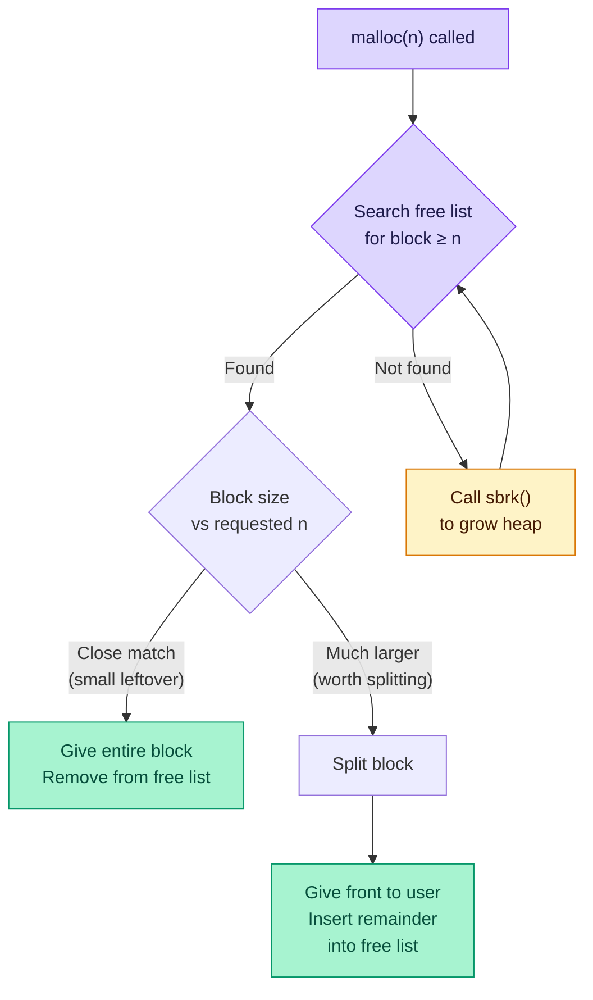
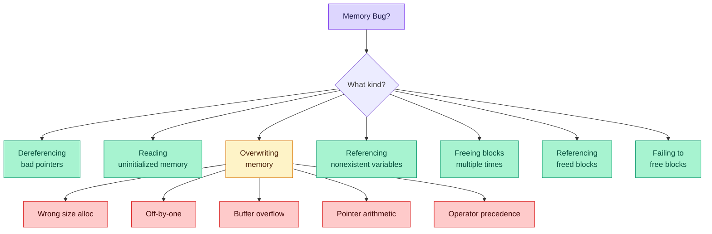

# Dynamic Memory Allocation: Advanced Concepts — Lecture 14 Notes

> **CMU 15-213/15-513/14-513: Introduction to Computer Systems** | 14th Lecture, Feb 26th, 2026
> [YouTube](https://youtu.be/JOXj5M_7chg) | Based on slides & transcript

---

## Table of Contents

1. [Review: Implicit Free Lists (from Lecture 13)](#1-review-implicit-free-lists-from-lecture-13)
2. [Explicit Free Lists — Concept & Motivation](#2-explicit-free-lists--concept--motivation)
3. [Explicit Free List Block Format](#3-explicit-free-list-block-format)
4. [Logical vs Physical Order](#4-logical-vs-physical-order)
5. [Allocating From Explicit Free Lists](#5-allocating-from-explicit-free-lists)
6. [Freeing With Explicit Free Lists — Insertion Policies](#6-freeing-with-explicit-free-lists--insertion-policies)
7. [The 4 Cases of Freeing With LIFO Policy](#7-the-4-cases-of-freeing-with-lifo-policy)
8. [Implementation Trick: Circular Doubly-Linked List](#8-implementation-trick-circular-doubly-linked-list)
9. [Explicit List Summary](#9-explicit-list-summary)
10. [Segregated Free Lists (Seglists)](#10-segregated-free-lists-seglists)
11. [Seglist Allocator Algorithm](#11-seglist-allocator-algorithm)
12. [Seglist Advantages](#12-seglist-advantages)
13. [Memory-Related Perils and Pitfalls — Overview](#13-memory-related-perils-and-pitfalls--overview)
14. [Bug 1: Dereferencing Bad Pointers](#14-bug-1-dereferencing-bad-pointers)
15. [Bug 2: Reading Uninitialized Memory](#15-bug-2-reading-uninitialized-memory)
16. [Bug 3: Overwriting Memory — Wrong Size](#16-bug-3-overwriting-memory--wrong-size)
17. [Bug 4: Overwriting Memory — Off-by-One](#17-bug-4-overwriting-memory--off-by-one)
18. [Bug 5: Overwriting Memory — Buffer Overflow](#18-bug-5-overwriting-memory--buffer-overflow)
19. [Bug 6: Overwriting Memory — Pointer Arithmetic](#19-bug-6-overwriting-memory--pointer-arithmetic)
20. [Bug 7: Overwriting Memory — Operator Precedence](#20-bug-7-overwriting-memory--operator-precedence)
21. [Bug 8: Referencing Nonexistent Variables](#21-bug-8-referencing-nonexistent-variables)
22. [Bug 9: Freeing Blocks Multiple Times](#22-bug-9-freeing-blocks-multiple-times)
23. [Bug 10: Referencing Freed Blocks](#23-bug-10-referencing-freed-blocks)
24. [Bug 11: Failing to Free Blocks (Memory Leaks)](#24-bug-11-failing-to-free-blocks-memory-leaks)
25. [Dealing With Memory Bugs — Tools](#25-dealing-with-memory-bugs--tools)
26. [Key Takeaways](#key-takeaways)
27. [Code Examples Summary](#code-examples-summary)
28. [Formulas & Calculations Summary](#formulas--calculations-summary)
29. [Glossary](#glossary)
30. [References](#references)

---

## 1. Review: Implicit Free Lists (from Lecture 13)

📊 **Slides 4–6** | ⏱️ **~02:03–04:35**

### Why do we need this review?

Lecture 13 introduced **implicit free lists** — the simplest way to manage heap memory. Before we can understand *why* explicit lists are better, we need to clearly understand what's wrong with implicit lists.

### How implicit lists work

Each block has a **header** containing the block size and an allocated bit. To find the next block, you add the current block's size to its address — the sizes *are* the pointers:

```
                    Implicit Free List
  ┌────────┬────────┬────────┬────────┬────────┬────────┐
  │ 4/1    │ 6/1    │ 4/0    │ 8/1    │ 4/0    │ 0/1    │
  │(alloc) │(alloc) │(free)  │(alloc) │(free)  │(end)   │
  └────────┴────────┴────────┴────────┴────────┴────────┘
  ─────────────── walk by adding size ──────────────────►
  Header format: size/allocated-bit
```

### The coalescing problem and boundary tags

When `free()` is called, adjacent free blocks must be **coalesced** to avoid **false fragmentation**. Looking *right* is easy (check next header), but looking *left* requires a **footer** — a copy of the header at the *end* of each block:

> "We had a free block and a free block before it but it looked like we had three smaller blocks, not one bigger block."

Back up from a header → hit predecessor's footer → know predecessor's size → jump to its header.

### Implicit list summary (Slide 6)

| Aspect | Performance |
|--------|-------------|
| **Implementation** | Very simple |
| **Allocate cost** | Linear time (worst case) — must walk *all* blocks |
| **Free cost** | Constant time (even with coalescing) |
| **Memory overhead** | Depends on placement policy |
| **Placement** | First fit, next fit, best fit |
| **Used in practice?** | No (for general malloc), yes for special-purpose apps |

> "Not used in practice for malloc/free because of linear-time allocation... However, the concepts of splitting and boundary tag coalescing are general to **all** allocators."

**Key limitation:** We must walk through *every* block — allocated and free — just to find one free block.

> "Used, used, used, used, used, used, used... okay finally a free one. We're walking through a whole bunch of already-allocated memory just to find the memory that's freed."

---

## 2. Explicit Free Lists — Concept & Motivation

📊 **Slides 7–9** | ⏱️ **~04:35–05:20**

### Why do explicit free lists exist?

The fundamental problem with implicit lists: **searching for free blocks is slow** because you traverse allocated blocks too. If 95% of memory is allocated, 95% of your search time is wasted.

**Solution:** Maintain a linked list of **only free blocks** using actual pointers (not just sizes). This way, `malloc` only visits blocks that could actually satisfy the request.

> "The idea is just like freshman year — we just have pointers."

### What changes from implicit lists?

- We **still have** the implicit list (headers with sizes) for walking by address
- We **still have** boundary tags (footers) for coalescing
- We **add** `next` and `prev` pointers **inside free blocks** to chain them together
- Allocated blocks don't need these pointers (the user's payload fills that space)

---

## 3. Explicit Free List Block Format

📊 **Slide 9** | ⏱️ **~04:43–06:05**

### Block layouts

```
  ALLOCATED BLOCK                 FREE BLOCK
  ┌─────────────────┐             ┌─────────────────┐
  │  Header         │             │  Header          │
  │  (size | a=1)   │             │  (size | a=0)    │
  ├─────────────────┤             ├─────────────────┤
  │                 │             │  Next pointer    │◄── points to next free block
  │  Payload        │             ├─────────────────┤
  │                 │             │  Prev pointer    │◄── points to prev free block
  │                 │             ├─────────────────┤
  │                 │             │  (unused space)  │
  ├─────────────────┤             ├─────────────────┤
  │  Footer         │             │  Footer          │
  │  (size | a=1)   │             │  (size | a=0)    │
  └─────────────────┘             └─────────────────┘
```

### Why are next/prev only in the header, not the footer?

> **Student Q:** Why do we only have previous and next in the header and not in the footer?
>
> **Professor:** The footer is there only for coalescing. If I want to find the predecessor block's pointers, I use the footer to find its size, jump back to its header, and read next/prev from there.

**Key insight:** Free blocks *reuse the payload area* for the linked-list pointers. Since free blocks have no payload (nobody's using them), we get the pointer storage "for free" — no additional overhead beyond the minimum block size.

### Minimum block size implication

Every free block must be large enough to hold: header + next ptr + prev ptr + footer. On a 64-bit system with 8-byte words, that's **4 × 8 = 32 bytes minimum**.

---

## 4. Logical vs Physical Order

📊 **Slide 10** | ⏱️ **~07:01–07:45**

### Why this distinction matters

In an implicit list, logical order = physical order (low address → high address). With explicit lists, the **logical order** (linked list traversal) can be **completely different** from the **physical order** (address in memory).

```
  PHYSICAL ORDER (memory addresses):
  ┌───────┬───────┬───────┬───────┬───────┐
  │ Alloc │ FREE  │ Alloc │ FREE  │ FREE  │
  │       │  (B)  │       │  (A)  │  (C)  │
  └───────┴───────┴───────┴───────┴───────┘
             ▲                ▲       ▲
             │                │       │
  LOGICAL ORDER (linked list): A ──► B ──► C
  (next pointers can link in ANY order)
```

> "The 'next' free block could be anywhere. So we need to store forward/back pointers, not just sizes."

**This freedom** is what enables different ordering policies (LIFO, FIFO, address-ordered, size-ordered).

---

## 5. Allocating From Explicit Free Lists

📊 **Slide 11** | ⏱️ **~07:53–09:09**

### The process (conceptual)

When `malloc(n)` is called:

1. **Search** the free list for a block ≥ `n` bytes
2. **Found a block?** Two options:
   - Block is close to `n` → give the **whole block** to the user (remove from free list)
   - Block is much larger → **split**: give `n` bytes to user, put remainder back in free list
3. **Removal** = standard doubly-linked list removal (freshman-year data structures)



> "This is really a rehash of freshman year... I am going to remove a node from the linked list. Take the next pointer and skip past it, take the previous pointer and skip past it."

---

## 6. Freeing With Explicit Free Lists — Insertion Policies

📊 **Slide 12** | ⏱️ **~09:33–12:10**

### Where in the free list do you put a newly freed block?

| Policy | How it works | Pro | Con |
|--------|-------------|-----|-----|
| **LIFO** | Insert at the **head** of the free list | Simple, O(1) | Higher fragmentation |
| **FIFO** | Insert at the **tail** of the free list | Simple, O(1) | Higher fragmentation |
| **Address-ordered** | Insert so that `addr(prev) < addr(curr) < addr(next)` | Lower fragmentation | Requires search, O(n) |

### LIFO — the intuition and its flaw

> "Things tend to get reused — if you ask for a block of a particular size and free it, you're likely to ask for a block of that size again. The person who's got a loop — at the top allocate, at the bottom free — that's gonna be great because I free it and put it at the head, malloc and take it off the head."

**But in practice:** Temporal locality doesn't work as well as expected. Other requests intervene and fragment the recently-freed block before it can be reused.

### Address-ordered — limited value

> "The implicit list is necessarily address-ordered, so using the explicit pointers for address order just isn't particularly helpful. You already have that benefit."

Since coalescing uses the **implicit list** (boundary tags) — not the explicit list — address ordering of the explicit list doesn't provide additional benefit.

---

## 7. The 4 Cases of Freeing With LIFO Policy

📊 **Slides 13–16** | ⏱️ **~12:12–16:20**

When we free a block, we check its physical neighbors (via boundary tags) and coalesce if possible. There are 4 cases depending on whether the left/right neighbors are free.

### Case 1: Neither neighbor is free (Slide 13)

No coalescing needed. Simply insert the freed block at the root of the free list.

```
  BEFORE free(B):
  ┌─────────┬─────────┬─────────┐
  │  Alloc  │ B(alloc)│  Alloc  │    Free list: Root → X → Y → ...
  └─────────┴─────────┴─────────┘

  AFTER free(B):
  ┌─────────┬─────────┬─────────┐
  │  Alloc  │ B(free) │  Alloc  │    Free list: Root → B → X → Y → ...
  └─────────┴─────────┴─────────┘
```

### Case 2: Right neighbor is free (Slide 14)

**Splice out** the right neighbor from the free list, **coalesce** B with it, then **insert** the merged block at the root.

```
  BEFORE free(B):
  ┌─────────┬─────────┬─────────┐
  │  Alloc  │ B(alloc)│ C(free) │    Free list: Root → C → X → ...
  └─────────┴─────────┴─────────┘

  AFTER free(B):
  ┌─────────┬───────────────────┐
  │  Alloc  │   B+C (free)      │    Free list: Root → B+C → X → ...
  └─────────┴───────────────────┘
```

### Case 3: Left neighbor is free (Slide 15)

**Splice out** the left neighbor from the free list, **coalesce** it with B, then **insert** the merged block at the root.

```
  BEFORE free(B):
  ┌─────────┬─────────┬─────────┐
  │ A(free) │ B(alloc)│  Alloc  │    Free list: Root → A → X → ...
  └─────────┴─────────┴─────────┘

  AFTER free(B):
  ┌───────────────────┬─────────┐
  │   A+B (free)      │  Alloc  │    Free list: Root → A+B → X → ...
  └───────────────────┴─────────┘
```

### Case 4: Both neighbors are free (Slide 16)

**Splice out both** neighbors, **coalesce** all three blocks, then **insert** the merged block at the root.

```
  BEFORE free(B):
  ┌─────────┬─────────┬─────────┐
  │ A(free) │ B(alloc)│ C(free) │    Free list: Root → A → C → X → ...
  └─────────┴─────────┴─────────┘

  AFTER free(B):
  ┌─────────────────────────────┐
  │       A+B+C (free)          │    Free list: Root → A+B+C → X → ...
  └─────────────────────────────┘
```

### The general free algorithm (professor's summary)

> "Mark my newly freed block. If I can coalesce left, remove the block to the left and merge. If I can coalesce right, remove the block to the right and coalesce. Now I have the block I actually need to insert according to my policy. Do that."

**Important clarification (Student Q&A):** "Left" and "right" mean physically contiguous neighbors in memory (by address), NOT linked-list predecessors/successors.

---

## 8. Implementation Trick: Circular Doubly-Linked List

📊 **Slide 17** | ⏱️ **~15:40–16:20**

### Why use a circular list?

A **circular doubly-linked list** with a single free pointer supports multiple policies with one data structure:

```
         ┌──────────────────────────────────────┐
         │                                      │
         ▼                                      │
  ┌─────────┐     ┌─────────┐     ┌─────────┐  │
  │  Free   │────►│  Free   │────►│  Free   │──┘
  │  Ptr    │◄────│  Block  │◄────│  Block  │
  │ (root)  │     │   B     │     │   C     │
  └─────────┘     └─────────┘     └─────────┘
```

| Want this policy? | Do this with circular list |
|-------------------|---------------------------|
| **First-fit** | Keep free pointer fixed, search forward |
| **Next-fit** | Move free pointer after each search |
| **LIFO** | Insert as *next* block after free pointer |
| **FIFO** | Insert as *previous* block before free pointer |

---

## 9. Explicit List Summary

📊 **Slide 18** | ⏱️ **~16:23–17:30**

### Comparison: Explicit vs Implicit

| Feature | Implicit List | Explicit List |
|---------|--------------|---------------|
| **Allocate time** | O(total blocks) | O(free blocks only) |
| **Free time** | O(1) with coalescing | O(1) with coalescing |
| **Implementation** | Simpler | Slightly more complex (splice in/out) |
| **Extra space** | None beyond headers/footers | 2 extra words per **free** block (next/prev) |
| **When memory is mostly full** | Very slow (walks allocated blocks) | Fast (only walks free blocks) |

> "Does the extra space for links increase **internal** fragmentation?"

**Answer:** Not directly — the next/prev pointers only exist in **free** blocks (reusing the payload area). But the **minimum block size** increases because every block must be large enough to hold next/prev pointers when freed.

---

## 10. Segregated Free Lists (Seglists)

📊 **Slides 19–20** | ⏱️ **~17:30–20:00**

### Why seglists?

Even with explicit free lists, searching is O(free blocks). If there are thousands of small free blocks and you need a large one, you waste time scanning blocks that are too small.

**Seglists solve this** by maintaining **separate free lists for different size classes**. Jump directly to the list of appropriately-sized blocks.

### Structure

```
  Size Class      Free List
  ┌─────────┐
  │  1-16   │───► [16] ──► [12] ──► [16] ──► NULL
  ├─────────┤
  │  17-32  │───► [24] ──► [32] ──► NULL
  ├─────────┤
  │  33-48  │───► [48] ──► [40] ──► NULL
  ├─────────┤
  │  49-64  │───► [64] ──► NULL
  ├─────────┤
  │  65-128 │───► [96] ──► [128] ──► NULL
  ├─────────┤
  │ 129-inf │───► [256] ──► [1024] ──► NULL
  └─────────┘
  (Array of free list head pointers)
```

**Size classes are a design parameter.** Common choices:
- Powers of 2: {1–16}, {17–32}, {33–64}, {65–128}, ...
- Custom ranges tuned to workload

> **Student Q:** You have a list of lists?
>
> **Professor:** Yes, you probably have an array of explicit free list headers. You're probably going to have relatively few size classes and use something like an if statement to pick the right size class.

---

## 11. Seglist Allocator Algorithm

📊 **Slides 21–22** | ⏱️ **~20:00–26:10**

### To allocate a block of size `n`:

1. Determine the appropriate **size class** for `n`
2. Search that size class's free list
3. **Found a block?**
   - If block ≈ `n`: remove it, mark as allocated, return to user
   - If block >> `n`: **split** — give `n` to user, insert remainder into the appropriate (smaller) size class
4. **Not found?** Search the **next larger** size class, repeat
5. **All lists empty?** Call `sbrk()` to grow the heap

### To free a block:

1. Use boundary tags to **coalesce** with adjacent free neighbors
2. Place the coalesced block on the **appropriate size class** list

> **Student Q:** What happens if you look in a larger size class and there's nothing there either?
>
> **Professor:** If your malloc allocator doesn't have a block that's big enough, allocate more memory. From where? The heap — `sbrk`. We move the break point up, get a whole bunch more big blocks. They land in the biggest size class and then we can tear them down.

### What if `sbrk` fails?

On 64-bit machines with enormous address spaces, this is rarely an issue in practice.

---

## 12. Seglist Advantages

📊 **Slide 22** | ⏱️ **~26:14–31:30**

### Higher throughput

With **power-of-two size classes**, finding the right class is **O(log n)** instead of O(n):

> **Student Q:** Why is the search time logarithmic with power-of-two size classes?
>
> **Professor:** They're sorted, so you can do a binary search. In the worst case, you're taking a block of size X and dividing it into X/2, X/4, X/8...

### Better memory utilization

**First-fit in a segregated list ≈ best-fit in the entire heap.**

The intuition: by constraining your search to a narrow size class, any block you find is already a *reasonable* match. You don't waste large blocks on small requests.

> "In the extreme, if I give each block its own size class — 1 byte, 2 bytes, 3 bytes — that would be basically the same as best-fit. But the idea is a very broad sort: with just a dozen classes, I'm only making a dozen decisions, it's very fast, and it rules out a lot of ridiculous possibilities."

| Policy | Speed | Utilization |
|--------|-------|-------------|
| First fit (unsegregated) | Fast | Low-medium |
| Best fit (unsegregated) | Slow (requires sorted list) | High |
| **First fit + seglists** | **Fast** | **High** (approximates best fit) |

> "It really turns out to be a nice balance — the speed of a first fit with a lot of the efficiency of the best fit."

---

## 13. Memory-Related Perils and Pitfalls — Overview

📊 **Slides 25–26** | ⏱️ **~52:12–54:10**

### The seven deadly sins of C memory management

C gives you power over memory, but no safety net. Here are the common ways programs go wrong:



---

## 14. Bug 1: Dereferencing Bad Pointers

📊 **Slide 27** | ⏱️ **~01:09:29–01:09:57**

### The classic `scanf` bug

```c
int val;
...
scanf("%d", val);    /* ❌ BUG: passes VALUE of val, not ADDRESS */
```

**What's wrong:** `scanf` expects a *pointer* (`int *`) so it can write the scanned value. Passing `val` (an uninitialized integer) means `scanf` interprets whatever garbage value `val` holds as a memory address and tries to write there.

**Inside scanf:**
```c
case 'd': {
    int *valp = va_arg(ap, int *);  // Gets val's VALUE as a pointer
    *valp = (int)strtol(valbuf, &endp, 10);  // WRITES to garbage address!
}
```

**The fix:**
```c
scanf("%d", &val);   /* ✅ Pass ADDRESS of val */
```

> "The first thing you did is tried to scan into an integer... then you were smart, read the man page, and it said that should be an integer pointer so you added a star before val. How many people did that? The rest of you lie."

**Crash behavior:** You crash — *if you're lucky*. A crash gives you a clear signal. If the garbage address happens to be writable, you silently corrupt random memory.

---

## 15. Bug 2: Reading Uninitialized Memory

📊 **Slide 28** | ⏱️ **~01:10:00–01:10:12**

### The `matvec` bug

```c
/* Compute y = Ax (matrix-vector multiply) */
int *matvec(int **A, int *x, int N) {
    int *y = malloc(N * sizeof(int));  /* ❌ malloc does NOT zero memory */
    int i, j;

    for (i = 0; i < N; i++)
        for (j = 0; j < N; j++)
            y[i] += A[i][j] * x[j];   /* ❌ y[i] starts as garbage! */
    return y;
}
```

**What's wrong:** `malloc` returns memory with **whatever data was previously there** (garbage). The `+=` operator reads `y[i]` before writing, so the result includes that garbage.

**The fix — two options:**

```c
/* Option 1: Use calloc (zeros memory) */
int *y = calloc(N, sizeof(int));     /* ✅ Guaranteed zeros */

/* Option 2: Explicitly initialize */
int *y = malloc(N * sizeof(int));
for (i = 0; i < N; i++) y[i] = 0;   /* ✅ Manual zeroing */
```

> "malloc doesn't zero anything. Don't assume it does. Use calloc if you care."

---

## 16. Bug 3: Overwriting Memory — Wrong Size

📊 **Slide 29** | ⏱️ **~01:10:12–01:10:25**

### Allocating the wrong-sized object

```c
int **p;

p = malloc(N * sizeof(int));    /* ❌ BUG: sizeof(int), not sizeof(int*) */

for (i = 0; i < N; i++) {
    p[i] = malloc(M * sizeof(int));  /* Writes int* pointers into too-small buffer */
}
```

**What's wrong:** `p` is a pointer to pointers (`int **`). We need `N * sizeof(int *)` bytes, but we only allocated `N * sizeof(int)`. On a 64-bit system:
- `sizeof(int)` = 4 bytes
- `sizeof(int *)` = 8 bytes

So we allocated **half** the space we need. The loop writes 8-byte pointers into 4-byte slots, overwriting beyond the allocated buffer.

**The fix:**
```c
p = malloc(N * sizeof(int *));   /* ✅ Correct: sizeof pointer, not int */
```

**Pro tip:** Use `sizeof(*p)` to always match the type:
```c
p = malloc(N * sizeof(*p));      /* ✅ Always correct regardless of p's type */
```

---

## 17. Bug 4: Overwriting Memory — Off-by-One

📊 **Slide 30** | ⏱️ **~01:10:25–01:10:31**

### Classic off-by-one in a loop

```c
char **p;
p = malloc(N * sizeof(int *));

for (i = 0; i <= N; i++) {      /* ❌ BUG: <= instead of < */
    p[i] = malloc(M * sizeof(int));
}
```

**What's wrong:** The loop runs N+1 times (indices 0 through N), but only N slots were allocated (indices 0 through N-1). The final iteration `p[N] = ...` writes one slot past the end of the array.

### String copy off-by-one

```c
char *p;
p = malloc(strlen(s));           /* ❌ BUG: forgot +1 for null terminator */
strcpy(p, s);                    /* Writes one byte past allocated space */
```

**What's wrong:** `strlen("hello")` returns 5, but `strcpy` copies 6 bytes (5 chars + `'\0'`).

**The fix:**
```c
p = malloc(strlen(s) + 1);      /* ✅ +1 for the null terminator */
strcpy(p, s);
```

---

## 18. Bug 5: Overwriting Memory — Buffer Overflow

📊 **Slide 31** | ⏱️ **~01:10:31–01:10:41**

### Not checking max string size

```c
char s[8];
int i;

gets(s);  /* reads "123456789" from stdin */
/* ❌ BUG: input is 9 chars + '\0' = 10 bytes, but s is only 8 bytes */
```

**What's wrong:** `gets()` has **no length limit**. If the user types more than 7 characters, it overflows `s` and overwrites adjacent memory (possibly `i`, the return address, etc.).

> "This is the basis for classic buffer overflow attacks."

**The fix:**
```c
fgets(s, sizeof(s), stdin);     /* ✅ Limits read to buffer size */
```

---

## 19. Bug 6: Overwriting Memory — Pointer Arithmetic

📊 **Slide 32** | ⏱️ **~01:10:41–01:10:58**

### Misunderstanding pointer arithmetic

```c
int *search(int *p, int val) {
    while (p && *p != val)
        p += sizeof(int);       /* ❌ BUG: advances by sizeof(int) INTS, not bytes */
    return p;
}
```

**What's wrong:** In C, pointer arithmetic automatically scales by the pointed-to type. `p += 1` already advances by `sizeof(int)` bytes. Writing `p += sizeof(int)` advances by `sizeof(int) * sizeof(int)` = 16 bytes on a system where `sizeof(int)` = 4.

```
  What you wanted:     p moves 4 bytes at a time (one int)
  What you got:        p moves 16 bytes at a time (four ints!)

  Memory:  [0] [1] [2] [3] [4] [5] [6] [7] [8] ...
            ^               ^
            p           p + sizeof(int)  ← skips 3 elements!
```

**The fix:**
```c
p += 1;    /* ✅ OR simply: p++ */
```

> "Remember that if you add something to a pointer type, it adds a multiple of the type size."

---

## 20. Bug 7: Overwriting Memory — Operator Precedence

📊 **Slides 33–35** | ⏱️ **~01:11:00–01:13:45**

### Referencing a pointer instead of the object it points to

```c
int *BinheapDelete(int **binheap, int *size) {
    int *packet;
    packet = binheap[0];
    binheap[0] = binheap[*size - 1];
    *size--;                    /* ❌ BUG: decrements the POINTER, not the value */
    Heapify(binheap, *size, 0);
    return(packet);
}
```

**What's wrong:** `*size--` is parsed as `*(size--)` due to operator precedence. The `--` operator has **higher precedence** than `*` (dereference). So this:
1. Decrements the **pointer** `size` (moves it to point at previous memory location)
2. Then dereferences the **original** location

**It does NOT** decrement the integer that `size` points to.

**C Operator Precedence (relevant excerpt from Slide 34):**

| Precedence | Operators | Associativity |
|-----------|-----------|---------------|
| 1 (highest) | `()  []  ->  .  ++  --` (postfix) | left to right |
| 2 | `!  ~  ++  --  +  -  *  &  (type)  sizeof` (prefix/unary) | right to left |
| ... | ... | ... |

Since postfix `--` binds tighter than unary `*`, the expression `*size--` means `*(size--)`.

**The fix:**
```c
(*size)--;                      /* ✅ Parentheses force dereference first */
```

> "What gets decremented? The pointer, not the value."

---

## 21. Bug 8: Referencing Nonexistent Variables

📊 **Slide 36** | ⏱️ **~01:14:40–01:15:00**

### Returning a pointer to a local variable

```c
int *foo() {
    int val;           /* Local variable — lives on the stack */
    return &val;       /* ❌ BUG: returns address of stack memory */
}
```

**What's wrong:** When `foo` returns, its stack frame is deallocated. The pointer now points to memory that will be **overwritten** by the next function call. It might work briefly (the old value is still there), then fail mysteriously.

> "That address is technically unallocated. We can use it for a while. The next time I make a function call, it will scribble over it."

**The fix:**
```c
int *foo() {
    int *val = malloc(sizeof(int));  /* ✅ Allocate on the heap */
    return val;
}
```

---

## 22. Bug 9: Freeing Blocks Multiple Times

📊 **Slide 37** | ⏱️ **~01:15:01–01:15:36**

### Double free

```c
x = malloc(N * sizeof(int));
/* ...manipulate x... */
free(x);

y = malloc(M * sizeof(int));
/* ...manipulate y... */
free(x);    /* ❌ BUG: should be free(y), x was already freed! */
```

**What's wrong:** After the first `free(x)`, that memory may have been reallocated to `y` or some other call. Freeing `x` again corrupts the allocator's internal data structures. This is labeled **"Nasty!"** on the slide for good reason.

**Prevention — establish ownership conventions:**

> "You want strong conventions about who creates an object and who destroys it. The library allocates everything and the library frees everything, *or* the caller allocates and the caller frees. You don't want confusion where some objects are allocated by the caller and some by the library."

**The fix:** Set pointers to NULL after freeing:
```c
free(x);
x = NULL;   /* ✅ Prevents accidental double-free */
```

---

## 23. Bug 10: Referencing Freed Blocks

📊 **Slide 38** | ⏱️ **~01:15:40–01:15:53**

### Use-after-free

```c
x = malloc(N * sizeof(int));
/* ...manipulate x... */
free(x);
...
y = malloc(M * sizeof(int));
for (i = 0; i < M; i++)
    y[i] = x[i]++;    /* ❌ BUG: reading AND writing freed memory via x */
```

**What's wrong:** After `free(x)`, that memory might now belong to `y` (or any other allocation). Reading `x[i]` reads potentially corrupted data. Writing `x[i]++` modifies memory that may now be part of the allocator's free list metadata, or another live object.

The slide marks this **"Evil!"** — it silently corrupts data with no immediate crash.

---

## 24. Bug 11: Failing to Free Blocks (Memory Leaks)

📊 **Slides 39–40** | ⏱️ **~01:15:53–01:04:07**

### Simple leak — forgetting to free

```c
void foo() {
    int *x = malloc(N * sizeof(int));
    ...
    return;   /* ❌ BUG: x is never freed, and the pointer is now lost */
}
```

The slide calls this a **"Slow, long-term killer!"** — each call to `foo` leaks memory. Over time, the program consumes all available memory.

### Partial data structure free

```c
struct list {
    int val;
    struct list *next;
};

void foo() {
    struct list *head = malloc(sizeof(struct list));
    head->val = 0;
    head->next = NULL;
    /* ...create and manipulate the rest of the list... */
    free(head);    /* ❌ BUG: only frees head node, rest of list leaked */
    return;
}
```

**What's wrong:** Only the head node is freed. All subsequent nodes remain allocated but unreachable — a classic linked list memory leak.

**The fix — free all nodes:**
```c
void free_list(struct list *head) {
    struct list *tmp;
    while (head != NULL) {
        tmp = head;
        head = head->next;
        free(tmp);             /* ✅ Free each node */
    }
}
```

### The Professor's `malloc` Story ⏱️ **~54:31–01:04:07**

> The professor wrote a proxy server in grad school and put a temporary `malloc` in an inner loop, never freeing the buffers. When deployed with large data, `strace` showed `sbrk` called **40,000 times** — the program consumed all physical memory and thrashed to disk.
>
> **Lesson 1:** "Human intuition is often a poor indicator of system performance." → **Profile your code** (use `strace`, `gprof`).
>
> **Lesson 2:** Failing to free blocks can make your program run at **disk speed** instead of memory speed.

---

## 25. Dealing With Memory Bugs — Tools

📊 **Slide 41** | ⏱️ **~01:16:23–01:17:36**

### Tool comparison

| Tool | What it does | Strengths | Limitations |
|------|-------------|-----------|-------------|
| **gdb** | Debugger — shows where crashes happen | Great for segfaults, bad dereferences | Hard to detect silent corruption |
| **valgrind** | Binary translator — instruments every memory access at runtime | Detects bad pointers, overwrites, out-of-bounds, leaks | Slows program ~10-50× |
| **MALLOC_CHECK_** | `setenv MALLOC_CHECK_ 3` — enables glibc malloc debugging | Easy to enable, catches heap corruption | Less powerful than valgrind |
| **Data structure checker** | Custom consistency checker you write | Targeted to your specific data structures | Requires effort to write |

> "Valgrind is much more powerful than gdb — no doubt. Valgrind gets much more information because it actually instruments the code, whereas the debug malloc just works from the perspective of malloc."

### How to use them

```bash
valgrind --leak-check=full ./myprogram        # Full memory checking
export MALLOC_CHECK_=3 && ./myprogram         # glibc malloc debugging
gdb ./myprogram                               # Debug crashes with backtrace
```

---

## Key Takeaways

1. **Explicit free lists** solve the "searching through allocated blocks" problem by maintaining a separate linked list of only free blocks. Allocation becomes O(free blocks) instead of O(all blocks).

2. **Segregated free lists** are the real-world choice. They combine the speed of first-fit with the utilization of best-fit by bucketing blocks into size classes.

3. **The free algorithm** always works the same way: (1) coalesce with neighbors via boundary tags, (2) insert the result into the free list per your policy (LIFO, FIFO, or address-ordered).

4. **Memory bugs in C are silent killers.** They don't always crash — they often corrupt data and manifest as bizarre behavior far from the actual bug.

5. **Profile before optimizing.** The professor's story teaches that guessing where performance problems lie is unreliable. Use tools like `strace`, `gprof`, and `valgrind`.

6. **Establish ownership conventions** for allocation/deallocation to prevent double-frees and leaks.

---

## Code Examples Summary

| # | Bug Type | Slide | Key Error | Fix |
|---|----------|-------|-----------|-----|
| 1 | `scanf` bad pointer | 27 | `scanf("%d", val)` | `scanf("%d", &val)` |
| 2 | Uninitialized read | 28 | `malloc` ≠ zeroed | Use `calloc` |
| 3 | Wrong `sizeof` | 29 | `sizeof(int)` vs `sizeof(int*)` | Use `sizeof(*p)` |
| 4a | Off-by-one loop | 30 | `i <= N` | `i < N` |
| 4b | Off-by-one string | 30 | `strlen(s)` | `strlen(s) + 1` |
| 5 | Buffer overflow | 31 | `gets(s)` | `fgets(s, sizeof(s), stdin)` |
| 6 | Pointer arithmetic | 32 | `p += sizeof(int)` | `p += 1` or `p++` |
| 7 | Operator precedence | 33–35 | `*size--` = `*(size--)` | `(*size)--` |
| 8 | Dangling pointer | 36 | `return &val` (local) | Allocate on heap |
| 9 | Double free | 37 | `free(x)` twice | Set `x = NULL` after free |
| 10 | Use-after-free | 38 | Read/write after `free(x)` | Don't use freed pointers |
| 11 | Memory leak | 39–40 | No `free`, or partial free | Free all nodes in structure |

---

## Formulas & Calculations Summary

### Minimum block size (explicit free list, 64-bit)

```
Min block = header + next_ptr + prev_ptr + footer
         = 8 + 8 + 8 + 8 = 32 bytes
```

### Seglist search time (power-of-two classes)

```
Number of size classes = log₂(max_size / min_size)
Finding correct class = O(log n) via binary search or bit manipulation
```

### Allocation time comparison

| Allocator | Allocation time |
|-----------|----------------|
| Implicit list | O(total blocks) |
| Explicit list | O(free blocks) |
| Segregated list (first-fit) | O(free blocks in one size class) |
| Segregated list (power-of-2) | O(log n) to find class + O(blocks in class) |

### String allocation formula

```
Bytes needed = strlen(s) + 1    (for null terminator '\0')
```

---

## Glossary

| # | Term | Definition |
|---|------|-----------|
| 1 | **Implicit free list** | Free list where block sizes serve as implicit links to the next block |
| 2 | **Explicit free list** | Free list with actual `next`/`prev` pointers linking only free blocks |
| 3 | **Segregated free list (seglist)** | Multiple free lists, one per size class, for faster searching |
| 4 | **Size class** | A range of block sizes assigned to one free list in a seglist allocator |
| 5 | **Boundary tag** | A footer containing the block size, enabling backward traversal for coalescing |
| 6 | **Coalescing** | Merging adjacent free blocks into a single larger free block |
| 7 | **False fragmentation** | Adjacent free blocks that appear separate because they weren't coalesced |
| 8 | **Internal fragmentation** | Wasted space *inside* an allocated block (padding, unused payload) |
| 9 | **External fragmentation** | Free memory is available but too scattered to satisfy a large request |
| 10 | **Splitting** | Dividing a large free block to satisfy a smaller request |
| 11 | **LIFO policy** | Insert freed blocks at the head of the free list (stack-like) |
| 12 | **FIFO policy** | Insert freed blocks at the tail of the free list (queue-like) |
| 13 | **Address-ordered policy** | Insert freed blocks so the free list is sorted by memory address |
| 14 | **First fit** | Allocate from the first free block that is large enough |
| 15 | **Best fit** | Allocate from the smallest free block that is large enough |
| 16 | **Next fit** | Like first fit, but start searching from where the last search ended |
| 17 | **Worst fit** | Allocate from the largest free block (generally performs poorly) |
| 18 | **Placement policy** | Strategy for choosing which free block to allocate |
| 19 | **sbrk** | System call that moves the heap's break point to request more memory from the OS |
| 20 | **Heap** | Region of virtual memory managed by the dynamic memory allocator |
| 21 | **Payload** | The usable data area within an allocated block |
| 22 | **Header** | Metadata at the start of a block containing size and allocation status |
| 23 | **Footer** | Copy of the header at the end of a block, used for backward coalescing |
| 24 | **Double free** | Calling `free()` on a pointer that has already been freed |
| 25 | **Use-after-free** | Accessing memory through a pointer after the block has been freed |
| 26 | **Memory leak** | Allocated memory that is never freed and has no remaining references |
| 27 | **Dangling pointer** | A pointer that references memory that has been freed or is out of scope |
| 28 | **Buffer overflow** | Writing past the end of an allocated buffer |
| 29 | **valgrind** | Binary instrumentation tool that checks every memory access at runtime |
| 30 | **strace** | Linux utility that traces system calls made by a program |
| 31 | **gprof** | GNU profiler for identifying where a program spends its execution time |
| 32 | **MALLOC_CHECK_** | Environment variable that enables glibc's malloc debugging features |
| 33 | **calloc** | Memory allocation function that zeros the allocated memory |
| 34 | **Circular doubly-linked list** | A linked list where the tail connects back to the head, enabling flexible traversal |
| 35 | **Throughput** | Number of allocation/free operations completed per unit time |
| 36 | **Utilization** | Fraction of heap memory that is actually used by payloads (vs. overhead/fragmentation) |
| 37 | **Power-of-two allocator** | Seglist allocator whose size classes are powers of 2 |
| 38 | **Garbage collection** | Automatic memory management that reclaims unreachable objects |
| 39 | **Mark-and-sweep** | GC algorithm: mark all reachable objects, then free unmarked ones |

---

## References

1. **D. Knuth**, *The Art of Computer Programming*, Vol 1, 3rd ed., Addison-Wesley, 1997 — Classic reference on dynamic storage allocation
2. **Wilson et al.**, "Dynamic Storage Allocation: A Survey and Critical Review", Proc. 1995 Int'l Workshop on Memory Management — Comprehensive survey, available at csapp.cs.cmu.edu
3. **Railing et al.**, "Implementing Malloc: Students and Systems Programming", SIGCSE'18, Feb 2018
4. **CS:APP3e** (Bryant & O'Hallaron), Chapter 9: Virtual Memory — Textbook for this course
5. **Lecture video**: [YouTube](https://youtu.be/JOXj5M_7chg)
