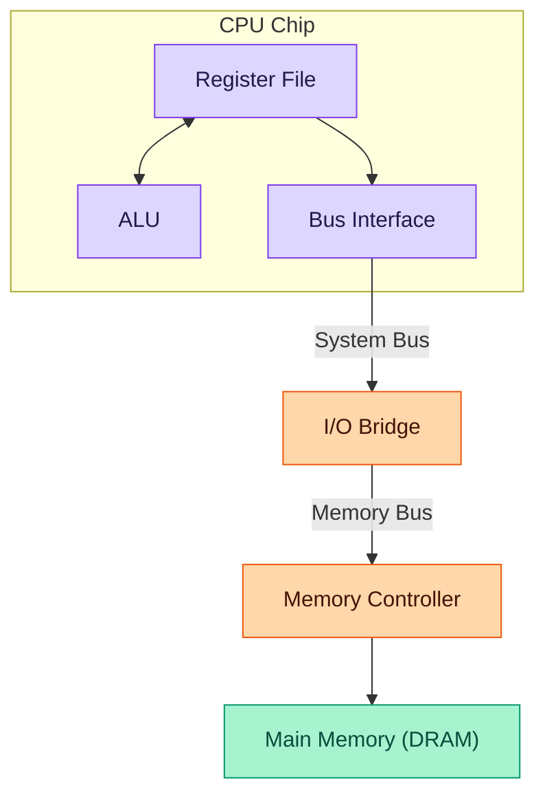
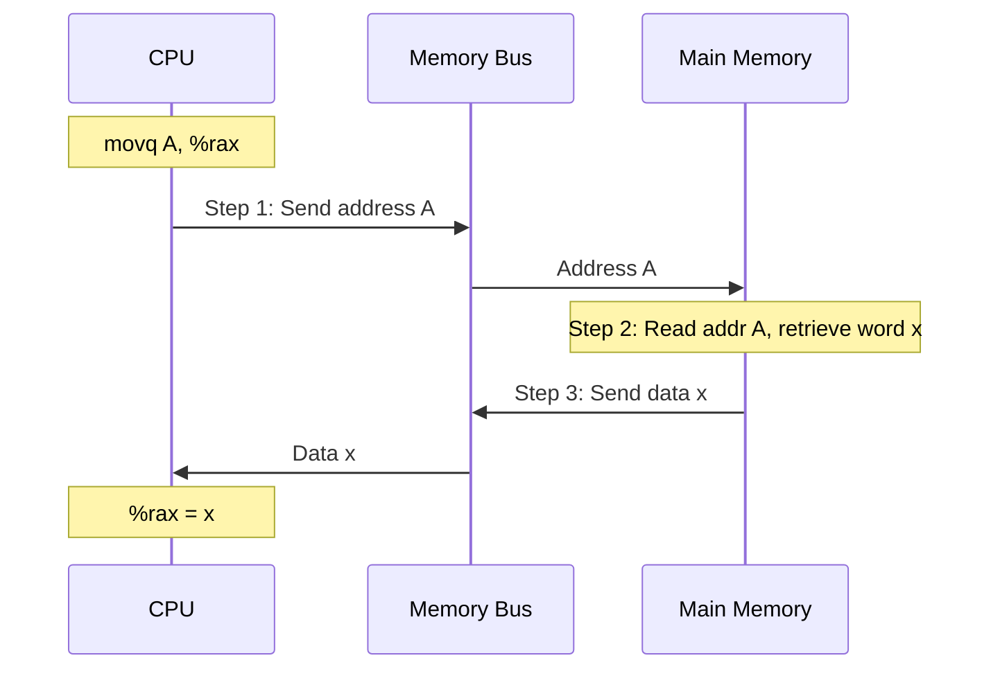
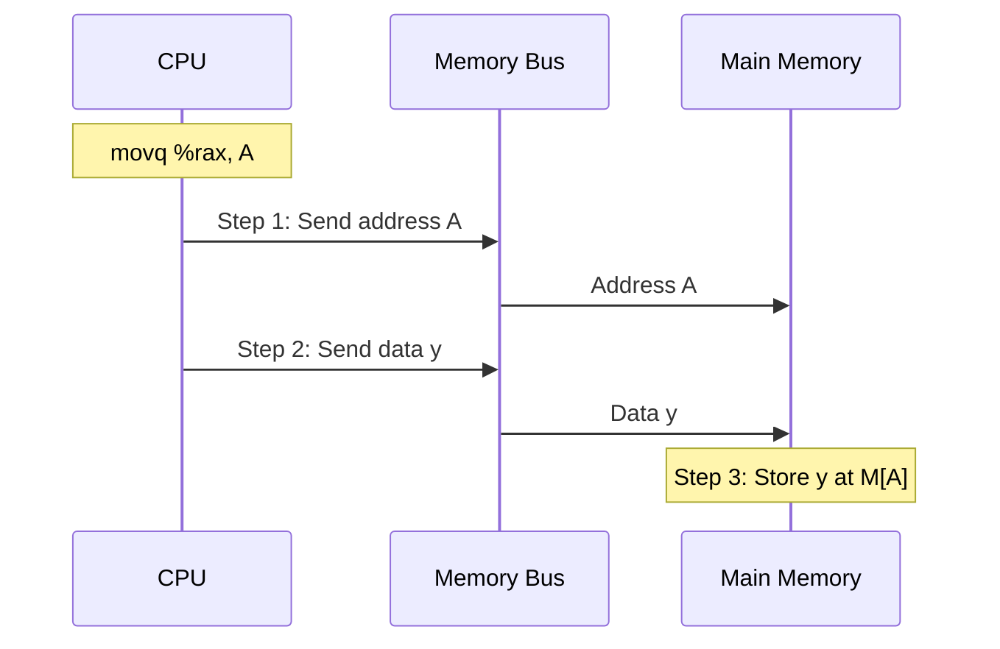
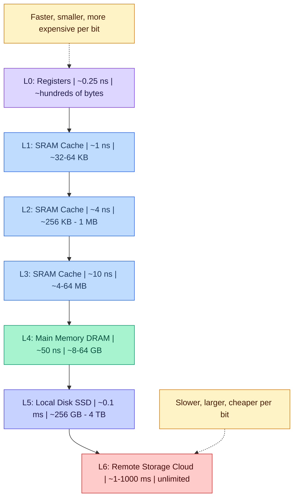
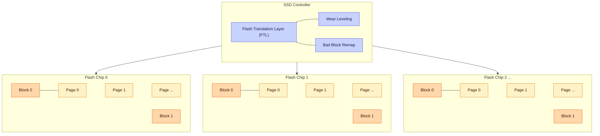

# The Memory Hierarchy — Lecture 9 Study Notes

---

| **Field**        | **Detail**                                                        |
|------------------|-------------------------------------------------------------------|
| **Course**       | 15-213 / 14-513 / 15-513: Introduction to Computer Systems (CMU) |
| **Lecture**       | 9 — *The Memory Hierarchy*                                       |
| **Date**         | September 23, 2025                                                |
| **Textbook**     | CS:APP3e (Bryant & O'Hallaron), Chapter 6                        |
| **Sections**     | 6.1.1, 6.1.2–6.1.4, 6.2, 6.3                                   |
| **Slides**       | 74 slides (including supplemental)                                |
| **Source**       | Carnegie Mellon University — School of Computer Science           |

---

## Table of Contents

- [The Memory Hierarchy — Lecture 9 Study Notes](#the-memory-hierarchy--lecture-9-study-notes)
  - [Table of Contents](#table-of-contents)
  - [1. Announcements \& Logistics](#1-announcements--logistics)
  - [2. Memory Abstraction: Why Memory Matters](#2-memory-abstraction-why-memory-matters)
    - [Why do processors need data?](#why-do-processors-need-data)
    - [Two Fundamental Operations](#two-fundamental-operations)
  - [3. The CPU–Memory Bus](#3-the-cpumemory-bus)
    - [What Is a Bus?](#what-is-a-bus)
    - [Bus Characteristics](#bus-characteristics)
    - [Path of a Memory Access](#path-of-a-memory-access)
  - [4. Memory Read \& Write Transactions](#4-memory-read--write-transactions)
    - [Memory Read Transaction (Load)](#memory-read-transaction-load)
    - [Memory Write Transaction (Store)](#memory-write-transaction-store)
  - [5. Random-Access Memory (RAM)](#5-random-access-memory-ram)
    - [5.1 DRAM — Dynamic RAM](#51-dram--dynamic-ram)
    - [5.2 SRAM — Static RAM](#52-sram--static-ram)
    - [5.3 SRAM vs DRAM Comparison](#53-sram-vs-dram-comparison)
    - [Student Q\&A — Is Memory *Inherently* Slower?](#student-qa--is-memory-inherently-slower)
    - [5.4 DRAM Organization \& Enhanced DRAMs](#54-dram-organization--enhanced-drams)
      - [16 × 8 DRAM Chip Example](#16--8-dram-chip-example)
      - [Enhanced DRAM Technologies](#enhanced-dram-technologies)
    - [5.5 Memory Modules](#55-memory-modules)
  - [6. The CPU–Memory Gap](#6-the-cpumemory-gap)
    - [6.1 Historical Clock Rates](#61-historical-clock-rates)
    - [6.2 The Memory Wall / Von Neumann Bottleneck](#62-the-memory-wall--von-neumann-bottleneck)
    - [6.3 Multi-Core \& Memory Pressure](#63-multi-core--memory-pressure)
  - [7. Locality of Reference](#7-locality-of-reference)
    - [Principle of Locality](#principle-of-locality)
    - [7.1 Temporal Locality](#71-temporal-locality)
    - [7.2 Spatial Locality](#72-spatial-locality)
    - [7.3 Working Set](#73-working-set)
    - [7.4 Locality Code Examples](#74-locality-code-examples)
      - [Example 1: Simple Array Sum — Good Locality](#example-1-simple-array-sum--good-locality)
      - [Example 2: Row-Major 2D Array Access — GOOD Locality](#example-2-row-major-2d-array-access--good-locality)
      - [Example 3: Column-Major 2D Array Access — BAD Locality](#example-3-column-major-2d-array-access--bad-locality)
      - [Example 4: 3D Array Access — Which Loop Order?](#example-4-3d-array-access--which-loop-order)
  - [8. The Memory Hierarchy](#8-the-memory-hierarchy)
    - [8.1 Why a Hierarchy?](#81-why-a-hierarchy)
    - [8.2 Example Memory Hierarchy (Pyramid)](#82-example-memory-hierarchy-pyramid)
    - [The Big Idea](#the-big-idea)
    - [8.3 Cache vs Memory](#83-cache-vs-memory)
    - [Student Q\&A — Is the Stack Put in Cache?](#student-qa--is-the-stack-put-in-cache)
  - [9. General Cache Concepts](#9-general-cache-concepts)
    - [Block-Based Transfers](#block-based-transfers)
    - [9.1 Hit \& Miss](#91-hit--miss)
    - [9.2 Three Types of Cache Misses](#92-three-types-of-cache-misses)
      - [1. Cold (Compulsory) Miss](#1-cold-compulsory-miss)
      - [2. Capacity Miss](#2-capacity-miss)
      - [3. Conflict Miss](#3-conflict-miss)
    - [9.3 Cold Cache Miss Calculation](#93-cold-cache-miss-calculation)
  - [10. Storage Technologies](#10-storage-technologies)
    - [10.1 Magnetic Disk Drives](#101-magnetic-disk-drives)
      - [Internal Components](#internal-components)
      - [Disk Geometry](#disk-geometry)
    - [10.2 Disk Geometry \& Capacity](#102-disk-geometry--capacity)
    - [10.3 Disk Access Time Calculation](#103-disk-access-time-calculation)
      - [Worked Example](#worked-example)
      - [Comparison with SRAM and DRAM](#comparison-with-sram-and-dram)
    - [10.4 Nonvolatile Memories \& Flash](#104-nonvolatile-memories--flash)
      - [Flash Memory Details](#flash-memory-details)
    - [10.5 Solid State Disks (SSDs)](#105-solid-state-disks-ssds)
      - [SSD Performance Benchmarks (Samsung 970 EVO Plus)](#ssd-performance-benchmarks-samsung-970-evo-plus)
    - [10.6 SSD vs Rotating Disk Tradeoffs](#106-ssd-vs-rotating-disk-tradeoffs)
  - [11. Key Takeaways](#11-key-takeaways)
  - [12. Code Examples Summary](#12-code-examples-summary)
    - [Assembly — Memory Load](#assembly--memory-load)
    - [Assembly — Memory Store](#assembly--memory-store)
    - [C — Simple Array Sum (Good Locality)](#c--simple-array-sum-good-locality)
    - [C — 2D Array Row-Major Access (GOOD Locality)](#c--2d-array-row-major-access-good-locality)
    - [C — 2D Array Column-Major Access (BAD Locality)](#c--2d-array-column-major-access-bad-locality)
    - [C — 3D Array Access (Analyze Stride)](#c--3d-array-access-analyze-stride)
    - [C — Cold Miss Counting Example](#c--cold-miss-counting-example)
  - [13. Formulas \& Calculations Summary](#13-formulas--calculations-summary)
    - [Bus Metrics](#bus-metrics)
    - [DRAM Access Pattern](#dram-access-pattern)
    - [Memory Hierarchy Approximate Latencies](#memory-hierarchy-approximate-latencies)
    - [Cold Cache Miss Count](#cold-cache-miss-count)
    - [Disk Capacity](#disk-capacity)
    - [Disk Access Time](#disk-access-time)
    - [Speed Comparisons](#speed-comparisons)
    - [SRAM vs DRAM Quick Reference](#sram-vs-dram-quick-reference)
  - [14. Glossary](#14-glossary)
  - [15. References](#15-references)

---

## 1. Announcements & Logistics

📊 **Slide 3**

| **Item**                          | **Due / Release**          |
|-----------------------------------|----------------------------|
| Written #3 peer review            | Due now                    |
| Written #4                        | Due now                    |
| Attack Lab                        | Due **Thursday**           |
| Cache Lab                         | Goes out **Thursday**      |
| Recitation (Caches & C Review)    | **Friday**                 |
| Written #5                        | Goes out (date TBA)        |
| Bootcamp video — C Programming    | Released **Sunday**        |

---

## 2. Memory Abstraction: Why Memory Matters

📊 **Slides 4–5**

### Why do processors need data?

Most computations are **not** pure arithmetic on register values. They:

- Need **complex input** (arrays, structs, strings, files).
- Have **side effects** (writing results to memory or I/O devices).

Data is stored in **"memory"** — but the term hides enormous complexity. Memory is **byte-addressable**: every byte has a unique address starting from 0, 1, 2, … up to some maximum determined by the address space.

### Two Fundamental Operations

| Operation | Direction           | x86 Example                | Also Called |
|-----------|---------------------|----------------------------|-------------|
| **Write** | CPU → Memory        | `movq %rax, 8(%rsp)`      | **Store**   |
| **Read**  | Memory → CPU        | `movq 8(%rsp), %rax`      | **Load**    |

```asm
# STORE — transfer data FROM register TO memory
movq %rax, 8(%rsp)       # M[rsp+8] ← rax

# LOAD  — transfer data FROM memory TO register
movq 8(%rsp), %rax       # rax ← M[rsp+8]
```

> In x86 you have a load-store architecture with some instructions allowing one memory operand — but at the hardware level, every memory access still goes through the bus.

---

## 3. The CPU–Memory Bus

📊 **Slides 6–7, 11**

### What Is a Bus?

A **bus** is a collection of **parallel wires** that carry three kinds of signals:

1. **Address signals** — which memory location?
2. **Data signals** — what value?
3. **Control signals** — read or write? ready? acknowledge?

Buses are **shared** by multiple devices (CPU, memory, I/O devices).

### Bus Characteristics

> A bus is basically a high-speed, low-latency, reliable network — contrast that with the Internet. When you think about Comcast or Verizon, you think about latency, packet loss, unreliable delivery. A bus is the opposite of that.

**Two key metrics:**

| Metric        | Analogy                      | Meaning                                |
|---------------|------------------------------|----------------------------------------|
| **Bandwidth** | Lanes on a highway           | How much data per unit time            |
| **Latency**   | Speed limit / travel time    | Time for a single request to complete  |

> Ping time measures latency — you send a request, you get a reply. Bandwidth is like lanes on a highway — more lanes, more cars per second.

> Speed of light isn't getting faster. If you Skype someone in India or China, that latency is physics — nothing software can fix.

### Path of a Memory Access



The **ALU + register file** operate at full processor speed — zero extra delay.
As soon as you access **memory**, you must cross the **I/O bridge** and traverse the **system bus → memory bus → memory → back**. This crossing is the source of the CPU–Memory gap.

---

## 4. Memory Read & Write Transactions

📊 **Slides 12–17**

### Memory Read Transaction (Load)

```asm
movq A, %rax          # Load word at address A into %rax
```

**Step-by-step:**



### Memory Write Transaction (Store)

```asm
movq %rax, A          # Store contents of %rax to address A
```

**Step-by-step:**



---

## 5. Random-Access Memory (RAM)

📊 **Slides 18–21**

RAM is packaged as a **chip** or **embedded** directly in the processor die. The basic storage unit is a **cell** (stores 1 bit). Multiple chips are combined to form a complete memory system.

There are **two** main varieties:

### 5.1 DRAM — Dynamic RAM

- **1 transistor + 1 capacitor** per bit.
- The capacitor is built **vertically** (trench or stacked) to save area.
- Charge **leaks** → must be **refreshed** every 10–100 ms.
- Relatively **cheap** and **dense** — the workhorse of main memory.

> DRAM is great because it's relatively cheap, random access, relatively fast — but WAY slower than the processor.

**How does refresh work?**

> The professor admitted: "I'd need the 20-year-old version of me to explain the refresh circuit in full detail." But the key point is that refresh happens **on the DRAM chip itself**, not from the system memory controller. The chip's internal circuitry periodically re-reads and re-writes every row to restore charge.

> This is what cramming is bad — professor's humorous aside about forgetting the details of DRAM refresh circuits.

### 5.2 SRAM — Static RAM

- **4–6 transistors** per bit (typically 6).
- Holds state **indefinitely** as long as power is applied — no refresh needed.
- Much **faster** than DRAM but far more **expensive** and **less dense**.
- Used for **cache memories** (L1, L2, L3).

### 5.3 SRAM vs DRAM Comparison

📊 **Slide 21**

| Property                  | SRAM              | DRAM               |
|---------------------------|--------------------|--------------------|
| Transistors per bit       | 6–8                | 1                  |
| Relative access time      | 1×                 | ~10×               |
| Needs refresh?            | No                 | Yes                |
| Relative cost per bit     | ~100×              | 1×                 |
| Typical use               | Cache memories     | Main memory        |
| Persistent?               | Yes (while powered)| Must refresh       |
| Sensitivity to noise      | Low                | High               |

### Student Q&A — Is Memory *Inherently* Slower?

> **Student:** "Is memory inherently slower than the processor?"
>
> **Professor:** "No fundamental reason. Three engineering constraints make it slower:
> 1. **Processor size limits** — the entire CPU die must stay synchronized at clock speed; making it larger breaks timing.
> 2. **Faster memory circuitry is hard to build** — you can build very fast small arrays (that's what SRAM is), but it's extremely expensive.
> 3. **The addressing problem** — 16 registers? Easy to decode. Billions of memory addresses? Enormously more complex routing and decode logic."

### 5.4 DRAM Organization & Enhanced DRAMs

📊 **Slides 57–60** (supplemental)

#### 16 × 8 DRAM Chip Example

A small DRAM organized as a **4 × 4 array** of **supercells**, each holding 8 bits. Total = 16 supercells × 8 bits = 128 bits (16 bytes).

```
              Column
          0     1     2     3
       ┌─────┬─────┬─────┬─────┐
  R 0  │ SC  │ SC  │ SC  │ SC  │   ← 4 supercells per row
  o    ├─────┼─────┼─────┼─────┤
  w 1  │ SC  │ SC  │ SC  │ SC  │
       ├─────┼─────┼─────┼─────┤
    2  │ SC  │ SC  │ SC  │ SC  │
       ├─────┼─────┼─────┼─────┤
    3  │ SC  │ SC  │ SC  │ SC  │
       └─────┴─────┴─────┴─────┘
                  │
                  ▼
             ┌────────────┐
             │ Row Buffer  │  (copies of one full row)
             └────────────┘
                  │
              data out (8 bits)
```

**Access protocol (two-step):**

1. **RAS (Row Access Strobe):** Supply the row address → the entire row is copied into the **row buffer**.
2. **CAS (Column Access Strobe):** Supply the column address → the desired supercell is read from the row buffer.

> There's actually **spatial locality within DRAM access** itself. If you're accessing addresses sequentially within the same row, you don't need to re-copy the row to the buffer — just keep issuing CAS commands. This is why stride-1 access patterns are faster even at the DRAM level.

#### Enhanced DRAM Technologies

📊 **Slides 57–58** (supplemental)

| Technology | Key Improvement                                                     |
|------------|---------------------------------------------------------------------|
| **FPM**    | Fast Page Mode — reuse row buffer for consecutive column accesses   |
| **EDO**    | Extended Data Out — overlap CAS signals                             |
| **SDRAM**  | Synchronous — driven by system clock, allows burst transfers        |
| **DDR**    | Double Data Rate — data on **both** rising and falling clock edges  |
| **DDR2**   | Higher clock freq, lower voltage than DDR                           |
| **DDR3**   | Higher clock freq, lower voltage than DDR2                          |
| **DDR4**   | Higher clock freq, lower voltage than DDR3                          |

> SDRAM allows reuse of row addresses — you do a RAS then multiple CAS commands. DDR means double data rate: you transfer data on both the rising and falling edges of the clock.

> DRAM access time is 30–50 ns, but the full transfer to the register can take 3× more.

### 5.5 Memory Modules

📊 **Slide 60** (supplemental)

A typical memory module (DIMM) spreads a 64-bit word across **8 DRAM chips** in parallel. Each chip provides **8 bits** simultaneously.

```
   Address A ─────────────────────────────────────────────►

   ┌──────┐ ┌──────┐ ┌──────┐ ┌──────┐ ┌──────┐ ┌──────┐ ┌──────┐ ┌──────┐
   │Chip 0│ │Chip 1│ │Chip 2│ │Chip 3│ │Chip 4│ │Chip 5│ │Chip 6│ │Chip 7│
   │ 8bit │ │ 8bit │ │ 8bit │ │ 8bit │ │ 8bit │ │ 8bit │ │ 8bit │ │ 8bit │
   └──┬───┘ └──┬───┘ └──┬───┘ └──┬───┘ └──┬───┘ └──┬───┘ └──┬───┘ └──┬───┘
      │        │        │        │        │        │        │        │
      └────────┴────────┴────────┴────────┴────────┴────────┴────────┘
                                    │
                            64-bit data word
                                    │
                                    ▼
                              Memory Bus
```

> We write eight bytes in parallel to eight different DRAM modules.

---

## 6. The CPU–Memory Gap

📊 **Slides 8–9, 23**

### 6.1 Historical Clock Rates

📊 **Slides 8, 57–58** (supplemental)

| Year  | Approx. CPU Clock Speed | Notes                           |
|-------|------------------------|---------------------------------|
| 1980  | ~1 MHz (4.77 MHz PC)   | Simple processors               |
| 1990  | ~20 MHz                | 486-era                         |
| 1995  | ~150 MHz               | Pentium Pro era                 |
| 2003  | ~3.3 GHz               | Pentium 4 peak                  |
| 2005+ | ~3–5 GHz               | **Power wall** — clock stopped rising |

```
  Speed
  (log)
    │
    │                              CPU ●──────────────── (flat after ~2003)
    │                         ●
    │                    ●
    │               ●
    │          ●         ╱─── Gap widens! ───╲
    │     ●         ●
    │  ●       ●              DRAM ●─────────── (slow improvement)
    │●    ●
    │●                               SSD ●──── (enters ~2007)
    │●  ●
    │● ●                                   Disk ●── (nearly flat)
    ├──────────────────────────────────────────────── Year
   1980  1985  1990  1995  2000  2005  2010  2015
```

### 6.2 The Memory Wall / Von Neumann Bottleneck

📊 **Slide 9**

The **memory wall** (also called the **Von Neumann bottleneck**) is the growing performance gap between CPU computation speed and data storage/retrieval speed.

> About 1/3 of instructions are loads or stores. So even if the CPU is blazing fast, it's stalled waiting for memory a huge fraction of the time.

Three approaches to dealing with the memory wall:

| Approach                         | Course      | Idea                                                  |
|----------------------------------|-------------|-------------------------------------------------------|
| **Build a memory hierarchy**     | 15-213      | Use caches to keep frequently used data close to CPU  |
| **Find other stuff to do**       | 15-346, 418 | Overlap computation with memory access (ILP, OoO)     |
| **Move computation to data**     | 15-346, 7xx | Near-data processing, PIM                             |

### 6.3 Multi-Core & Memory Pressure

📊 **Slide 9** (transcript context)

After ~2003, CPU designers **couldn't** raise clock speeds economically (the **power wall**). The response was **multi-core**:

- AMD pivoted to multi-core first; Intel followed.
- But more cores = **more memory pressure**.
- Each core issues its own loads and stores, all competing for the same memory bus.

> When they went from 1 core to 2 cores, memory didn't get twice as fast. So the gap actually got *worse* per-core for multi-threaded workloads.

---

## 7. Locality of Reference

📊 **Slides 22–29**

### Principle of Locality

Programs tend to use data and instructions with addresses **near** or **equal to** those that have been recently used.

Two forms:

### 7.1 Temporal Locality

**Recently** referenced items are likely to be referenced **again** in the near future.

> Recent past is a good indicator of near future.

Examples:
- Loop variable `sum` accessed every iteration.
- Instructions inside a loop body executed repeatedly.
- Stack frames for recursive calls.

> It's like the stock market — your best predictor of tomorrow's price is today's price.

### 7.2 Spatial Locality

Items with **nearby** addresses tend to be referenced **close together in time**.

Examples:
- Iterating through an array element by element.
- Sequential instruction fetch (PC increments by instruction size).

> If you've just accessed element 5 of an array, you'll probably access element 6 next.

### 7.3 Working Set

📊 **Slide 43**

The **working set** is the set of data a program is currently working on. Locality reduces the effective size of the working set.

> **Professor's "Collaborative Commons" analogy:** "Walking through the collaborative commons at night — you can tell what students are working on by what's on their desk: a textbook, some code printouts, an Intel manual. That desk IS their working set for the current task."

> **Airplane seat analogy (for capacity):** "You need your laptop, a book, a notebook, and a coffee — but you only have THIS MUCH space. So now you're shuffling things back and forth from your lap to the tray and back. That's a capacity miss — your 'cache' (the tray table) is smaller than your working set."

> We use spatial and temporal locality to **estimate** the working set.

### 7.4 Locality Code Examples

#### Example 1: Simple Array Sum — Good Locality

📊 **Slide 26**

```c
long sum = 0;
for (int i = 0; i < n; i++)
    sum += a[i];
return sum;
```

| Element       | Locality Type | Explanation                                         |
|---------------|---------------|-----------------------------------------------------|
| `a[i]`        | **Spatial**   | Array elements accessed in order (stride-1)         |
| `sum`         | **Temporal**  | Same variable read/written every iteration          |
| Instructions  | **Spatial**   | PC moves sequentially through loop body             |
| Loop body     | **Temporal**  | Same instructions re-executed each iteration        |

#### Example 2: Row-Major 2D Array Access — GOOD Locality

📊 **Slide 27**

```c
int sum_array_rows(int a[M][N])
{
    int i, j, sum = 0;
    for (i = 0; i < M; i++)          // outer loop over rows
        for (j = 0; j < N; j++)      // inner loop over columns
            sum += a[i][j];
    return sum;
}
```

**Why good?** In C, 2D arrays are stored in **row-major** order:

```
Memory layout of a[M][N]:

  a[0][0]  a[0][1]  a[0][2] ... a[0][N-1]  a[1][0]  a[1][1] ...
  ◄──────── Row 0 ──────────►  ◄──── Row 1 ────...

  Access pattern:  →  →  →  →  →  →  →  →  →  →   (stride-1, sequential)
```

This is **stride-1** access — consecutive memory locations. **Excellent spatial locality!**

#### Example 3: Column-Major 2D Array Access — BAD Locality

📊 **Slide 28**

```c
int sum_array_cols(int a[M][N])
{
    int i, j, sum = 0;
    for (j = 0; j < N; j++)          // outer loop over columns
        for (i = 0; i < M; i++)      // inner loop over rows
            sum += a[i][j];
    return sum;
}
```

**Why bad?** Accessing `a[0][j]`, `a[1][j]`, `a[2][j]`, … jumps by `N * sizeof(int)` bytes each step.

```
Memory layout:
  a[0][0]  a[0][1]  a[0][2] ... a[0][N-1]  a[1][0]  a[1][1] ...

  Access:  ↓ (skip N)   ↓ (skip N)   ↓ (skip N) ...

  = stride-N access pattern — BAD spatial locality!
```

> A simple, tiny little change — just swapping which loop is inner vs outer — can make a **big** difference in performance.

> On a small example you might not notice because the block size might be big enough to cover a whole column. But as the array grows, the penalty becomes severe.

[Note: If M is very small (e.g., M=2), the data may still fit in one or two cache lines, and performance may not suffer much. The penalty grows as M increases.]

#### Example 4: 3D Array Access — Which Loop Order?

📊 **Slide 29**

```c
int sum_array_3d(int a[M][N][N])
{
    int i, j, k, sum = 0;
    for (i = 0; i < M; i++)
        for (j = 0; j < N; j++)
            for (k = 0; k < N; k++)
                sum += a[k][i][j];
    return sum;
}
```

**Analysis:** The array index `a[k][i][j]` has:
- `j` changing fastest (innermost loop) → **rightmost** index changes fastest ✓
- But `k` is the **leftmost** index and changes in the **outermost** of the three array indices used, yet `k` is in the *middle* loop while `i` is truly outermost.

Wait — let's re-examine. The loops from outer to inner are: `i`, `j`, `k`. The access is `a[k][i][j]`.

- `k` (innermost loop) changes the **leftmost** array dimension → stride = `N*N*sizeof(int)` → **BAD**.

**Fix:** Make `j` the innermost loop for stride-1 access, matching the rightmost array index:

For `a[k][i][j]`:
- Rightmost index = `j` → make `j` the innermost loop.
- Then `i` second.
- Then `k` outermost.

```c
// Better loop order for a[k][i][j]:
for (k = 0; k < M; k++)
    for (i = 0; i < N; i++)
        for (j = 0; j < N; j++)
            sum += a[k][i][j];
```

**Rule of thumb:** The innermost loop's variable should be the **rightmost** index of the array being accessed (for C's row-major layout).

---

## 8. The Memory Hierarchy

📊 **Slides 30–36**

### 8.1 Why a Hierarchy?

Three facts that complement each other:

1. **Faster storage** = more $/bit, less capacity, more power.
2. The **CPU–memory gap** keeps widening.
3. Well-written programs exhibit **locality**.

These three facts together motivate a **hierarchy** of storage levels, each acting as a cache for the level below.

### 8.2 Example Memory Hierarchy (Pyramid)

📊 **Slide 33**



**Key insight:** Each level **k** serves as a **cache** for level **k+1**.

> SRAM costs about 100× DRAM, but is 10× faster.

### The Big Idea

📊 **Slides 34–35**

> **Big Idea:** The hierarchy creates a pool of storage that **costs** like the cheap technology at the bottom but **serves data** at the speed of the fast technology at the top — as long as programs have good locality.

### 8.3 Cache vs Memory

📊 **Slide 36**

| Property          | Cache                        | Memory                          |
|-------------------|------------------------------|---------------------------------|
| Visible to SW?    | **No** (invisible, HW-managed) | **Yes** (addressable by ISA)  |
| Managed by        | Hardware (cache controller)  | OS + programmer                 |
| Address space     | Not directly addressable     | Byte-addressable (0, 1, 2, …) |

### Student Q&A — Is the Stack Put in Cache?

> **Student:** "Is the stack put in cache?"
>
> **Professor:** "Yes! Stack, heap, text area — all of them are addressed in the same virtual address space, and all of them can be cached. The stack gets cached through temporal locality — you keep accessing the same stack frame. Even though stack and code may not be spatially near each other, they each independently benefit from locality."

---

## 9. General Cache Concepts

📊 **Slides 37–44**

### Block-Based Transfers

Memory is logically partitioned into fixed-size **blocks** (also called **cache lines**). Data is always copied between levels in **block-sized** units.

```
   Level k (cache):
   ┌─────┬─────┬─────┬─────┬─────┬─────┬─────┬─────┐
   │  0  │  1  │  2  │  3  │     │     │     │     │
   └─────┴─────┴─────┴─────┴─────┴─────┴─────┴─────┘
          ▲ ▲ ▲ ▲
          │ │ │ │   (subset of blocks from level k+1)
          │ │ │ │
   Level k+1 (memory):
   ┌─────┬─────┬─────┬─────┬─────┬─────┬─────┬─────┬─────┬─────┬──...
   │  0  │  1  │  2  │  3  │  4  │  5  │  6  │  7  │  8  │  9  │
   └─────┴─────┴─────┴─────┴─────┴─────┴─────┴─────┴─────┴─────┴──...
```

### 9.1 Hit & Miss

📊 **Slides 38–39**

**Cache Hit:** Program needs block **b**, and **b is already in the cache**.
- ✅ Fast! Served from the cache.

**Cache Miss:** Program needs block **b**, and **b is NOT in the cache**.
- ❌ Slow! Must fetch **b** from the next level down.
- Two policies come into play:
  - **Placement policy:** Where can the fetched block be stored in the cache?
  - **Replacement policy (eviction):** If the cache is full, which existing block (the **victim**) gets evicted?

```mermaid
flowchart TD
    subgraph HIT["Cache Hit"]
        REQ1["Request: block b"] --> CHECK1["Check Cache"]
        CHECK1 -->|"b found!"| RET["Return b (fast)"]
    end

    subgraph MISS["Cache Miss"]
        REQ2["Request: block b"] --> CHECK2["Check Cache"]
        CHECK2 -->|"b NOT found"| FETCH["Fetch b from Memory"]
        FETCH --> PLACE["Place b in Cache"]
        PLACE -->|"may evict victim"| RET2["Return b (slow)"]
    end

    classDef cache fill:#bfdbfe,stroke:#2563eb,color:#1e3a5f
    classDef mem fill:#a7f3d0,stroke:#059669,color:#064e3b
    classDef disk fill:#fecaca,stroke:#dc2626,color:#450a0a
    classDef highlight fill:#fef3c7,stroke:#d97706,color:#451a03

    class CHECK1,CHECK2 cache
    class FETCH mem
    class RET highlight
    class RET2,PLACE disk
```



### 9.2 Three Types of Cache Misses

📊 **Slides 40–41**

#### 1. Cold (Compulsory) Miss

The **very first** reference to a block. The cache starts empty, so any first access is guaranteed to miss.

> Just turned on the machine, cache is empty — nothing we can do about cold misses.

#### 2. Capacity Miss

The program's **working set** is larger than the cache. Even if we had a perfect replacement policy, we'd still miss because there's simply not enough room.

> **Airplane analogy:** "You need your laptop, a book, a notebook, and a coffee — but you only have THIS MUCH space on the tray table. That's a capacity miss."

#### 3. Conflict Miss

The cache is **large enough** to hold the working set, but the **placement/mapping** rules cause blocks to collide.

Example: blocks 0 and 8 both map to the **same cache position**. Accessing 0, 8, 0, 8, 0, 8 causes a miss every time even though the cache has plenty of room overall.

```
  Access sequence:  Block 0 → Block 8 → Block 0 → Block 8 → ...

  Cache set 0:
    Iteration 1:  [Block 0]       ← cold miss
    Iteration 2:  [Block 8]       ← conflict miss (evicts Block 0)
    Iteration 3:  [Block 0]       ← conflict miss (evicts Block 8)
    Iteration 4:  [Block 8]       ← conflict miss (evicts Block 0)
    ...                           ← thrashing! 100% miss rate
```

### 9.3 Cold Cache Miss Calculation

📊 **Slide 44**

```c
for (int i = 0; i < 16; i++)
    sum += a[i];
```

**Question:** How many cold cache misses occur?

**Given assumptions:**
- Cache is **initially empty** (cold start).
- Each cache block holds **8** `int`-sized elements.
- Array `a` is **aligned** to block boundaries.

**Calculation:**

```
Total elements accessed:  16

Elements per cache block: 8

Number of distinct blocks touched: 16 / 8 = 2

Cold misses = number of distinct blocks = 2
```

- **Miss 1:** Access `a[0]` → block not in cache → **cold miss** → fetches `a[0]..a[7]` into cache.
- Accesses `a[1]` through `a[7]` → all **hits** (same block).
- **Miss 2:** Access `a[8]` → new block → **cold miss** → fetches `a[8]..a[15]` into cache.
- Accesses `a[9]` through `a[15]` → all **hits**.

**Result: 2 cold misses, 14 hits → miss rate = 2/16 = 12.5%**

**Factors that affect this count:**
1. Were elements already cached? (assumes no)
2. How many elements fit per block? (given: 8)
3. Is the array aligned to block boundaries? (assumes yes)

[Note: If the array were *not* aligned — e.g., starting at element 3 within a block — the first block would hold elements 3–7 (only 5), and we'd need 3 blocks total for 16 elements → 3 cold misses.]

---

## 10. Storage Technologies

📊 **Slides 46–55**

### 10.1 Magnetic Disk Drives

📊 **Slides 47–50**

Disk drives are **electromechanical** devices — they have physical **moving parts**.

#### Internal Components

```
            ┌─────────────────────────────┐
            │       Disk Drive            │
            │                             │
            │    ┌─────────┐              │
            │    │ Platter │──┐           │
            │    │ (top)   │  │           │
            │    ├─────────┤  │ Spindle   │
            │    │ Platter │  │ (motor)   │
            │    │ (bot)   │──┘           │
            │    └─────────┘              │
            │         ▲                   │
            │    ┌────┴────┐              │
            │    │  Arm    │◄── Actuator  │
            │    │ (heads) │              │
            │    └─────────┘              │
            │                             │
            │    [ Electronics ]          │
            └─────────────────────────────┘
```

> Heads have to move, the disk spins, you need to energize the motor, swing the arm, hit the brakes, wait for oscillation to dampen…

#### Disk Geometry

- **Platter:** A flat circular disk, coated with magnetic material on both **surfaces**.
- **Surface:** Each platter has 2 recording surfaces.
- **Track:** A concentric circle on a surface.
- **Sector:** A fixed-size arc of a track (the minimum unit of read/write). Typical sector = 512 bytes.
- **Gap:** Space between sectors (no data stored here).
- **Cylinder:** The set of tracks at the same radial position across all surfaces.
- **Zone:** A group of consecutive cylinders. Outer zones have **more sectors per track** than inner zones (because the circumference is larger).

```
  Top view of a platter surface:

        ╭──────────────────────────╮
       ╱    ╭──────────────╮        ╲
      │    ╱  ╭──────────╮  ╲        │
      │   │  ╱ ╭──────╮  ╲  │        │
      │   │ │  │Spindle│  │  │        │   ← Concentric tracks
      │   │  ╲ ╰──────╯  ╱  │        │
      │    ╲  ╰──────────╯  ╱        │
       ╲    ╰──────────────╯        ╱
        ╰──────────────────────────╯

  Each track divided into sectors:

  ──[Sector 0][gap][Sector 1][gap][Sector 2]──...──[Sector N]──
```

### 10.2 Disk Geometry & Capacity

📊 **Slide 50**

**Disk Capacity Formula:**

```
Capacity = (bytes/sector) × (sectors/track) × (tracks/surface)
         × (surfaces/platter) × (platters/disk)
```

### 10.3 Disk Access Time Calculation

📊 **Slides 50, 63–64** (supplemental)

Disk access time has three components:

```
T_access = T_seek + T_rotation + T_transfer
```

| Component       | What it measures                                            |
|-----------------|-------------------------------------------------------------|
| **T_seek**      | Time to move the arm to the correct track (cylinder)        |
| **T_rotation**  | Time for the desired sector to spin under the head          |
| **T_transfer**  | Time to read the bits as they pass under the head           |

#### Worked Example

**Given:**
- Rotational speed = **7,200 RPM**
- Average seek time = **9 ms**
- Average sectors per track = **400**

**Step 1: Average Rotational Latency (T_rotation)**

Average case = half a revolution:

```
T_rotation = (1/2) × (60 sec / 7200 rev) × 1000 ms/sec

           = (1/2) × (60 / 7200) × 1000

           = (1/2) × 0.00833 × 1000

           = (1/2) × 8.33 ms

           = 4.17 ms  ≈  4 ms
```

**Step 2: Transfer Time (T_transfer)**

Time to read one sector:

```
T_transfer = (60 / 7200) × (1 / 400) × 1000

           = 0.00833 × 0.0025 × 1000

           = 0.0208 ms

           ≈ 0.02 ms
```

**Step 3: Total Access Time**

```
T_access = T_seek + T_rotation + T_transfer

         = 9 ms + 4 ms + 0.02 ms

         = 13.02 ms
```

> Access time is totally dominated by seek and rotational latency — the actual reading of data is the easy part. The 0.02 ms transfer time is negligible compared to the 13 ms of mechanical delays.

#### Comparison with SRAM and DRAM

```
SRAM access:     ~5 ns     =  0.000005 ms
DRAM access:     ~50 ns    =  0.00005  ms
Disk access:     ~13 ms    = 13 ms

Disk / SRAM  =  13 ms / 0.000005 ms  ≈  2,600,000×  (or ~40,000× for just seek+rot vs SRAM)
Disk / DRAM  =  13 ms / 0.00005 ms   ≈  260,000×    (or ~2,500× for seek+rot vs DRAM)
```

> Disk is about **40,000×** slower than SRAM and about **2,500×** slower than DRAM.

### 10.4 Nonvolatile Memories & Flash

📊 **Slides 51–52**

DRAM and SRAM are **volatile** — they lose data when power is removed.

**Nonvolatile memory** technologies:

| Technology    | Description                                           | Erasings       |
|---------------|-------------------------------------------------------|----------------|
| **ROM**       | Read-Only Memory, programmed at manufacture           | 0 (read-only)  |
| **PROM**      | Programmable ROM — write once                         | 1              |
| **EPROM**     | Erasable PROM — UV light to erase                     | ~1,000         |
| **EEPROM**    | Electrically Erasable PROM — electronic erase         | ~100,000       |
| **Flash**     | Based on EEPROM, block-oriented erase                 | ~100,000       |
| **3D XPoint** | Intel/Micron crosspoint (Optane), byte-addressable    | Very high       |

**Common uses:** Firmware (BIOS), SSDs, disk caches.

#### Flash Memory Details

- NAND-based flash.
- **Wears out** after ~100,000 erasings per block.
- Must erase an entire **block** before writing to any page in it.

> Way too much is made of the wear-out property. It's like 100,000 times — for most use cases, the drive will be obsolete long before it wears out.

### 10.5 Solid State Disks (SSDs)

📊 **Slides 52–54**

SSDs use flash memory organized into **pages** and **blocks**:

| Unit     | Size           | Notes                                          |
|----------|----------------|------------------------------------------------|
| **Page** | 512 B – 4 KB   | Minimum unit of read/write                     |
| **Block**| 32–128 pages   | Minimum unit of **erase**                      |

**Key constraints:**
- Can **read** any page.
- Can **write** a page only if it has been **erased** first.
- Erasing works at the **block** level — erases all pages in the block.
- Each block wears out after ~**10,000** writes (depends on technology).



**Flash Translation Layer (FTL):** Handles wear leveling (distribute writes evenly) and bad block remapping.

#### SSD Performance Benchmarks (Samsung 970 EVO Plus)

📊 **Slides 53–54**

| Operation           | Throughput        |
|---------------------|-------------------|
| Sequential Read     | **2,221 MB/s**    |
| Sequential Write    | **1,912 MB/s**    |
| Random Read         | **61.7 MB/s**     |
| Random Write        | **165 MB/s**      |

**Key observations:**
- Sequential ≫ Random (by ~35× for reads).
- Random writes were historically very slow because: read entire block → erase block → merge old + new data → write back. This is improving rapidly with better FTL algorithms.

> Buy way more memory and less processor for clusters. If systems start swapping to disk, performance completely falls apart.

### 10.6 SSD vs Rotating Disk Tradeoffs

📊 **Slide 55**

| Factor              | SSD                              | Rotating Disk (HDD)            |
|---------------------|----------------------------------|---------------------------------|
| Moving parts        | **None**                         | Spindle, arm, platters          |
| Speed               | **Much faster**                  | Slower (mechanical delays)      |
| Power consumption   | **Lower**                        | Higher (motor)                  |
| Ruggedness          | **More rugged** (no moving parts)| Fragile (head crash risk)       |
| Wear-out            | Yes (~100K erasings/block)       | No (mechanical wear instead)    |
| $/GB                | **More expensive**               | Cheaper per byte                |
| Wear mitigation     | Wear leveling in FTL             | N/A                             |

---

## 11. Key Takeaways

📊 **Slide 56**

1. **The CPU–Memory gap is real and widening.** CPU speeds plateaued around 2003 (power wall), but even before that, DRAM speeds lagged far behind.

2. **Locality is the key to performance.** Programs that exhibit good temporal and spatial locality make effective use of caches and run dramatically faster.

3. **The memory hierarchy exploits locality** to create the illusion of a large, fast memory at low cost. Each level caches the one below it.

4. **Array access order matters enormously in C.** Row-major access (stride-1) is critical for performance with 2D and 3D arrays. The innermost loop variable should correspond to the rightmost array index.

5. **Three types of cache misses:** Cold (unavoidable), Capacity (working set > cache), Conflict (mapping collisions). Understanding these helps you write cache-friendly code.

6. **Storage technologies span 7+ orders of magnitude** in access time — from ~0.25 ns (registers) to ~10 ms (disk). The hierarchy bridges this gap.

7. **SSDs are transformative** — 100–1000× faster than HDDs for random access, with no moving parts — but cost more per byte and have wear limitations.

8. **~1/3 of all instructions are loads or stores.** Memory performance is not a niche concern — it's central to overall system performance.

9. **DRAM technology has remained fundamentally the same since the 1970s.** Improvements (DDR, DDR2–4) are incremental refinements, not architectural revolutions.

10. **Multi-core makes the memory wall worse.** More cores contend for the same memory bandwidth without memory getting proportionally faster.

---

## 12. Code Examples Summary

All code examples from the lecture, consolidated:

### Assembly — Memory Load

```asm
movq A, %rax           # Load: read word at address A into %rax
movq 8(%rsp), %rax     # Load: read word at rsp+8 into %rax
```

### Assembly — Memory Store

```asm
movq %rax, A           # Store: write %rax to address A
movq %rax, 8(%rsp)     # Store: write %rax to rsp+8
```

### C — Simple Array Sum (Good Locality)

```c
long sum = 0;
for (int i = 0; i < n; i++)
    sum += a[i];
return sum;
```

### C — 2D Array Row-Major Access (GOOD Locality)

```c
int sum_array_rows(int a[M][N])
{
    int i, j, sum = 0;
    for (i = 0; i < M; i++)
        for (j = 0; j < N; j++)
            sum += a[i][j];
    return sum;
}
```

### C — 2D Array Column-Major Access (BAD Locality)

```c
int sum_array_cols(int a[M][N])
{
    int i, j, sum = 0;
    for (j = 0; j < N; j++)
        for (i = 0; i < M; i++)
            sum += a[i][j];
    return sum;
}
```

### C — 3D Array Access (Analyze Stride)

```c
// ORIGINAL (bad stride on innermost loop)
int sum_array_3d(int a[M][N][N])
{
    int i, j, k, sum = 0;
    for (i = 0; i < M; i++)
        for (j = 0; j < N; j++)
            for (k = 0; k < N; k++)
                sum += a[k][i][j];
    return sum;
}

// FIXED (stride-1 access: j innermost matches rightmost index)
int sum_array_3d_fixed(int a[M][N][N])
{
    int i, j, k, sum = 0;
    for (k = 0; k < M; k++)
        for (i = 0; i < N; i++)
            for (j = 0; j < N; j++)
                sum += a[k][i][j];
    return sum;
}
```

### C — Cold Miss Counting Example

```c
// How many cold misses with empty cache, 8 elements/block, aligned?
// Answer: 2 cold misses (a[0] and a[8])
for (int i = 0; i < 16; i++)
    sum += a[i];
```

---

## 13. Formulas & Calculations Summary

### Bus Metrics

```
Bandwidth = data transferred / time       (bytes/sec or GB/s)
Latency   = time for single round-trip    (ns or ms)
```

### DRAM Access Pattern

```
Access = RAS (row select) + CAS (column select) + data transfer

Typical DRAM access latency: 30–50 ns
Full transfer to register:   up to 3× the access latency
```

### Memory Hierarchy Approximate Latencies

```
Level     Technology    Typical Latency    Typical Size
─────     ──────────    ───────────────    ────────────
L0        Registers     ~0.25 ns           ~hundreds of B
L1        SRAM          ~1 ns              32–64 KB
L2        SRAM          ~4 ns              256 KB – 1 MB
L3        SRAM          ~10 ns             4–64 MB
L4        DRAM          ~50 ns             8–64 GB
L5        SSD/Flash     ~0.1 ms            256 GB – 4 TB
L6        Disk (HDD)    ~10 ms             1–16 TB
L7        Network       1–1000 ms          "unlimited"
```

### Cold Cache Miss Count

```
Cold misses = ⌈ N / B ⌉

Where:
  N = number of distinct elements accessed
  B = elements per cache block

Example:  N = 16, B = 8  →  cold misses = 16/8 = 2
```

[Note: This assumes aligned access. If unaligned, add 1: ⌈(N + offset) / B⌉]

### Disk Capacity

```
Capacity = (bytes/sector) × (avg sectors/track) × (tracks/surface)
         × (surfaces/platter) × (platters/disk)
```

### Disk Access Time

```
T_access = T_seek + T_rotation + T_transfer
```

**Rotational latency (average = half revolution):**

```
T_rotation = (1/2) × (60 / RPM) × 1000  [ms]
```

**Transfer time (one sector):**

```
T_transfer = (60 / RPM) × (1 / sectors_per_track) × 1000  [ms]
```

**Worked example (7200 RPM, 9 ms seek, 400 sectors/track):**

```
T_rotation = 0.5 × (60/7200) × 1000  = 0.5 × 8.33  = 4.17 ms
T_transfer = (60/7200) × (1/400) × 1000              = 0.02 ms
T_access   = 9 + 4.17 + 0.02                         = 13.19 ms

(Slide rounds to: 9 + 4 + 0.02 = 13.02 ms)
```

### Speed Comparisons

```
Disk vs SRAM:   ~13 ms / ~5 ns    ≈  2,600,000×  slower
                (or ~40,000× commonly cited for seek+rot vs SRAM cycle)

Disk vs DRAM:   ~13 ms / ~50 ns   ≈  260,000×  slower
                (or ~2,500× commonly cited)
```

### SRAM vs DRAM Quick Reference

```
SRAM cost   ≈ 100 × DRAM cost  (per bit)
SRAM speed  ≈ 10 × DRAM speed  (access time)
SRAM size   ≈ 6× transistors/bit  vs  1 transistor/bit (DRAM)
```

---

## 14. Glossary

| Term | Definition |
|------|-----------|
| **ALU** | Arithmetic Logic Unit — the part of the CPU that performs arithmetic and logical operations on register values. |
| **Bandwidth** | The rate at which data can be transferred, typically measured in bytes/second or GB/s. Analogous to "lanes on a highway." |
| **Block (Cache Line)** | The minimum unit of data transfer between cache levels. Typically 64 bytes in modern systems. |
| **Bus** | A collection of parallel wires that carry address, data, and control signals between components. |
| **Cache** | A smaller, faster storage that holds copies of frequently accessed data from a larger, slower storage level. |
| **Cache Hit** | The requested data block is found in the cache — fast access. |
| **Cache Miss** | The requested data block is NOT in the cache — must fetch from a lower (slower) level. |
| **Capacity Miss** | A cache miss caused by the working set exceeding the cache size. |
| **CAS (Column Access Strobe)** | The second step in DRAM access — selects the column from the row buffer to retrieve specific data. |
| **Cold Miss (Compulsory Miss)** | A cache miss on the very first access to a block — unavoidable. |
| **Conflict Miss** | A cache miss caused by mapping rules, even when the cache has enough total capacity. |
| **Cylinder** | The set of tracks at the same radial distance on all surfaces/platters of a disk. |
| **DDR (Double Data Rate)** | DRAM technology that transfers data on both the rising and falling edges of the clock. |
| **DIMM (Dual Inline Memory Module)** | A circuit board holding multiple DRAM chips that together form a memory module. |
| **DMA (Direct Memory Access)** | A method allowing I/O devices to transfer data to/from memory without CPU involvement. |
| **DRAM (Dynamic RAM)** | Memory using 1 transistor + 1 capacitor per bit. Dense and cheap but needs periodic refresh. |
| **EEPROM** | Electrically Erasable Programmable ROM — can be erased and rewritten electrically. |
| **Eviction** | Removing a block (the "victim") from the cache to make room for a new block. |
| **Flash Memory** | Non-volatile storage based on EEPROM technology, organized in pages and blocks. |
| **Flash Translation Layer (FTL)** | Firmware in an SSD that manages wear leveling, bad block remapping, and logical-to-physical address translation. |
| **FPM (Fast Page Mode)** | Early DRAM improvement that reuses the row buffer for consecutive column accesses. |
| **Gap (Disk)** | Space between sectors on a disk track; contains no user data. |
| **I/O Bridge** | A chip connecting the system bus (CPU side) to the memory bus and I/O bus. |
| **Latency** | The time delay between requesting data and receiving it. Analogous to "speed limit on a highway." |
| **Load** | A memory read operation — transfers data from memory to a CPU register. |
| **Locality** | The principle that programs tend to access data and instructions near recently accessed addresses. |
| **Memory Bus** | The bus connecting the I/O bridge to main memory (DRAM). |
| **Memory Controller** | Hardware that manages read/write requests to DRAM, handling RAS/CAS timing. |
| **Memory Hierarchy** | A multi-level storage system organized from fastest/smallest/most expensive (top) to slowest/largest/cheapest (bottom). |
| **Memory Wall** | The growing performance gap between CPU speed and memory access speed. Also called the Von Neumann bottleneck. |
| **NAND Gate** | The logical basis for flash memory storage cells. |
| **Nonvolatile Memory** | Storage that retains data without power (ROM, EEPROM, Flash, 3D XPoint). |
| **Platter** | A flat, circular disk coated with magnetic material; the recording medium in an HDD. |
| **Placement Policy** | Rules determining where a fetched block can be stored in the cache. |
| **Power Wall** | The practical limit on CPU clock speed increases due to excessive heat and power consumption (~2003). |
| **RAS (Row Access Strobe)** | The first step in DRAM access — selects a row and copies it into the row buffer. |
| **Refresh** | The periodic process of re-reading and re-writing DRAM cells to prevent charge leakage. Occurs every 10–100 ms. |
| **Replacement Policy** | Rules determining which cache block (the victim) to evict on a miss. |
| **ROM (Read-Only Memory)** | Non-volatile memory that is permanently programmed at manufacture time. |
| **Row Buffer** | An internal SRAM buffer in a DRAM chip that holds one complete row of supercells. |
| **RPM (Revolutions Per Minute)** | The rotational speed of a hard disk platter. Common values: 5400, 7200, 10000, 15000 RPM. |
| **SDRAM (Synchronous DRAM)** | DRAM synchronized to the system clock, enabling burst transfers. |
| **Sector** | The minimum addressable unit on a disk track, typically 512 bytes. |
| **Seek Time** | The time for the disk arm to move the read/write head to the correct track/cylinder. |
| **Spatial Locality** | The tendency to access data at addresses near recently accessed addresses. |
| **SRAM (Static RAM)** | Memory using 4–6 transistors per bit. Fast and stable but expensive. Used for caches. |
| **SSD (Solid State Disk)** | Storage device using flash memory instead of magnetic platters. No moving parts. |
| **Store** | A memory write operation — transfers data from a CPU register to memory. |
| **Stride** | The distance (in elements or bytes) between consecutive memory accesses in a loop. Stride-1 = best spatial locality. |
| **Supercell** | The basic addressable unit within a DRAM array, typically 8 bits (1 byte). |
| **Surface** | One side of a platter; each platter has two recording surfaces. |
| **System Bus** | The bus connecting the CPU to the I/O bridge. |
| **Temporal Locality** | The tendency to access the same data item again in the near future. |
| **Track** | A concentric circle on a disk surface containing sectors. |
| **Victim** | The cache block chosen for eviction when a new block must be loaded. |
| **Volatile Memory** | Storage that loses data when power is removed (SRAM, DRAM). |
| **Von Neumann Bottleneck** | The fundamental limitation that data and instructions must travel through the same bus between CPU and memory. Same as "memory wall." |
| **Wear Leveling** | An FTL technique that distributes writes evenly across flash blocks to prevent premature wear-out of any single block. |
| **Working Set** | The set of data and instructions actively being used by a program at a given time. |
| **Zone** | A group of consecutive cylinders on a disk. Outer zones have more sectors per track than inner zones. |
| **3D XPoint** | A non-volatile memory technology by Intel/Micron (marketed as Optane), faster than flash, byte-addressable. |

---

## 15. References

1. **Textbook:** Bryant, R. E., & O'Hallaron, D. R. (2015). *Computer Systems: A Programmer's Perspective* (3rd ed.). Pearson. — **Chapter 6: The Memory Hierarchy** (Sections 6.1–6.3).

2. **Lecture Slides:** CMU 15-213, Lecture 9, "The Memory Hierarchy," September 23, 2025. Slides 1–74.

3. **CSAPP Section 6.1.1:** Memory Abstraction, Bus Architecture, Memory Read/Write Transactions.

4. **CSAPP Section 6.1.2–6.1.4:** Disk Storage, Nonvolatile Memory, SSDs.

5. **CSAPP Section 6.2:** Locality of Reference (Temporal, Spatial, Examples).

6. **CSAPP Section 6.3:** The Memory Hierarchy, Caching Concepts, Cache Hits/Misses.

7. **Samsung 970 EVO Plus** — SSD benchmark data referenced in slides 53–54.

8. **Related Courses:**
   - 15-346: Parallelism and concurrency (overlapping computation with memory)
   - 15-418: Parallel Computer Architecture and Programming
   - 15-7xx: Advanced topics (near-data processing)

---

*Notes compiled from CMU 15-213 Lecture 9 (Sept 23, 2025). For the most accurate and complete information, always refer to the official lecture slides and CS:APP3e textbook.*
