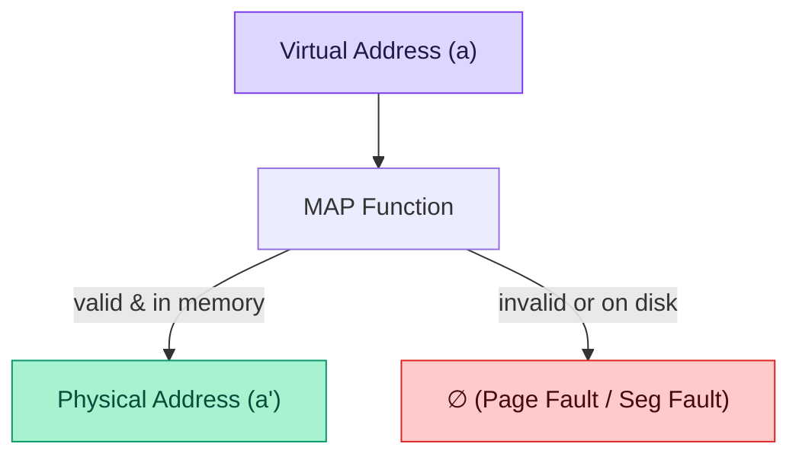
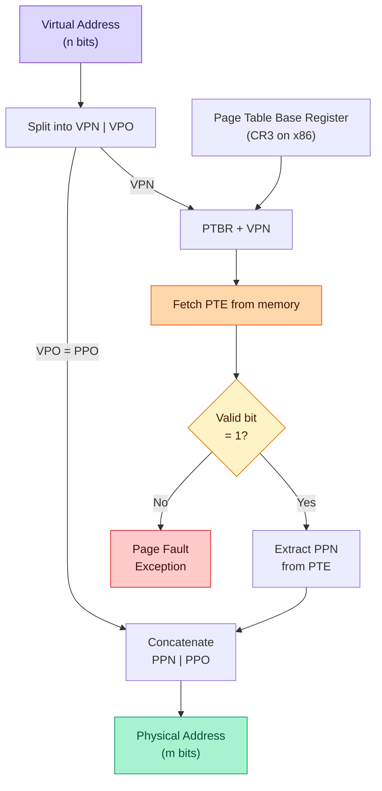
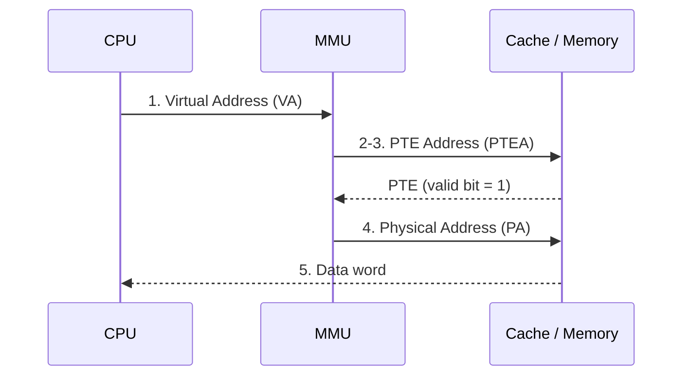
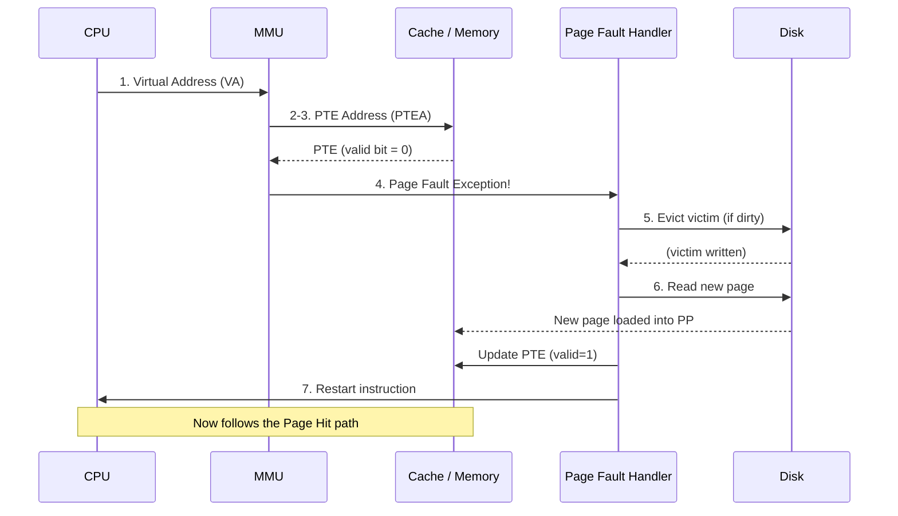
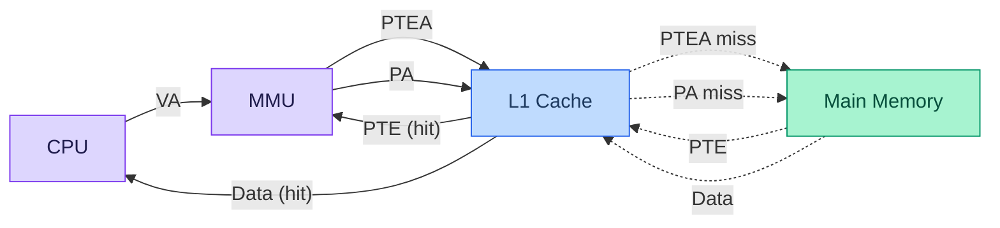
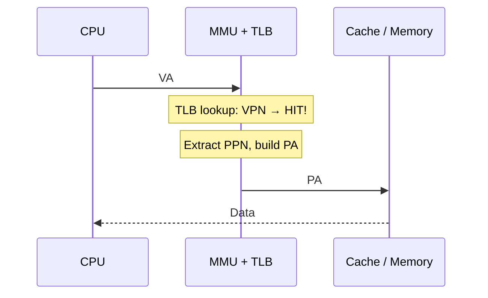
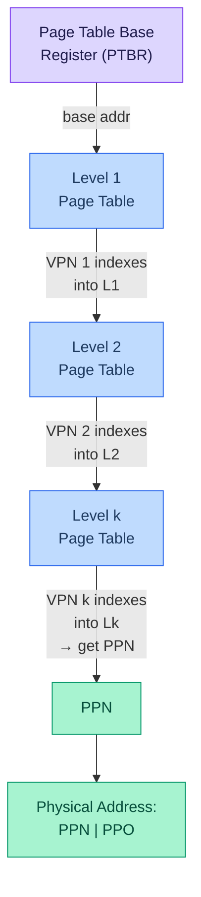

# Virtual Memory: Concepts — Lecture 11 Notes

> **CMU 15-213 / 15-503 / 14-513: Introduction to Computer Systems**
> 11th Lecture, Feb 17th, 2026
> [YouTube](https://youtu.be/ee838q5qkvc)

---

## Table of Contents

1. [Introduction — "This Picture is a Lie"](#1-introduction--this-picture-is-a-lie)
2. [Processes and `fork`](#2-processes-and-fork)
3. [Why Virtual Memory Exists — Three Motivations](#3-why-virtual-memory-exists--three-motivations)
4. [Physical Addressing vs Virtual Addressing](#4-physical-addressing-vs-virtual-addressing)
5. [Address Spaces](#5-address-spaces)
6. [The MAP Function — VM Address Translation (Abstract)](#6-the-map-function--vm-address-translation-abstract)
7. [VM as a Tool for Caching](#7-vm-as-a-tool-for-caching)
8. [DRAM Cache Organization — Design Decisions](#8-dram-cache-organization--design-decisions)
9. [Page Tables — The Enabling Data Structure](#9-page-tables--the-enabling-data-structure)
10. [Address Translation With a Page Table](#10-address-translation-with-a-page-table)
11. [Page Hits](#11-page-hits)
12. [Page Faults](#12-page-faults)
13. [Handling a Page Fault — Step by Step](#13-handling-a-page-fault--step-by-step)
14. [Demand Paging and Allocating Pages](#14-demand-paging-and-allocating-pages)
15. [Locality to the Rescue — Working Sets and Thrashing](#15-locality-to-the-rescue--working-sets-and-thrashing)
16. [VM as a Tool for Memory Management](#16-vm-as-a-tool-for-memory-management)
17. [Simplifying Linking and Loading](#17-simplifying-linking-and-loading)
18. [VM as a Tool for Memory Protection](#18-vm-as-a-tool-for-memory-protection)
19. [Integrating VM and the Cache Hierarchy](#19-integrating-vm-and-the-cache-hierarchy)
20. [Speeding Up Translation — The TLB](#20-speeding-up-translation--the-tlb)
21. [Accessing the TLB — Address Decomposition](#21-accessing-the-tlb--address-decomposition)
22. [TLB Hits and TLB Misses](#22-tlb-hits-and-tlb-misses)
23. [Summary of Address Translation Symbols](#23-summary-of-address-translation-symbols)
24. [The Problem With Single-Level Page Tables](#24-the-problem-with-single-level-page-tables)
25. [Multi-Level Page Tables](#25-multi-level-page-tables)
26. [Translating With a k-Level Page Table](#26-translating-with-a-k-level-page-table)
27. [TLBs and Multi-Level Page Tables](#27-tlbs-and-multi-level-page-tables)
28. [Lecture Summary](#28-lecture-summary)
29. [Key Takeaways](#key-takeaways)
30. [Code Examples Summary](#code-examples-summary)
31. [Formulas & Calculations Summary](#formulas--calculations-summary)
32. [Glossary](#glossary)
33. [References](#references)

---

## 1. Introduction — "This Picture is a Lie"

📊 **Slide 4** | ⏱️ **~00:01–01:00**

The lecture opens with a provocation: the mental model you have been using all semester — that memory is a simple, contiguous array of bytes from address `0` to `2^64 - 1` — is **a lie**.

> "This is RAM, we said… But the computer can run more than one program at a time! Where are all the other programs? Let's investigate."

### Why the Abstraction Breaks Down

| Assumption | Reality |
|---|---|
| One program owns all of memory | Many processes share physical RAM |
| Memory is a flat array `0..N-1` | Addresses are **virtual**; hardware translates them |
| Program size ≤ RAM size | Programs can be **larger** than physical memory |
| Addresses used by CPU go directly to DRAM | An **MMU** intercepts every address first |

The professor emphasizes:

> "We know we're running lots of processes at any one particular time and they all see the same abstraction — that they get all of memory all on their own. So obviously something's going on to provide that."

He also notes you can run programs **larger** than your physical memory:

> "If you have 8 gigabytes of RAM in your system you can still run a program that is more than 8 gigabytes big."

**That "something" is Virtual Memory (VM).** This lecture and the next explain how it works.

---

## 2. Processes and `fork`

📊 **Slide 5** | ⏱️ **~01:00–01:30**

Before diving into VM, the lecture gives a brief refresher on **processes** — the entities that *need* virtual memory.

### Key Definitions

- **Process**: An instance of a running program.
  - *Not* the same as a "program" (a file on disk) or a "processor" (the CPU chip).
  - The professor calls this "one of the most profound ideas in computer science."

### `fork` and `waitpid` (Unix)

| System Call | What It Does |
|---|---|
| `fork()` | Parent creates a **child** process that is (roughly) a copy of itself |
| | Returns **twice** — once in the parent (child's PID), once in the child (0) |
| `waitpid()` | Parent blocks until the child finishes |

> "For now, think of this as 'what main returns to.'"

The important question becomes: if every process thinks it owns all of memory, **how can multiple processes coexist?**

```
┌─────────────┐   ┌─────────────┐        ┌─────────────┐
│  Process 1   │   │  Process 2   │  ...   │  Process n   │
│  0..N-1      │   │  0..N-1      │        │  0..N-1      │
│  (virtual)   │   │  (virtual)   │        │  (virtual)   │
└──────┬───────┘   └──────┬───────┘        └──────┬───────┘
       │                  │                       │
       └──────────────────┴───────────────────────┘
                          │
                  ┌───────▼───────┐
                  │ Physical RAM  │
                  │  0..M-1       │
                  └───────────────┘
```

> **Answer:** Virtual Memory. (Slide 6)

---

## 3. Why Virtual Memory Exists — Three Motivations

📊 **Slides 6, 13** | ⏱️ **~01:30–04:37**

The professor frames VM around **four** inter-related benefits, all delivered by **one** mechanism (the mapping function):

| # | Benefit | Description |
|---|---------|-------------|
| 1 | **Efficient use of RAM** | Use DRAM as a cache for disk; run processes larger than RAM |
| 2 | **Memory management** | Each process gets a uniform, linear address space; no manual overlay management |
| 3 | **Protection** | Processes cannot corrupt each other's memory |
| 4 | **Sharing** | Libraries like `libc` loaded once in physical memory, shared by all processes |

> "One mechanism gives me solutions to all four of these problems — being able to run multiple processes on the machine, each thinking that they own all of memory that's actually bigger than the memory I have in my system, get protection from each other, and share when they want to."

### The Core Mechanism

> "Every memory reference made by a user program is actually **more than one** memory reference. The first memory reference will turn the virtual address into a physical address, and then the second memory address will actually get the value that you wanted."

This two-step process — **translate, then access** — is the heart of virtual memory.

### Historical Note

> "Back in the day you could essentially double or triple the time a project took because you would have to worry about how to manage the memory and write an overlay manager and pull it in yourself and it was a pain in the butt."

---

## 4. Physical Addressing vs Virtual Addressing

📊 **Slides 7–8** | ⏱️ **~08:18–09:48**

### Physical Addressing (Slide 7)

Used in **simple** embedded systems: cars, elevators, washing machines, digital picture frames.

```
                Physical Addressing
  ┌─────┐                        ┌──────────────┐
  │ CPU │──── Physical Addr ────▶│ Main Memory  │
  │     │◀──── Data ─────────────│ 0: ...       │
  └─────┘          4             │ 1: ...       │
                                 │ 2: ...       │
                                 │ ...          │
                                 │ M-1: ...     │
                                 └──────────────┘
```

> "Your washing machine probably uses physical addresses only."

The CPU puts an address directly on the bus, and the memory returns the data at that address. No translation, no indirection.

### Virtual Addressing (Slide 8)

Used in **all modern** servers, laptops, smartphones.

```
             Virtual Addressing
  ┌─────┐        ┌─────┐                 ┌──────────────┐
  │ CPU │──VA───▶│ MMU │───PA──────────▶│ Main Memory  │
  │     │  4100  │     │    4           │ 0: ...       │
  └─────┘        └─────┘                │ 1: ...       │
      ◀─────── Data ────────────────────│ ...          │
       CPU Chip                         │ M-1: ...     │
                                        └──────────────┘
```

The CPU emits a **virtual address** (VA). The **Memory Management Unit** (MMU), which is on the CPU chip, translates it to a **physical address** (PA). Only then does the memory return data.

> "Almost every computer system that you'll use unless you're working in embedded systems will use virtual memory — your phone, your laptop, servers."

| Feature | Physical Addressing | Virtual Addressing |
|---------|--------------------|--------------------|
| Translation | None | MMU translates VA → PA |
| Used in | Embedded controllers | Servers, laptops, phones |
| Era | Pre-1960s (and embedded today) | All modern general-purpose systems |
| Complexity | Trivial | Requires MMU + page tables |
| Process isolation | None | Full isolation |

---

## 5. Address Spaces

📊 **Slide 12** | ⏱️ **~05:44–07:10**

### Definitions

```
Linear address space:   {0, 1, 2, 3, …}              (ordered, contiguous)

Virtual address space:  {0, 1, 2, …, N-1}  where N = 2^n
                        n = number of bits in a virtual address

Physical address space: {0, 1, 2, …, M-1}  where M = 2^m
                        m = number of bits in a physical address
```

> "The standard is to number the virtual addresses from 0 to N-1 and the physical addresses from 0 to M-1."

### Important Distinction: Labels vs Contents

The professor uses a **box analogy**:

> "Think of every byte as a box with a value inside. The address is the **label** on the box. I can give the box **different labels**. In one process that memory location might be at address `0xFBBB8923`; in another process that same box might be `0xEFB91234`. I can give it as many labels as I want."

This is the fundamental insight of virtual memory: the **same physical byte** can have **different virtual addresses** in different processes.

### Typical Sizes

| Parameter | Typical Value | Notes |
|-----------|--------------|-------|
| `n` (virtual addr bits) | 48 (x86-64) | Only 48 of 64 bits used in practice |
| `N` (virtual addr space) | 2^48 = 256 TB | |
| `m` (physical addr bits) | 40–52 | Depends on CPU model |
| `M` (physical addr space) | 1 TB – 4 PB | |

---

## 6. The MAP Function — VM Address Translation (Abstract)

📊 **Slide 14–15** | ⏱️ **~34:42–35:48**

### Formal Definition

```
MAP: V → P ∪ {∅}

For virtual address a:
  MAP(a) = a'  if data at virtual address a is at physical address a' in P
  MAP(a) = ∅   if data at virtual address a is NOT in physical memory
                (either invalid or stored on disk)
```

> "If you ask the MAP function to map a virtual address that is not in physical memory at this moment, or you don't have permission to access it, then it returns null."

### Properties of the MAP Function

- **Granularity**: Mapping is done at the **page** level, not byte-by-byte.
- **Must be simple and efficient**: Implemented partly in hardware (MMU).
- **Data structure**: A **k-nary tree** called a **Page Table**.
  - Each node of the tree is 1 page in size.
- The MAP function is **per-process**: each process has its own page table.



---

## 7. VM as a Tool for Caching

📊 **Slides 28–29** | ⏱️ **~09:54–14:04**

### The Key Insight

> "The way we're going to think about physical memory is as a **cache**. What is it caching? It's caching the entire memory image that you have, which is sitting on the disk."

Physical DRAM acts as a **cache** for the much larger virtual address space that conceptually lives on disk.

### Three States of a Virtual Page

| State | Meaning | What Happens on Access |
|-------|---------|----------------------|
| **Cached** | Page is in physical memory (DRAM) | Normal access — fast |
| **Uncached** | Page exists on disk but not in DRAM | **Page fault** — must load from disk |
| **Unallocated** | Page has never been assigned | **Segmentation fault** — illegal access |

```
  Virtual Memory                          Physical Memory
  (on disk)                               (DRAM cache)

  ┌────────────────┐                     ┌────────────────┐
  │ VP 0  Uncached │                     │ PP 0  [VP 3]   │
  ├────────────────┤                     ├────────────────┤
  │ VP 1  Cached ──┼─────────────────────▶ PP 1  [VP 1]   │
  ├────────────────┤                     ├────────────────┤
  │ VP 2  Cached ──┼──────┐              │ PP 2  (empty)  │
  ├────────────────┤      │              ├────────────────┤
  │ VP 3  Cached ──┼──┐   └─────────────▶ PP 3  [VP 2]   │
  ├────────────────┤  │                  ├────────────────┤
  │ VP 4  Uncached │  └─────────────────▶         ...     │
  ├────────────────┤                     ├────────────────┤
  │ VP 5 Unalloc.  │                     │ PP 2^(m-p)-1   │
  ├────────────────┤                     └────────────────┘
  │     ...        │
  │ VP 2^(n-p)-1   │
  └────────────────┘
```

### Terminology Mapping: Caches vs Virtual Memory

The professor explicitly maps the two vocabularies:

| Cache Terminology | VM Terminology |
|-------------------|---------------|
| Block | **Page** |
| Cache miss | **Page fault** |
| Cache line | Physical page (frame) |
| Block size | **Page size** (P = 2^p bytes) |
| Valid bit | Valid bit (same concept) |

> "Instead of talking about blocks I'll talk about pages. Instead of talking about a cache miss I'll talk about a page fault. But it's basically the same exact concepts."

---

## 8. DRAM Cache Organization — Design Decisions

📊 **Slide 30** | ⏱️ **~14:04–21:52**

The design of the "DRAM cache" (physical memory acting as cache for disk) is driven by one overwhelming fact: **the miss penalty is enormous**.

### Speed Hierarchy

| Level | Access Time | Relative Speed |
|-------|-------------|----------------|
| SRAM (L1 cache) | ~1–4 cycles | 1× |
| DRAM | ~100–300 cycles | ~100× slower than SRAM |
| Disk (first byte) | ~100,000–1,000,000 cycles | ~10,000–100,000× slower than DRAM |

> "The first byte that I read from a block might take me let's say a hundred thousand or a million cycles. The next few bytes take ten thousand cycles."

### Why the First Byte Is So Expensive

The professor explains the physical mechanics of a hard drive:

> "Remember the disk is a physical device. It's spinning at this ridiculously low speed… first of all the disk is spinning, second of all we've got this disk arm that moves. So we've got to move to the right cylinder, then we've got to wait for the disk to rotate around so that it gets underneath the right spot, and then I can start reading the bytes."

### Design Consequences

| Design Choice | Rationale |
|---------------|-----------|
| **Large page size** (4 KB – 4 MB) | Amortize the enormous seek + rotational latency via spatial locality |
| **Fully associative** | Any VP can go in any PP → eliminates conflict misses |
| **Sophisticated replacement** | Too expensive to pick wrong victim; OS uses complex algorithms (e.g., LRU approximation) |
| **Write-back** (not write-through) | Writing to disk on every store would be catastrophic for performance |

### Student Q&A: Why Large Pages?

> **Professor:** "Don't want these blocks to be big or small? 64 bytes or two megabytes?"
>
> **Student (implied):** "Big, to amortize seek time."
>
> **Professor:** "If I make it big, the hope is that the time it takes to read that big block in is amortized by the fact that I'm going to access that block lots of times. What kind of locality is that called?"
>
> **Student:** "Spatial locality."

### Student Q&A: Why Write-Back?

> **Professor:** "Why do you think it would be a write-back cache?"
>
> **Student (implied):** "Because writing to disk is expensive."
>
> **Professor:** "Going to write to disk is expensive. Furthermore these blocks are big. One of these pages is gonna represent some portion of my stack — every time I push something onto the stack I don't want to go and seek to the disk. Being lazy is being smart."

He gives an example: the stack pages may never need to be written back at all — if the program finishes, the stack is discarded.

> "I might never need to write it back if I use a write-back policy instead of a write-through policy."

---

## 9. Page Tables — The Enabling Data Structure

📊 **Slide 16** | ⏱️ **~22:01–24:12**

### What Is a Page Table?

A **page table** is an array of **Page Table Entries (PTEs)** that maps virtual pages to physical pages.

- One page table **per process** (kernel data structure stored in DRAM).
- Indexed by **Virtual Page Number (VPN)**.
- Each PTE contains:
  - A **valid bit**: Is this page in physical memory?
  - A **physical page number** (if valid) or **disk address** (if not valid but allocated).

```
  Page Table (per-process, in DRAM)
  ┌────────┬───────┬────────────────────────────┐
  │ Index  │ Valid │ Physical Page # / Disk Addr │
  ├────────┼───────┼────────────────────────────┤
  │ PTE 0  │   0   │ null                       │  ← unallocated
  ├────────┼───────┼────────────────────────────┤
  │ PTE 1  │   1   │ PP 0                       │  ← cached (VP1 → PP0)
  ├────────┼───────┼────────────────────────────┤
  │ PTE 2  │   1   │ PP 1                       │  ← cached (VP2 → PP1)
  ├────────┼───────┼────────────────────────────┤
  │ PTE 3  │   0   │ disk addr (VP3)            │  ← on disk
  ├────────┼───────┼────────────────────────────┤
  │ PTE 4  │   1   │ PP 3                       │  ← cached (VP4 → PP3)
  ├────────┼───────┼────────────────────────────┤
  │ PTE 5  │   0   │ null                       │  ← unallocated
  ├────────┼───────┼────────────────────────────┤
  │ PTE 6  │   0   │ disk addr (VP6)            │  ← on disk
  ├────────┼───────┼────────────────────────────┤
  │ PTE 7  │   1   │ PP 2                       │  ← cached (VP7 → PP2)
  └────────┴───────┴────────────────────────────┘
```

> "It's essentially an array where there's one entry in the array for each virtual page in the virtual address space."

### Three Possible PTE States

| Valid Bit | Content | Meaning |
|-----------|---------|---------|
| 1 | Physical page number | Page is **cached** in DRAM |
| 0 | Disk address | Page is **on disk** (uncached) — access causes page fault |
| 0 | null | Page is **unallocated** — access causes seg fault |

---

## 10. Address Translation With a Page Table

📊 **Slide 17** | ⏱️ **~35:48–40:09**

### Virtual Address Decomposition

A virtual address of `n` bits is split into two fields:

```
  n-1                    p    p-1              0
  ┌──────────────────────┬────────────────────┐
  │  Virtual Page Number │  Virtual Page      │
  │       (VPN)          │   Offset (VPO)     │
  │    (n - p) bits      │     p bits         │
  └──────────────────────┴────────────────────┘
```

### Physical Address Construction

The physical address of `m` bits is:

```
  m-1                    p    p-1              0
  ┌──────────────────────┬────────────────────┐
  │ Physical Page Number │ Physical Page      │
  │       (PPN)          │   Offset (PPO)     │
  │    (m - p) bits      │     p bits         │
  └──────────────────────┴────────────────────┘
```

### Critical Insight: VPO = PPO

Because we transfer entire pages at a time, the **offset within the page never changes** during translation.

> "The first thing is easy — I'm just going to take the offset and copy it into the low-order bits of the physical address. The hard part is dealing with the virtual page number."

### The Translation Process



### Page Table Base Register (PTBR)

- On x86: stored in the **CR3** register.
- Each process has its own PTBR value.
- On context switch, the OS loads the new process's PTBR into CR3.

> "Every part of loading a process is loading what's called the page table base register — this is the start of the page table for that particular process."

### Calculation: PTE Address

```
PTE_address = PTBR + VPN × sizeof(PTE)
```

For a 32-bit system with 4 KB pages and 4-byte PTEs:
- VPN = upper 20 bits of VA
- PTE address = PTBR + VPN × 4

---

## 11. Page Hits

📊 **Slides 18–19** | ⏱️ **~24:37–25:08, 42:38–43:30**

### Definition

> "Page hit: reference to VM word that is in physical memory (DRAM cache hit)."

### Step-by-Step: Address Translation on Page Hit (Slide 19)

| Step | Action |
|------|--------|
| 1 | Processor sends **virtual address** to MMU |
| 2 | MMU computes PTE address (PTBR + VPN) |
| 3 | MMU fetches **PTE from page table in memory** (or L1 cache) |
| 4 | MMU constructs **physical address** and sends it to cache/memory |
| 5 | Cache/memory returns the **data word** to processor |



> "I present the virtual address, look it up in the page table, see that it's valid, get the address in physical memory for that page, and then access that location and return the data."

---

## 12. Page Faults

📊 **Slides 20–21** | ⏱️ **~25:08–26:15, 43:29–45:22**

### Definition

> "Page fault: reference to VM word that is NOT in physical memory (DRAM cache miss)."

### Step-by-Step: Address Translation on Page Fault (Slide 21)

| Step | Action |
|------|--------|
| 1 | Processor sends **virtual address** to MMU |
| 2 | MMU computes PTE address |
| 3 | MMU fetches PTE from page table in memory |
| 4 | **Valid bit is 0** → MMU triggers a **page fault exception** |
| 5 | Handler identifies a **victim page** (if dirty, writes it to disk) |
| 6 | Handler pages in the **new page** from disk and updates the PTE |
| 7 | Handler returns to original process; **faulting instruction restarts** |



> "A page fault is expensive — it's not just that you have to go to the disk which costs tens of thousands of cycles, but you've got to run this page fault handler and it's got to select the victim page, figure out where that should be, update the page table entries — there's a lot of work it actually has to do."

---

## 13. Handling a Page Fault — Step by Step

📊 **Slides 22–25** | ⏱️ **~25:08–26:15**

The slides walk through a concrete example with 8 virtual pages and 4 physical pages.

### Initial State (Slide 22)

```
  Page Table           Physical Memory          Disk
  ┌───┬───┬─────┐     ┌─────────────┐     ┌────────────┐
  │ 0 │ 0 │null │     │ PP 0: VP 1  │     │ VP 3       │
  │ 1 │ 1 │PP 0 │     │ PP 1: VP 2  │     │ VP 6       │
  │ 2 │ 1 │PP 1 │     │ PP 2: VP 7  │     │            │
  │ 3 │ 0 │disk │◀──  │ PP 3: VP 4  │     │            │
  │ 4 │ 1 │PP 3 │     └─────────────┘     └────────────┘
  │ 5 │ 0 │null │
  │ 6 │ 0 │disk │
  │ 7 │ 1 │PP 2 │
  └───┴───┴─────┘
```

**Access VP 3** → PTE 3 has valid = 0 → **Page fault!**

### Step 1: Select Victim (Slide 23)

The page fault handler selects **VP 4** (in PP 3) as the victim.

### Step 2: Evict Victim, Load New Page (Slide 24)

- If VP 4 is **dirty**, write it back to disk.
- Load VP 3 from disk into PP 3.
- Update PTE 4: valid = 0, set disk address.
- Update PTE 3: valid = 1, set PP 3.

### Step 3: Restart (Slide 25)

```
  Page Table           Physical Memory
  ┌───┬───┬─────┐     ┌─────────────┐
  │ 0 │ 0 │null │     │ PP 0: VP 1  │
  │ 1 │ 1 │PP 0 │     │ PP 1: VP 2  │
  │ 2 │ 1 │PP 1 │     │ PP 2: VP 7  │
  │ 3 │ 1 │PP 3 │◀──  │ PP 3: VP 3  │  ← NEW
  │ 4 │ 0 │disk │     └─────────────┘
  │ 5 │ 0 │null │
  │ 6 │ 0 │disk │
  │ 7 │ 1 │PP 2 │
  └───┴───┴─────┘
```

> "Key point: Waiting until the miss to copy the page to DRAM is known as **demand paging**."

The faulting instruction is **restarted** and now gets a **page hit**.

---

## 14. Demand Paging and Allocating Pages

📊 **Slides 25–26** | ⏱️ **~26:00–26:15**

### Demand Paging

Pages are loaded into physical memory **only when they are actually accessed**, not preemptively.

> "Waiting until the miss to copy the page to DRAM is known as demand paging."

This is extremely efficient for large programs where only a fraction of code/data is used at any time (e.g., Microsoft Word's flight simulator Easter egg).

### Allocating a New Page (Slide 26)

When a new virtual page is allocated (e.g., via `malloc` expanding the heap), a new PTE is created:

- The new PTE (e.g., PTE 5 for VP 5) initially points to a **disk address**.
- The page is **not** loaded into DRAM yet — it will be demand-paged on first access.
- This is why `malloc` returns "instantly" even for huge allocations.

---

## 15. Locality to the Rescue — Working Sets and Thrashing

📊 **Slide 32** | ⏱️ **~26:17–28:37**

### Why VM Works Despite the Overhead

> "Virtual memory seems terribly inefficient, but it works because of locality."

### Working Set

At any point in time, a program accesses a set of **active virtual pages** called the **working set**:
- Stack pages near the current stack pointer
- Heap pages being actively used
- Code pages of the currently executing functions

> "Programs with better temporal locality will have smaller working sets."

### The Thrashing Condition

```
If (working set size < main memory size):
    ✅ Good performance after compulsory misses

If (Σ working set sizes > main memory size):
    ❌ THRASHING — pages swapped in and out continuously
```

> "When you start thrashing… you can hear it happen because the disk arm starts going crazy… in fact if you get it just right and hit the resonant frequency you can knock your server over."

### Key Nuance

The working set is **not** the total amount of memory allocated — it's the set of pages actively used in a **window** of recent instructions.

> "That's not to say that the amount of memory you're accessing is limited to the amount of physical memory. It's just that for a particular set of instructions — like 10 million instructions in a row — the addresses add up… that's the working set."

---

## 16. VM as a Tool for Memory Management

📊 **Slides 9–10** | ⏱️ **~28:37–30:21**

### Each Process Gets Its Own Virtual Address Space

```
  Process 1                    Process 2
  Virtual Space               Virtual Space           Physical Memory
  ┌──────────┐                ┌──────────┐           ┌──────────┐
  │ VP 1 ────┼───────────────▶│          │           │ PP 2     │
  │ VP 2 ────┼─────┐          │ VP 1 ────┼──────────▶│ PP 6     │◀── shared
  │   ...    │     └─────────▶│ VP 2     │           │ PP 8     │
  └──────────┘                └──────────┘           │  ...     │
                                                     └──────────┘
```

### Key Benefits

| Benefit | Explanation |
|---------|-------------|
| **Simplified allocation** | Each virtual page can map to **any** physical page; no contiguity required |
| **Time-varying mapping** | A virtual page can be in different physical pages at different times |
| **Code/data sharing** | Multiple processes can map virtual pages to the **same** physical page |

> "In this case they're sharing let's say some library code like libc. This allows me to squeeze more stuff into main memory if I can share code that's similar between these different processes."

The shared page is typically marked **read-only** so processes can't corrupt each other's view.

---

## 17. Simplifying Linking and Loading

📊 **Slide 11** | ⏱️ **~30:21–32:28**

### Linking

Because every process has the same virtual address layout, the **linker** can always place sections at fixed virtual addresses:

```
  Virtual Address Space Layout (x86-64 Linux)
  ┌─────────────────────────┐ 0xFFFFFFFFFFFFFFFF
  │   Kernel virtual memory │
  ├─────────────────────────┤
  │   User stack            │ ← %rsp (grows down)
  ├─────────────────────────┤
  │   Shared libraries      │
  │   (memory-mapped)       │
  ├─────────────────────────┤
  │         ↕               │
  │   Run-time heap         │ ← brk (grows up)
  │   (malloc)              │
  ├─────────────────────────┤
  │   .data, .bss           │
  ├─────────────────────────┤
  │   .text, .rodata, .init │ ← 0x400000
  ├─────────────────────────┤
  │   Unused                │
  └─────────────────────────┘ 0x000000000000000
```

> "Code, data, and heap always start at the same addresses."

### Loading (`execve`)

1. `execve` allocates virtual pages for `.text` and `.data` sections.
2. Creates PTEs marked as **invalid** (not loaded yet).
3. The `.text` and `.data` sections are copied **page by page, on demand** by the VM system.

> "You don't have to read in this entire program. What you can do instead is create the virtual page table for that program and mark all the pages for the text section etc. as invalid, and then when they're actually accessed you can pull them in on demand."

### The Microsoft Word Flight Simulator Example

> "You have a program like Microsoft Word — huge program — and there's a piece of that program that's a flight simulator. It doesn't get loaded every time you run Microsoft Word, because unless you know the secret little codes to get it, you're never gonna access that and it just stays on the disk."

---

## 18. VM as a Tool for Memory Protection

📊 **Slide 27** | ⏱️ **~32:46–34:38**

### Extended Page Table Entries With Permission Bits

Each PTE is extended with **permission bits** that the MMU checks on every access:

| Bit | Meaning |
|-----|---------|
| **SUP** | Supervisor (kernel) mode only? |
| **READ** | Read permission? |
| **WRITE** | Write permission? |
| **EXEC** | Execute permission? |

### Example: Two Processes With Different Permissions

```
  Process i Page Table                    Process j Page Table
  ┌────┬─────┬───┬─────┬─────┬──────┐   ┌────┬─────┬───┬─────┬─────┬──────┐
  │ VP │ Addr│SUP│READ │WRITE│ EXEC │   │ VP │ Addr│SUP│READ │WRITE│ EXEC │
  ├────┼─────┼───┼─────┼─────┼──────┤   ├────┼─────┼───┼─────┼─────┼──────┤
  │  0 │ PP6 │ No│ Yes │  No │  Yes │   │  0 │ PP9 │ No│ Yes │  No │  Yes │
  │  1 │ PP4 │ No│ Yes │ Yes │  Yes │   │  1 │ PP6 │Yes│ Yes │ Yes │  Yes │
  │  2 │ PP2 │Yes│ Yes │     │  No  │   │  2 │PP11 │ No│ Yes │ Yes │  No  │
  └────┴─────┴───┴─────┴─────┴──────┘   └────┴─────┴───┴─────┴─────┴──────┘
```

### How Protection Works

- **Write to read-only page** → MMU detects violation → **seg fault**
- **User code accesses SUP page** → MMU detects violation → **seg fault**
- **Execute non-executable page** → MMU detects violation → **seg fault** (prevents code injection attacks)

> "Each of these processes gets their own particular set of permissions on all of virtual memory. This allows you to share code in ways that will protect you from other people."

Notice that Process i's VP 0 and Process j's VP 1 both map to **PP 6** (shared library code, read-only for process i).

---

## 19. Integrating VM and the Cache Hierarchy

📊 **Slide 31** | ⏱️ **~45:58–51:02**

### Where Does the L1 Cache Go?

There are two possible placements for the L1 cache:

**Option A: Virtual Cache** (between CPU and MMU)
- ✅ On cache hit, no translation needed → very fast
- ❌ Multiple processes have different virtual addresses for same physical data
- ❌ Context switch would require cache flush
- ❌ Sharing between processes requires duplicating data
- ❌ Must store process ID in cache tags

**Option B: Physical Cache** (after MMU) — **This is what modern systems use**
- ✅ No ambiguity: physical addresses are unique across all processes
- ✅ No cache flush on context switch (for shared pages)
- ✅ Simpler protection — MMU already checked permissions
- ❌ Every access requires two memory references (PTE + data)

> "The real key reason why it's hard to put your cache [before the MMU] is because you've got multiple processes running in your system at all times and my virtual address for my process is going to be different than your virtual address for a different process even though the addresses might be identical."

### The Full Integration (Slide 31)



The L1 cache serves **double duty**: it caches both page table entries and regular data/instructions. Because PTEs are accessed repeatedly (same page = same PTE), they tend to stay in cache.

> "What's the likelihood that this page table entry is going to be stored in your L1 cache? It's gonna be high because you're accessing these things over and over and over again."

### Student Q&A: Virtual vs Physical Cache

> **Professor:** "Why is [the cache] over here? What's wrong with having your L1 cache between the CPU and the MMU?"
>
> **Student (various responses about overhead)**
>
> **Professor:** "The real key reason is because you've got multiple processes running… my virtual address for my process is going to be different than your virtual address for a different process, even though the addresses might be identical, I want to go to different places in main memory. So my cache would also have to hold my process identifier… and every time you change processes you've got to throw all the virtual addresses [out]."

---

## 20. Speeding Up Translation — The TLB

📊 **Slides 33–34** | ⏱️ **~51:22–55:35**

### The Problem

Every memory access requires **two** memory references:
1. Fetch the PTE (to translate VA → PA)
2. Fetch the actual data

Even with L1 cache hits for PTEs, there is still a small delay.

### The Solution: Translation Lookaside Buffer (TLB)

| Property | Value |
|----------|-------|
| What it is | Small, **hardware** cache inside the MMU |
| What it stores | Complete PTEs (VPN → PPN mappings) |
| Associativity | Typically **fully associative** or high set-associative |
| Size | Very small: 4–128 entries |
| Access time | **1 cycle** (same as register access) |

> "This is a really, really, really tiny fully-associative cache — and I mean tiny, maybe four entries or sixteen entries. Even though my system has thousands and millions — even billions — of pages, a very very small TLB can make a huge difference."

### Why So Tiny?

> **Student (implied):** "Because it's fully associative?"
>
> **Professor:** "It's all O(1) time because of the way the circuits are designed. But there is a trade-off: the more memory you have in a memory structure, the slower the cycle time… If I double the size of my TLB — go from eight entries to sixteen entries — I'm gonna increase the time it takes to access any entry."

The goal: fit the TLB lookup into **one cycle**.

> "Going from one cycle to two cycles by making the TLB bigger would turn out to be a bad trade-off."

And locality saves us:

> "Because of spatial locality and temporal locality, very few entries can actually get me a long way."

**Analogy with cache hierarchy:**

> "Just like we don't make our L1 cache four megabytes, we make our L1 cache 64K and then we have an L2 cache. Each structure gets a little bit bigger but it also gets a little bit slower."

---

## 21. Accessing the TLB — Address Decomposition

📊 **Slide 34** | ⏱️ **~52:00–53:11**

The VPN portion of the virtual address is further split for TLB lookup:

```
  n-1                  p+t    p+t-1        p    p-1              0
  ┌────────────────────┬──────────────────┬────────────────────┐
  │    TLB Tag (TLBT)  │  TLB Index (TLBI)│  Virtual Page      │
  │                    │                  │   Offset (VPO)     │
  └────────────────────┴──────────────────┴────────────────────┘
  ◄─────── VPN ────────►                  ◄────── p bits ──────►
```

Where:
- **T = 2^t** sets in the TLB
- **TLBI** = low-order `t` bits of VPN → selects the TLB set
- **TLBT** = remaining high-order bits of VPN → compared against tags in that set

### TLB Set Structure

```
  TLB (T = 2^t sets, E entries per set)
  ┌───────┬──────┬─────┬──────┬─────┬─────┐
  │ Set 0 │ v|tag|PTE  │ v|tag|PTE  │ ... │
  ├───────┼──────┬─────┬──────┬─────┬─────┤
  │ Set 1 │ v|tag|PTE  │ v|tag|PTE  │ ... │
  ├───────┼──────┬─────┬──────┬─────┬─────┤
  │  ...  │      ...                       │
  ├───────┼──────┬─────┬──────┬─────┬─────┤
  │Set T-1│ v|tag|PTE  │ v|tag|PTE  │ ... │
  └───────┴──────┴─────┴──────┴─────┴─────┘
```

---

## 22. TLB Hits and TLB Misses

📊 **Slides 35–36** | ⏱️ **~53:11–56:37**

### TLB Hit (Slide 35)

A TLB hit **eliminates a memory access** — the PTE is returned directly from the TLB hardware:



**Total memory accesses: 1** (just the data fetch).

### TLB Miss (Slide 36)

On a TLB miss, the MMU must fetch the PTE from the page table in memory:

| Step | Action |
|------|--------|
| 1 | CPU sends VA to MMU |
| 2 | MMU checks TLB → **miss** |
| 3 | MMU sends PTEA to cache/memory |
| 4 | Cache/memory returns PTE |
| 5 | MMU stores PTE in TLB, constructs PA |
| 6 | MMU sends PA to cache/memory; data returned to CPU |

**Total memory accesses: 2** (PTE fetch + data fetch).

> "A TLB miss incurs an additional memory access (the PTE). Fortunately, TLB misses are rare. Why?"

**Answer:** Locality! Each TLB entry covers an entire page (e.g., 4 KB). Accessing any byte within that page reuses the same TLB entry.

### Student Q&A: Why Are TLB Misses Rare?

> **Professor:** "Fortunately, TLB misses are very rare. Why?"
>
> Because each TLB entry covers a **4 KB page** (or larger). Once a page's PTE is in the TLB, all subsequent accesses to any of the 4096 bytes in that page are TLB hits. With good spatial and temporal locality, even 16–64 TLB entries can cover the active working set.

---

## 23. Summary of Address Translation Symbols

📊 **Slide 37** | ⏱️ **~36:01–37:56**

### Basic Parameters

| Symbol | Definition | Typical Value |
|--------|-----------|---------------|
| `N = 2^n` | Number of addresses in virtual address space | 2^48 (x86-64) |
| `M = 2^m` | Number of addresses in physical address space | 2^40 – 2^52 |
| `P = 2^p` | Page size in bytes | 4 KB (2^12) |

### Virtual Address Components

| Symbol | Name | Bits |
|--------|------|------|
| VPN | Virtual Page Number | n − p bits |
| VPO | Virtual Page Offset | p bits |
| TLBI | TLB Index | t bits (from VPN) |
| TLBT | TLB Tag | (n − p − t) bits (from VPN) |

### Physical Address Components

| Symbol | Name | Bits |
|--------|------|------|
| PPN | Physical Page Number | m − p bits |
| PPO | Physical Page Offset | p bits |

### Key Identity

```
VPO = PPO    (offset doesn't change during translation)
```

### Example Calculation: 32-bit VA, 4 KB pages

```
n = 32, p = 12 (since 4 KB = 2^12)

VPN bits = n - p = 32 - 12 = 20 bits  →  2^20 = 1,048,576 virtual pages
VPO bits = p = 12 bits                →  4096 byte offset within each page

If m = 30 (1 GB physical memory):
PPN bits = m - p = 30 - 12 = 18 bits  →  2^18 = 262,144 physical pages
PPO bits = p = 12 bits
```

---

## 24. The Problem With Single-Level Page Tables

📊 **Slide 39** | ⏱️ **~56:56–57:46**

### The Scalability Problem

Consider a system with:
- 32-bit addresses
- 4 KB pages (2^12)
- 4-byte PTEs

```
Number of PTEs = 2^n / P = 2^32 / 2^12 = 2^20 = 1,048,576 entries

Page table size = 2^20 × 4 bytes = 4 MB per process
```

This is manageable for 32-bit, but now consider **48-bit addresses** with **8-byte PTEs**:

```
Number of PTEs = 2^48 / 2^12 = 2^36

Page table size = 2^36 × 8 bytes = 2^39 bytes = 512 GB per process!!
```

That's **512 GB just for the page table** — clearly impractical.

### The Waste

Most of the virtual address space is **unallocated**:

```
  Example: 32-bit, 4KB pages, 4-byte PTEs
  ┌────────────────────┐ VP 0
  │ 2K allocated pages │ (code and data)
  │  for code & data   │
  ├────────────────────┤ VP 1023
  │                    │
  │  6K unallocated    │ ← GAP (6144 wasted PTEs!)
  │    VM pages        │
  │                    │
  ├────────────────────┤ VP 9215
  │ 1 allocated page   │ (stack)
  │  for the stack     │
  └────────────────────┘
```

Most PTEs are **null** — they map to unallocated pages. Storing them all wastes enormous memory.

---

## 25. Multi-Level Page Tables

📊 **Slides 40–41** | ⏱️ **~57:46 onward**

### The Insight

If a large contiguous region of virtual addresses is unallocated, we don't need page table entries for them at all.

### Solution: Multi-Level (Hierarchical) Page Tables

Split the single flat page table into a **tree structure**:

- **Level 1 table**: Always memory-resident. Each PTE points to a **Level 2 page table** (or null if entire region is unallocated).
- **Level 2 tables**: Each PTE points to an actual **physical page**. These can be paged in/out like normal data.

### Example: 2-Level Page Table (32-bit, 4 KB pages, 4-byte PTEs)

```
  Level 1 Page Table              Level 2 Page Tables
  (always resident)               (paged on demand)
  ┌──────────┐
  │ PTE 0 ───┼──────────────────▶ ┌──────────────┐
  │ PTE 1 ───┼──────────────┐     │ PTE 0..1023  │ ← maps VP 0..1023
  │ PTE 2: null │            │     │ (code & data)│
  │ PTE 3: null │            │     └──────────────┘
  │ PTE 4: null │            │
  │ PTE 5: null │            └───▶ ┌──────────────┐
  │ PTE 6: null │                  │ PTE 0..1023  │ ← maps VP 1024..2047
  │ PTE 7: null │                  │ (code & data)│
  │ PTE 8 ───┼──────────────────▶ └──────────────┘
  │  ...      │                    ┌──────────────┐
  │(1K-9 null)│                    │ PTE 0..1023  │ ← maps VP 9216..10239
  │ PTE 1023──┼──────────────────▶│ (stack)      │
  └──────────┘                    └──────────────┘
```

### Space Savings

**Without multi-level:** 2^20 PTEs × 4 bytes = **4 MB**

**With 2-level:** 
- Level 1: 1024 PTEs × 4 bytes = 4 KB (always resident)
- Level 2: Only **3** L2 tables needed (for allocated regions) = 3 × 4 KB = 12 KB
- **Total: ~16 KB** instead of 4 MB!

The null entries in the Level 1 table tell us "no Level 2 table exists for this region" — we never allocate L2 tables for unallocated address ranges.

### Why This Works

Key properties:
1. **Only the L1 table must be in memory** at all times (small: 1 page).
2. L2 tables for unallocated regions **don't exist** → huge savings.
3. L2 tables for allocated but not recently used regions can be **paged to disk**.

---

## 26. Translating With a k-Level Page Table

📊 **Slide 42** | ⏱️ **~57:46 onward**

### VPN Decomposition for k Levels

The VPN is split into k parts, one for each level:

```
  n-1                                                    p    p-1        0
  ┌──────────┬──────────┬─────┬──────────┬──────────────────────────────┐
  │   VPN 1  │   VPN 2  │ ... │   VPN k  │           VPO               │
  └──────────┴──────────┴─────┴──────────┴──────────────────────────────┘
```

### Translation Walk



### Step-by-Step for k = 4 (x86-64 style)

| Step | Level | Index | Result |
|------|-------|-------|--------|
| 1 | PTBR → L1 base | VPN1 | Address of L2 table |
| 2 | L2 table | VPN2 | Address of L3 table |
| 3 | L3 table | VPN3 | Address of L4 table |
| 4 | L4 table | VPN4 | **PPN** (final physical page number) |

Each level requires a **memory access** to fetch the next-level PTE. Without a TLB, a 4-level walk = **4 memory accesses** before you even get the data!

### Physical Address Construction

```
Physical Address = PPN (from final-level PTE) | PPO (= VPO from VA)
```

### Calculation: 48-bit VA, 4-level, 4 KB pages, 8-byte PTEs

```
Page size P = 4 KB = 2^12 → p = 12
VPO = 12 bits
VPN = 48 - 12 = 36 bits

Each page table page = 4 KB = 4096 bytes
Each PTE = 8 bytes
PTEs per page = 4096 / 8 = 512 = 2^9

So each level index = 9 bits
4 levels × 9 bits = 36 bits = VPN ✓
```

---

## 27. TLBs and Multi-Level Page Tables

📊 **Slide 43** | ⏱️ **~56:35–56:56**

### Critical Insight

> "TLBs cache the **complete** virtual-to-physical mapping. Regardless of the levels of page tables, the TLB stores the VPN → PPN."

The TLB doesn't care how many levels the page table has. It stores the **final result** of the full walk:

```
TLB entry:  VPN → PPN  (plus valid bit, permission bits, etc.)
```

On a TLB **hit**: zero page table accesses needed (just 1 memory access for data).
On a TLB **miss**: full k-level walk required (k + 1 memory accesses total).

This is why TLBs are so critical for multi-level page tables — without a TLB, every memory access would require **k+1** memory accesses!

---

## 28. Lecture Summary

📊 **Slide 44** | ⏱️ **~56:56–58:16**

### Programmer's View of Virtual Memory

- Each process has its own **private linear address space**.
- Cannot be corrupted by other processes.
- Memory appears as a huge, flat array from `0` to `N-1`.

### System View of Virtual Memory

- Uses memory efficiently by **caching virtual memory pages** in DRAM.
- Efficient only because of **locality**.
- **Simplifies** memory management and programming (linking, loading).
- **Simplifies protection** by providing a convenient interpositioning point to check permissions on every access.

> "So those are the concepts of virtual memory. Any questions before we talk about the really nitty-gritty stuff?"

---

## Key Takeaways

1. **VM is an abstraction** — programs see a flat, private address space; the hardware/OS maintain the illusion.
2. **One mechanism, four benefits** — the mapping function provides caching, management, protection, and sharing.
3. **DRAM is a cache for disk** — page size, associativity, replacement policy, and write-back are all driven by the enormous disk miss penalty.
4. **Page tables** are the core data structure — per-process arrays of PTEs stored in DRAM.
5. **Page faults** use the exception mechanism to transparently load pages on demand.
6. **Demand paging** means pages are only loaded when first accessed, not when allocated.
7. **Locality makes it all work** — without locality, VM would make programs ~1,000,000× slower.
8. **Working set** < physical memory → good performance; working set > physical memory → thrashing.
9. **Permission bits** in PTEs provide memory protection (read/write/execute/supervisor).
10. **TLB** eliminates the extra memory access for PTE lookups (~1 cycle on hit).
11. **Multi-level page tables** solve the space problem — unallocated regions don't need PTEs.
12. **TLBs cache the full VPN → PPN mapping**, making multi-level tables practical.

---

## Code Examples Summary

### Example 1: Address Decomposition (Conceptual)

```c
// Given a virtual address VA on a system with:
//   n = 32 bits (virtual address)
//   m = 28 bits (physical address)  
//   p = 12 bits (4 KB page size)

// Extract VPN and VPO from virtual address
uint32_t VA = 0x0003F7A4;
uint32_t VPO = VA & 0xFFF;         // Low 12 bits: 0x7A4
uint32_t VPN = VA >> 12;            // High 20 bits: 0x0003F

// After page table lookup, suppose PPN = 0x1234
uint32_t PPN = 0x1234;
uint32_t PA = (PPN << 12) | VPO;    // Physical address: 0x012347A4
//                                    PPN=0x1234, PPO=0x7A4
```

**Line-by-line explanation:**
- **Line 6**: The virtual address `0x0003F7A4` in binary has 12 low-order bits as the page offset.
- **Line 7**: Mask with `0xFFF` to extract the 12-bit VPO = `0x7A4` (byte 1956 within the page).
- **Line 8**: Right-shift by 12 to get the 20-bit VPN = `0x0003F` (page number 63).
- **Line 11**: After consulting the page table, we find this virtual page maps to physical page `0x1234`.
- **Line 12**: Concatenate PPN and PPO (which equals VPO) to form the complete physical address.

### Example 2: Page Table Size Calculation

```c
// System: 48-bit virtual addresses, 4 KB pages, 8-byte PTEs
// Q: How big would a single-level page table be?

// Number of virtual pages:
//   N_pages = 2^48 / 2^12 = 2^36

// Page table size:
//   PT_size = 2^36 * 8 = 2^39 bytes = 512 GB  ← IMPRACTICAL!

// With 4-level page tables (9 bits per level):
//   Each table = 2^9 entries * 8 bytes = 4 KB = 1 page
//   Only tables for allocated regions are instantiated
//   Typical: a few hundred KB instead of 512 GB
```

### Example 3: TLB Access Decomposition

```c
// System: 32-bit VA, 4 KB pages, TLB with 16 sets (4-way)
// n=32, p=12, T=16, t=4

// VPN = bits 31..12 (20 bits)
// TLBI = bits 15..12 (low 4 bits of VPN) → selects 1 of 16 sets
// TLBT = bits 31..16 (high 16 bits of VPN) → compared with tags

uint32_t VA   = 0xABCD1234;
uint32_t VPO  = VA & 0xFFF;                  // 0x234
uint32_t VPN  = (VA >> 12);                   // 0xABCD1
uint32_t TLBI = VPN & 0xF;                    // 0x1 (set 1)
uint32_t TLBT = VPN >> 4;                     // 0xABCD
```

### Example 4: fork and Virtual Memory (Conceptual)

```c
#include <unistd.h>
#include <sys/wait.h>
#include <stdio.h>

int main() {
    int x = 42;               // x lives on parent's stack

    pid_t pid = fork();        // Child gets COPY of parent's address space
    // Both parent and child have their own virtual page
    // mapping for the stack — they see the same virtual
    // address for x, but it may map to different physical pages

    if (pid == 0) {
        // Child process
        x = 100;              // Modifies child's COPY — parent's x unchanged
        printf("Child: x = %d\n", x);   // Prints 100
    } else {
        waitpid(pid, NULL, 0);
        printf("Parent: x = %d\n", x);  // Still prints 42
    }
    return 0;
}
```

**Key insight**: After `fork()`, parent and child initially **share** the same physical pages (marked read-only). On first **write**, a page fault triggers **copy-on-write**: the OS copies the page and gives each process its own writable copy. This is VM in action!

---

## Formulas & Calculations Summary

### Core Parameters

| Symbol | Formula | Description |
|--------|---------|-------------|
| N | 2^n | Virtual address space size |
| M | 2^m | Physical address space size |
| P | 2^p | Page size in bytes |

### Derived Quantities

| Quantity | Formula | Example (n=48, m=40, p=12) |
|----------|---------|---------------------------|
| Number of virtual pages | N / P = 2^(n-p) | 2^36 ≈ 68.7 billion |
| Number of physical pages | M / P = 2^(m-p) | 2^28 ≈ 268 million |
| VPN bits | n − p | 36 |
| VPO bits | p | 12 |
| PPN bits | m − p | 28 |
| PPO bits | p | 12 |

### Page Table Sizing

```
Single-level PT size = (N / P) × sizeof(PTE)
                     = 2^(n-p) × sizeof(PTE)

Example: n=48, p=12, PTE=8 bytes
  = 2^36 × 8 = 2^39 = 512 GB  ← TOO BIG
```

### Multi-Level Page Table

```
PTEs per page = P / sizeof(PTE)
              = 2^p / sizeof(PTE)

Bits per level = log2(PTEs per page)

Number of levels k = (n - p) / bits_per_level

Example: n=48, p=12, PTE=8 bytes
  PTEs/page = 4096/8 = 512 = 2^9
  Bits/level = 9
  k = 36/9 = 4 levels
```

### TLB Sizing

```
T = 2^t          (number of TLB sets)
TLBI = t bits    (from low-order bits of VPN)
TLBT = (n-p-t) bits (remaining VPN bits)
```

### Address Translation Formula

```
PTE_address = PTBR + VPN × sizeof(PTE)

Physical_address = (PPN << p) | VPO

where:
  VPN = VA >> p               (high-order bits of VA)
  VPO = VA & (P - 1)          (low-order p bits of VA)
  PPN = PTE.physical_page_num (from page table entry)
  PPO = VPO                   (offset unchanged)
```

### Miss Penalty Comparison

| Cache Level | Miss Penalty (cycles) | Ratio |
|------------|----------------------|-------|
| L1 → L2 | ~10 | 1× |
| L2 → L3 | ~50 | 5× |
| L3 → DRAM | ~200 | 20× |
| DRAM → Disk | ~10,000,000 | 1,000,000× |

### Working Set Condition

```
If Σ(working_set_i for all processes i) ≤ Physical Memory:
    → Good performance (after compulsory misses)

If Σ(working_set_i) > Physical Memory:
    → THRASHING (constant page faults, ~1,000,000× slowdown)
```

---

## Glossary

| # | Term | Definition |
|---|------|-----------|
| 1 | **Virtual Memory (VM)** | An abstraction that provides each process the illusion of owning a large, private, contiguous memory space |
| 2 | **Virtual Address (VA)** | Address generated by the CPU; must be translated before accessing physical memory |
| 3 | **Physical Address (PA)** | Actual address used to access DRAM hardware |
| 4 | **Memory Management Unit (MMU)** | Hardware unit (on CPU chip) that translates virtual addresses to physical addresses |
| 5 | **Page** | Fixed-size block of virtual memory (typically 4 KB); the unit of transfer between disk and DRAM |
| 6 | **Physical Page (PP)** | Also called a **page frame**; a fixed-size slot in physical memory that holds one page |
| 7 | **Virtual Page (VP)** | A page-sized region of the virtual address space |
| 8 | **Page Table** | Per-process array of PTEs mapping virtual pages to physical pages; stored in DRAM |
| 9 | **Page Table Entry (PTE)** | One entry in the page table; contains valid bit, permissions, and PPN or disk address |
| 10 | **Valid Bit** | Bit in a PTE indicating whether the page is currently in physical memory |
| 11 | **Page Hit** | Access to a virtual address whose page is already in physical memory (DRAM cache hit) |
| 12 | **Page Fault** | Access to a virtual address whose page is NOT in physical memory (DRAM cache miss) |
| 13 | **Page Fault Handler** | OS routine invoked on a page fault; selects victim, loads page from disk, updates PTE |
| 14 | **Victim Page** | The physical page selected for eviction when a new page must be loaded |
| 15 | **Dirty Page** | A page that has been modified since being loaded; must be written back to disk before eviction |
| 16 | **Demand Paging** | Loading pages into physical memory only when they are actually accessed, not preemptively |
| 17 | **Working Set** | The set of virtual pages actively accessed by a process during a time window |
| 18 | **Thrashing** | Condition where pages are constantly swapped in/out because working set exceeds physical memory |
| 19 | **Segmentation Fault (seg fault)** | Error caused by accessing an unallocated or permission-violated virtual address |
| 20 | **Virtual Page Number (VPN)** | High-order bits of VA that identify which virtual page is being accessed |
| 21 | **Virtual Page Offset (VPO)** | Low-order bits of VA identifying the byte offset within the page |
| 22 | **Physical Page Number (PPN)** | High-order bits of PA identifying which physical frame holds the data |
| 23 | **Physical Page Offset (PPO)** | Low-order bits of PA (equals VPO — offset doesn't change during translation) |
| 24 | **Page Table Base Register (PTBR)** | CPU register holding the starting address of the current process's page table; CR3 on x86 |
| 25 | **CR3** | The x86 register that holds the PTBR |
| 26 | **Translation Lookaside Buffer (TLB)** | Small, fast, hardware cache in the MMU storing recent VPN → PPN translations |
| 27 | **TLB Hit** | VPN found in TLB; no page table walk needed — translation in 1 cycle |
| 28 | **TLB Miss** | VPN not in TLB; must walk the page table in memory to find the PPN |
| 29 | **TLB Index (TLBI)** | Low-order bits of VPN used to select a TLB set |
| 30 | **TLB Tag (TLBT)** | High-order bits of VPN used to match entries within a TLB set |
| 31 | **Fully Associative** | Cache organization where any block can be stored in any slot (no conflict misses) |
| 32 | **Write-Back** | Cache policy where writes are deferred; dirty blocks written to backing store only on eviction |
| 33 | **Write-Through** | Cache policy where every write immediately propagates to backing store |
| 34 | **Conflict Miss** | Cache miss caused by mapping constraints (impossible in fully associative caches) |
| 35 | **Compulsory Miss** | Cache miss on the very first access to a block (cold miss) |
| 36 | **Spatial Locality** | Tendency to access nearby addresses after accessing a given address |
| 37 | **Temporal Locality** | Tendency to re-access the same address in the near future |
| 38 | **Process** | An instance of a running program; has its own virtual address space and page table |
| 39 | **fork()** | Unix system call; parent creates child process that is a copy of itself |
| 40 | **execve()** | Unix system call; loads a new program into the current process's address space |
| 41 | **Multi-Level Page Table** | Hierarchical page table structure that avoids allocating PTEs for unallocated address regions |
| 42 | **Context Switch** | OS action of saving one process's state and loading another's (includes changing PTBR/CR3) |
| 43 | **Overlay Manager** | Historical technique (pre-VM) where programmers manually managed which parts of a program were in memory |
| 44 | **Address Space** | The set of all possible addresses; virtual (0..N-1) or physical (0..M-1) |
| 45 | **Linear Address Space** | Ordered set of contiguous non-negative integer addresses {0, 1, 2, 3, …} |
| 46 | **Supervisor Mode (SUP)** | Privileged execution mode; kernel code runs in supervisor mode |
| 47 | **Copy-on-Write (COW)** | Optimization where forked processes share pages until one writes; then the page is copied |
| 48 | **Exabyte** | 2^60 bytes; a 64-bit address space spans 16 exabytes |
| 49 | **Memory-Mapped Region** | Virtual address range backed by a file or device rather than anonymous memory |
| 50 | **brk** | The program break; top of the heap segment; adjusted by malloc |

---

## References

1. **Textbook**: Bryant & O'Hallaron, *Computer Systems: A Programmer's Perspective*, 3rd Edition — Chapter 9: Virtual Memory
2. **Lecture slides**: `11-vm-concepts.pptx` (CMU 15-213, Spring 2026)
3. **Lecture video**: [YouTube — Virtual Memory: Concepts](https://youtu.be/ee838q5qkvc)
4. **Activity**: `wget http://www.cs.cmu.edu/~213/activities/vm-concepts.tar` — hands-on exploration of VM behavior
5. **Intel SDM**: Volume 3A, Chapter 4 — Paging (for x86-64 page table format details)
6. **Course Canvas**: Quiz at `https://canvas.cmu.edu/courses/49105/quizzes/150041/`

---

*Notes generated from lecture transcript and slides for CMU 15-213, Lecture 11.*
