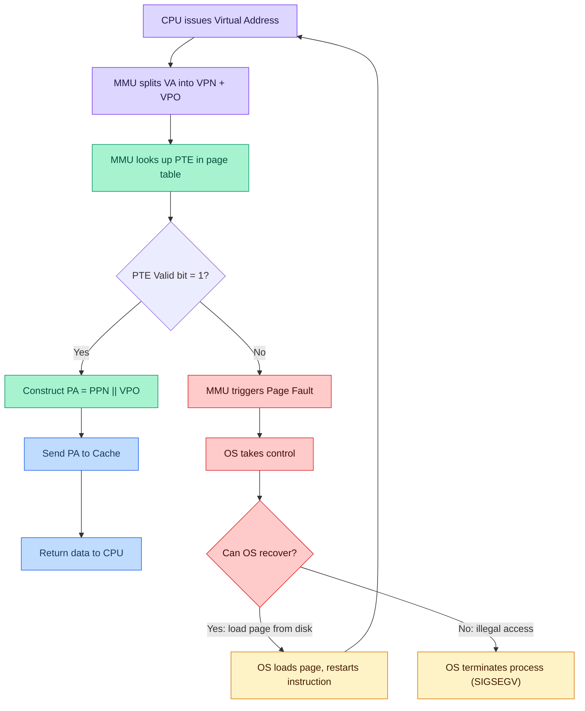
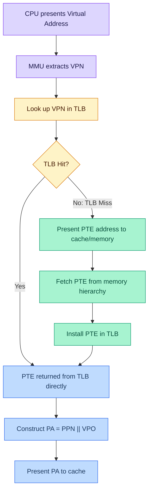
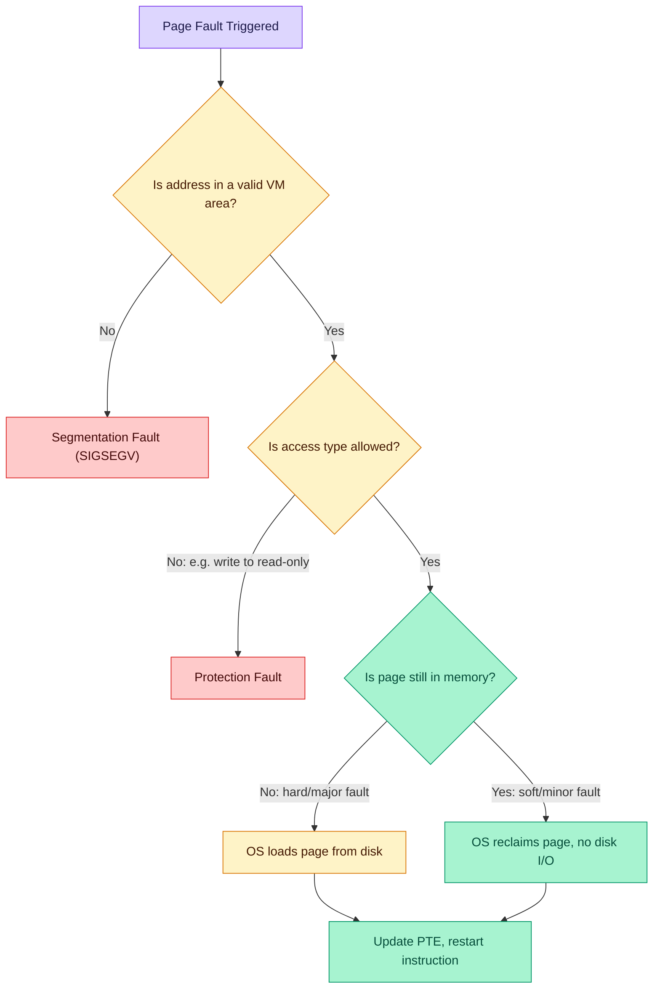
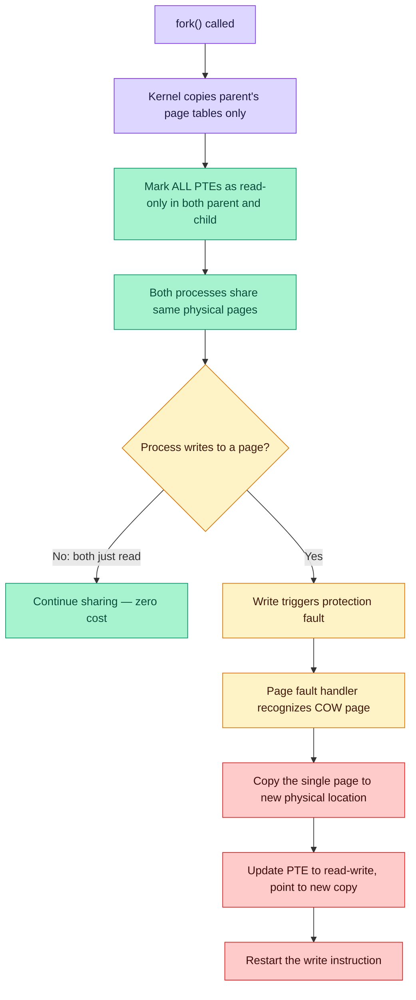
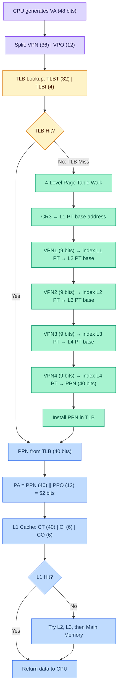

# Virtual Memory: Details — Lecture 12 Notes
> **CMU 15-213/15-503/14-513: Introduction to Computer Systems** | 12th Lecture, Feb 19th, 2026
> [YouTube](https://youtu.be/N1V775Ne7kE)

---

## Table of Contents

1. [Review of Virtual Memory Concepts](#1-review-of-virtual-memory-concepts)
2. [Address Translation Fundamentals](#2-address-translation-fundamentals)
3. [Page Table Entries and Caching](#3-page-table-entries-and-caching)
4. [The TLB — Translation Lookaside Buffer](#4-the-tlb--translation-lookaside-buffer)
5. [Multi-Level Page Tables](#5-multi-level-page-tables)
6. [Page Faults](#6-page-faults)
7. [Copy-on-Write and Fork](#7-copy-on-write-and-fork)
8. [Simple Memory System Example (CSAPP 9.6.4)](#8-simple-memory-system-example-csapp-964)
9. [Address Translation Example 1: VA 0x03D4](#9-address-translation-example-1-va-0x03d4)
10. [Address Translation Example 2: VA 0x01CF](#10-address-translation-example-2-va-0x01cf)
11. [Address Translation Example 3: VA 0x0020](#11-address-translation-example-3-va-0x0020)
12. [Intel Core i7 Memory System](#12-intel-core-i7-memory-system)
13. [Core i7 End-to-End Address Translation](#13-core-i7-end-to-end-address-translation)
14. [Core i7 Page Table Entry Formats](#14-core-i7-page-table-entry-formats)
15. [Core i7 Page Table Translation Walk](#15-core-i7-page-table-translation-walk)
16. [Virtually Indexed, Physically Tagged Cache Trick](#16-virtually-indexed-physically-tagged-cache-trick)
17. [Memory-Mapped Files](#17-memory-mapped-files)
18. [Copy-on-Write Sharing](#18-copy-on-write-sharing)
19. [Summary](#19-summary)
20. [Conceptual Quiz Questions and Answers](#20-conceptual-quiz-questions-and-answers)
21. [Key Takeaways](#key-takeaways)
22. [Code Examples Summary](#code-examples-summary)
23. [Formulas & Calculations Summary](#formulas--calculations-summary)
24. [Glossary](#glossary)
25. [References](#references)

---

## 1. Review of Virtual Memory Concepts
📊 **Slide(s) 4–8** | ⏱️ **~00:00–02:30**

### Virtual Addressing Overview

Each process has its own **virtual address space**. Page tables map virtual addresses to physical addresses. Physical memory can be **shared** among processes — two different virtual addresses (from two processes) can map to the same physical page.

> "These pages are the same size whether it's a virtual memory or physical memory. The idea is that we have to provide a mechanism that will translate this virtual address into a physical address so we can actually get the data out of main memory."

### Key Terminology

| Symbol | Meaning |
|--------|---------|
| **N** | Size of virtual address space |
| **M** | Size of physical address space |
| **P** | Page size (bytes) |
| **p** | Number of bits for page offset (P = 2^p) |
| **n** | Number of bits in virtual address (N = 2^n) |
| **m** | Number of bits in physical address (M = 2^m) |

### Virtual Address Decomposition

```
Virtual Address (n bits):
┌──────────────────────┬──────────────────────┐
│  Virtual Page Number  │  Virtual Page Offset  │
│      (VPN)            │       (VPO)           │
│    (n - p) bits       │      p bits           │
└──────────────────────┴──────────────────────┘
```

### Physical Address Decomposition

```
Physical Address (m bits):
┌──────────────────────┬──────────────────────┐
│ Physical Page Number  │ Physical Page Offset  │
│       (PPN)           │       (PPO)           │
│    (m - p) bits       │      p bits           │
└──────────────────────┴──────────────────────┘
```

**Critical insight**: VPO = PPO — the page offset is identical in virtual and physical addresses because pages are the same size on both sides.

> "The first part of that is easy — the virtual page offset is the exact same as the physical page offset."

---

## 2. Address Translation Fundamentals
📊 **Slide(s) 5–8** | ⏱️ **~00:30–02:30**

### Without Virtual Memory (Slide 5)

1. CPU sends **physical address** directly to cache
2. Cache returns data to CPU

### With Virtual Memory — Hit Path (Slide 6)

1. CPU sends **virtual address** to MMU
2. MMU uses page table base register (PTBR) + VPN to look up PTE
3. PTE returns **physical page number** (PPN)
4. MMU constructs physical address: `PA = PPN || VPO`
5. Physical address sent to cache
6. Cache returns data to CPU

### With Virtual Memory — Miss Path (Slides 7–8)



> "We use the page table base register which is set for every process when it starts, and it points to the start of the page table for that process."

---

## 3. Page Table Entries and Caching
📊 **Slide(s) 9–10** | ⏱️ **~02:30–05:00**

### Are PTEs Special?

A key question the professor poses: *Are page table entries addressed with virtual or physical addresses?*

> "Every address presented by the CPU is a virtual address."

**Answer**: PTEs are addressed with **virtual addresses**, just like all other data. They sit in main memory and are cached in the L1/L2/L3 cache just like any other data.

### The Double-Access Problem

Without optimization, every data access requires **two** memory accesses:
1. Access to fetch the **PTE** (to translate the address)
2. Access to fetch the **actual data**

> "Isn't this slow? Every single piece of data I want to access, I have to make two memory accesses for."

### Why PTE Cache Misses Are Rare

The professor asks: *How likely is a cache miss for a PTE vs. regular data?*

**Answer**: Very unlikely. Every data access must go through the PTE lookup first, so PTEs are accessed extremely frequently. By the principle of temporal locality, PTEs tend to stay in the cache.

> "Every single address of data that we try to read or write must go through this two-step process of generating a page table entry address and getting back the page table entry, so the likelihood that you've kicked out the page table entry is very low."

---

## 4. The TLB — Translation Lookaside Buffer
📊 **Slide(s) 9–10** | ⏱️ **~05:00–08:00**

### What Is the TLB?

The TLB is a **small, highly associative cache** dedicated to storing recent virtual-to-physical address translations (PTEs). It sits inside the MMU.

> "In addition to caching normal data in the L1 cache, page table entries are treated specially by the memory management unit and they are also cached in the TLB."

### TLB Lookup Flow



### Why a Small TLB Works

> "The hope is that a very few small number of entries in the TLB will provide us with lots and lots of hits so that we don't have to make two memory accesses for every memory request by the CPU, and this is generally true because of locality."

**Locality argument**: A single TLB entry covers an entire page (e.g., 4 KB). Sequential accesses within the same page all hit the same TLB entry.

### Page Fault vs. Cache Miss — Important Distinction

A student asked about the difference between a page fault and a cache miss:

> "There's a difference between a page fault and missing in the cache. If I have a cache miss, I go and get it and I get the page table entry back, and if it turns out that page table entry says it's valid, that is not a page fault. It was a cache miss in the process of translating the address."

| Event | Meaning |
|-------|---------|
| **TLB miss** | PTE not in TLB; must fetch from cache/memory |
| **Cache miss on PTE** | PTE not in L1 cache; must fetch from L2/L3/memory |
| **Page fault** | PTE valid bit = 0; page not in physical memory at all |

---

## 5. Multi-Level Page Tables
📊 **Slide(s) 10** | ⏱️ **~08:30–14:30**

### The Problem with Single-Level Page Tables

For a 64-bit address space with 4 KB pages and 8-byte PTEs:

```
Number of PTEs = 2^64 / 2^12 = 2^52 entries
Total size     = 2^52 × 8 bytes = 2^55 bytes = 32,768 TB
```

> "That would mean we would need 32,000 terabytes of page table. That's a lot of page table."

### Hierarchical (Multi-Level) Page Tables

**Solution**: Break the VPN into multiple fields, each indexing into a separate level of page tables.

```
2-Level Page Table (32-bit address, 4KB pages, 4-byte PTEs):

┌──────────┬──────────┬──────────────┐
│  VPN1    │  VPN2    │    VPO       │
│ (10 bits)│ (10 bits)│  (12 bits)   │
└──────────┴──────────┴──────────────┘

VPN1 → indexes into Level 1 PT → pointer to Level 2 PT
VPN2 → indexes into Level 2 PT → actual PTE with PPN
```

### How It Saves Space

> "If you're not using a big chunk of virtual memory for your process, then you can have a null stored in this first level page table, and it doesn't have any of the second level page table loaded in physical memory. So you can save a lot of space."

Unused regions of the address space require **no** Level 2 (or deeper) page tables — only a NULL pointer in the Level 1 table.

### Memory Accesses for K-Level Page Table

For a **K-level** page table with a **TLB miss**:

```
Total memory accesses = K + 1
  - K accesses for each level of the page table
  - 1 access for the actual data
```

> "It's gonna be K plus 1 because we're going to access each of the level K tables — that's K memory accesses — and then with the physical address that will access the data."

**Example**: 4-level page table → **5 memory accesses** on a TLB miss.

> "As you get to have bigger address spaces which forces you to have multi-level page tables, you're gonna end up really relying on the TLB."

---

## 6. Page Faults
📊 **Slide(s) 11–14** | ⏱️ **~14:30–15:30**

### What Is a Page Fault?

A page fault occurs when the MMU encounters a PTE with the **valid bit = 0** (page not present in physical memory).

### OS Tracks VM "Areas" (Slide 13)

The OS maintains metadata about each region of virtual memory:
- **Address range** (start, end)
- **Permissions** (read, write, execute)
- **Purpose** (code, data, heap, stack, shared library, mmap region)

### Types of Faults (Slide 14)

| Fault Type | Condition | What Happens |
|-----------|-----------|--------------|
| **Hard / Major fault** | Legal address, page on disk | OS loads page from disk into RAM, restarts instruction |
| **Soft / Minor fault** | Legal address, page still in memory (OS took it away but hasn't reused it) | OS reclaims the page quickly, no disk I/O needed |
| **Protection fault** | Legal address, wrong access type (e.g., write to read-only) | OS raises protection exception |
| **Segmentation fault** | Illegal address (not in any valid VM area) | OS sends SIGSEGV, terminates process |



---

## 7. Copy-on-Write and Fork
📊 **Slide(s) 35–37** | ⏱️ **~15:00–21:30**

### The Problem with Naive Fork

`fork()` creates a child process with an **identical copy** of the parent's memory. Naively, this requires copying the entire address space.

> "If I have a program that currently has a gigabyte worth of data and I fork off a child process, the naive way to think about that makes that a really expensive operation, right? Because you would actually have to copy a gigabyte's worth of data."

> "It's particularly expensive if I'm going to do an exec right afterwards, which wipes all of that data out."

### Copy-on-Write (COW) Mechanism



### Why COW Is Brilliant

> "In some sense I get to copy huge chunks of memory almost for free, and then lazily or on-demand I actually do the memcopy that I need to if I actually want to write to it."

**Benefits**:
1. `fork()` becomes nearly instant — only page tables are copied
2. If followed by `exec()`, almost zero physical memory was copied
3. Only pages that are actually **written** get duplicated
4. With hierarchical page tables, setting a high-level PTE to read-only makes all children read-only automatically

> "If you think about the hierarchical nature of a multi-level page table, I might only have to set one or two page table entries to read-only because all of their children will automatically be marked as read-only."

---

## 8. Simple Memory System Example (CSAPP 9.6.4)
📊 **Slide(s) 19–22** | ⏱️ **~21:30–27:00**

### System Parameters

| Parameter | Value | Derived |
|-----------|-------|---------|
| Virtual address bits (n) | 14 | N = 2^14 = 16,384 bytes |
| Physical address bits (m) | 12 | M = 2^12 = 4,096 bytes |
| Page size (P) | 64 bytes | p = 6 bits (2^6 = 64) |
| VPN width | n - p = 14 - 6 = **8 bits** | 2^8 = 256 virtual pages |
| PPN width | m - p = 12 - 6 = **6 bits** | 2^6 = 64 physical pages |

### Virtual Address Format (14 bits)

```
Bit:  13  12  11  10   9   8   7   6   5   4   3   2   1   0
     ┌───┬───┬───┬───┬───┬───┬───┬───┬───┬───┬───┬───┬───┬───┐
     │       Virtual Page Number       │  Virtual Page Offset  │
     │           (VPN)                 │       (VPO)           │
     │         8 bits                  │      6 bits           │
     └───┴───┴───┴───┴───┴───┴───┴───┴───┴───┴───┴───┴───┴───┘
```

### Physical Address Format (12 bits)

```
Bit:  11  10   9   8   7   6   5   4   3   2   1   0
     ┌───┬───┬───┬───┬───┬───┬───┬───┬───┬───┬───┬───┐
     │  Physical Page Number  │  Physical Page Offset  │
     │       (PPN)            │       (PPO)            │
     │      6 bits            │      6 bits            │
     └───┴───┴───┴───┴───┴───┴───┴───┴───┴───┴───┴───┘
```

### TLB Organization (Slide 20)

| Property | Value |
|----------|-------|
| Total entries | 16 |
| Associativity | 4-way set associative |
| Number of sets | 16 / 4 = **4 sets** |
| TLBI (index bits) | log₂(4) = **2 bits** |
| TLBT (tag bits) | 8 - 2 = **6 bits** |

```
VPN (8 bits) breakdown for TLB:
┌──────────────────────┬──────┐
│     TLBT (tag)       │ TLBI │
│     6 bits           │2 bits│
└──────────────────────┴──────┘
```

### TLB Contents

```
Set 0: | V=1 Tag=03 PPN=0D | V=0 Tag=09 PPN=-- | V=1 Tag=00 PPN=28 | V=0 Tag=00 PPN=-- |
Set 1: | V=1 Tag=03 PPN=02 | V=1 Tag=02 PPN=33 | V=0 Tag=08 PPN=-- | V=0 Tag=06 PPN=-- |
Set 2: | V=0 Tag=02 PPN=-- | V=1 Tag=04 PPN=16 | V=0 Tag=00 PPN=-- | V=0 Tag=07 PPN=-- |
Set 3: | V=1 Tag=03 PPN=0D | V=1 Tag=02 PPN=17 | V=1 Tag=07 PPN=09 | V=0 Tag=03 PPN=-- |
```

### Page Table — First 16 Entries (Slide 21)

```
VPN  | Valid | PPN       VPN  | Valid | PPN
-----+-------+-----     -----+-------+-----
0x00 |   1   | 0x28      0x08 |   1   | 0x13
0x01 |   0   |  --       0x09 |   1   | 0x17
0x02 |   1   | 0x33      0x0A |   1   | 0x09
0x03 |   1   | 0x02      0x0B |   0   |  --
0x04 |   0   |  --       0x0C |   0   |  --
0x05 |   1   | 0x16      0x0D |   1   | 0x2D
0x06 |   0   |  --       0x0E |   1   | 0x11
0x07 |   0   |  --       0x0F |   1   | 0x0D
```

> "Only showing the first 16 entries (out of 256)."

### Cache Organization (Slide 22)

| Property | Value |
|----------|-------|
| Number of lines | 16 |
| Line (block) size | 4 bytes |
| Mapping | Direct mapped |
| Addressing | **Physically addressed** |
| CO (cache offset) bits | log₂(4) = **2 bits** |
| CI (cache index) bits | log₂(16) = **4 bits** |
| CT (cache tag) bits | 12 - 4 - 2 = **6 bits** |

```
Physical Address (12 bits) breakdown for cache:
┌──────────────┬─────────────┬──────────┐
│  CT (tag)    │  CI (index) │ CO (off) │
│  6 bits      │  4 bits     │ 2 bits   │
└──────────────┴─────────────┴──────────┘
```

**Important observation** (foreshadowing the "virtually indexed, physically tagged" trick):

> "One thing I just want to point out... the division here between the cache index and the cache offset and the cache tag was actually not coincidentally constructed to break right at this point between the physical page offset and the physical page number."

```
Physical Address:
┌──── PPN (6 bits) ────┬──── PPO (6 bits) ────┐
│                      │                       │
│   CT (6 bits)        │  CI (4 bits) | CO (2) │
└──────────────────────┴───────────────────────┘
         ↑ same boundary ↑
```

### Cache Contents

```
Idx | V | Tag  | B3 | B2 | B1 | B0      Idx | V | Tag  | B3 | B2 | B1 | B0
----+---+------+----+----+----+----     ----+---+------+----+----+----+----
 0  | 1 | 0x19 | 99 | 11 | 11 | --       8  | 1 | 0x24 | B3 | B2 | B1 | B0
 1  | 0 | 0x15 | -- | -- | -- | --       9  | 1 | 0x2D | 3A | 00 | 51 | 89
 2  | 1 | 0x1B | 00 | 02 | 04 | 08      A  | 1 | 0x2D | 93 | 15 | DA | 3B
 3  | 0 | 0x36 | -- | -- | -- | --       B  | 0 | 0x0B | -- | -- | -- | --
 4  | 1 | 0x32 | 43 | 6D | 8F | 09      C  | 0 | 0x12 | -- | -- | -- | --
 5  | 1 | 0x0D | 36 | 72 | F0 | 1D      D  | 1 | 0x16 | 04 | 96 | 34 | 15
 6  | 0 | 0x31 | -- | -- | -- | --       E  | 1 | 0x13 | 83 | 77 | 1B | D3
 7  | 0 | 0x16 | -- | -- | -- | --       F  | 0 | 0x14 | -- | -- | -- | --
```

---

## 9. Address Translation Example 1: VA 0x03D4
📊 **Slide(s) 19–22** | ⏱️ **~27:00–36:00**

### Step 0: Convert VA to Binary

```
VA = 0x03D4

  0    3    D    4
0000 0011 1101 0100

14-bit address: 00 0011 1101 0100
```

### Step 1: Split VA into VPN and VPO

```
VA: 00 0011 11 | 01 0100
    ├─ VPN ───┤  ├ VPO ─┤
    (8 bits)     (6 bits)

VPN = 0000 1111 = 0x0F
VPO = 01 0100   = 0x14
```

### Step 2: Split VPN into TLBT and TLBI

```
VPN = 0x0F = 00001111

TLBT (6 bits) | TLBI (2 bits)
  000011       |     11

TLBT = 0x03
TLBI = 0x03 (binary 11 → set 3)
```

### Step 3: TLB Lookup

Look in **Set 3** for **Tag = 0x03**:

```
Set 3: | V=1 Tag=03 PPN=0D ✓ | V=1 Tag=02 PPN=17 | V=1 Tag=07 PPN=09 | V=0 Tag=03 PPN=-- |
                ↑ HIT!
```

**TLB HIT!** → PPN = **0x0D**

> "Here we are, tag three, physical page number 0D. So it returns this physical page number 0D."

### Step 4: Construct Physical Address

```
PA = PPN || VPO
   = 0x0D || 0x14

PPN  = 00 1101 (6 bits)
VPO  = 01 0100 (6 bits)

PA   = 0011 0101 0100
     = 0x354
```

### Step 5: Split PA for Cache Lookup

```
PA = 0x354 = 0011 0101 0100

CT (6 bits) | CI (4 bits) | CO (2 bits)
  001101    |    0101      |    00

CT = 0x0D
CI = 0x05 (decimal 5)
CO = 0x00 (byte 0)
```

### Step 6: Cache Lookup

Go to cache **line 5**, check tag:

```
Line 5: V=1, Tag=0x0D, Data: 36 72 F0 1D
                  ↑ matches CT=0x0D → CACHE HIT!
```

**CACHE HIT!**

### Step 7: Return Byte

CO = 0x00 → return **byte 0** from the block.

Byte ordering: B0=1D, B1=F0, B2=72, B3=36 → **Byte 0 = 0x36**

> Wait — let's be careful. The cache stores `B3 B2 B1 B0` as `36 72 F0 1D`. Byte at offset 0 (B0) = **0x1D**. Byte at offset 1 (B1) = **0xF0**. etc.

The returned value at CO=0 is **B0 = 0x36** (reading left to right from slide layout where the columns are B3, B2, B1, B0 with B0 at offset 0).

Looking at the slide layout for line 5: `1D F0 72 36` reading as `B0 B1 B2 B3`.

The cache returns **B0 = 0x36** for offset 0.

> "This is like the best of all possible worlds. This is what architects dream about, right? Because we got a TLB hit and we got a cache hit. This is the absolute simplest case."

### Full Summary — Example 1

```
┌───────────────────────────────────────────────────┐
│  VA = 0x03D4                                      │
│  VPN = 0x0F       VPO = 0x14                      │
│  TLBT = 0x03      TLBI = 0x03 → Set 3            │
│  TLB: HIT         PPN = 0x0D                      │
│  PA = 0x354                                       │
│  CT = 0x0D        CI = 0x05       CO = 0x00       │
│  Cache: HIT       Byte returned = 0x36            │
└───────────────────────────────────────────────────┘
```

---

## 10. Address Translation Example 2: VA 0x01CF
📊 **Slide(s) 19–22** | ⏱️ **~36:30–41:20**

### Step 0: Convert VA to Binary

```
VA = 0x01CF (but professor says "0x01CA" — let me use what the transcript shows)

Actually transcript says "01C F" then "01CA0" — the professor writes:
  0  1  C  F
0000 0001 1100 1111

But wait, the professor corrects: 0 1 C A 0...
Let me use 0x01CF as stated initially:

  0    1    C    F
0000 0001 1100 1111

14-bit address: 00 0001 1100 1111
```

### Step 1: Split VA into VPN and VPO

```
VA: 00 0001 11 | 00 1111
    ├─ VPN ───┤  ├ VPO ─┤

VPN = 0000 0111 = 0x07
VPO = 00 1111   = 0x0F
```

### Step 2: Split VPN into TLBT and TLBI

```
VPN = 0x07 = 00000111

TLBT (6 bits) | TLBI (2 bits)
  000001       |     11

TLBT = 0x01
TLBI = 0x03 (set 3)
```

### Step 3: TLB Lookup

Look in **Set 3** for **Tag = 0x01**:

```
Set 3: | V=1 Tag=03 | V=1 Tag=02 | V=1 Tag=07 | V=0 Tag=03 |
```

No entry with Tag = 0x01. **TLB MISS!**

> "I'm hesitant to take a TLB miss because it's so much extra work."

### Step 4: Page Table Lookup

VPN = 0x07 → Look in page table at entry 0x07:

```
VPN 0x07 | Valid = 0 | PPN = --
```

Valid bit is **0** → **PAGE FAULT!**

> "I look inside for 7 and it says that it's not valid."

### Step 5: Outcome

> "So now I get a page fault. I haven't specified how I'm gonna go get the stuff from disk or whether or not this is just a bad protection error or whatever... I'm gonna get a seg fault."

> "This is exactly what happens when you get a segfault."

### Full Summary — Example 2

```
┌───────────────────────────────────────────────────┐
│  VA = 0x01CF                                      │
│  VPN = 0x07       VPO = 0x0F                      │
│  TLBT = 0x01      TLBI = 0x03 → Set 3            │
│  TLB: MISS                                        │
│  Page Table: VPN 0x07 → Valid = 0                 │
│  Result: PAGE FAULT                               │
└───────────────────────────────────────────────────┘
```

---

## 11. Address Translation Example 3: VA 0x0020
📊 **Slide(s) 19–22** | ⏱️ **~41:30–51:00**

### Step 0: Convert VA to Binary

```
VA = 0x0020

  0    0    2    0
0000 0000 0010 0000

14-bit address: 00 0000 0010 0000
```

### Step 1: Split VA into VPN and VPO

```
VA: 00 0000 00 | 10 0000
    ├─ VPN ───┤  ├ VPO ─┤

VPN = 0000 0000 = 0x00
VPO = 10 0000   = 0x20
```

### Step 2: Split VPN into TLBT and TLBI

```
VPN = 0x00 = 00000000

TLBT (6 bits) | TLBI (2 bits)
  000000       |     00

TLBT = 0x00
TLBI = 0x00 (set 0)
```

### Step 3: TLB Lookup

Look in **Set 0** for **Tag = 0x00**:

```
Set 0: | V=1 Tag=03 PPN=0D | V=0 Tag=09 PPN=-- | V=1 Tag=00 PPN=28 | V=0 Tag=00 PPN=-- |
```

Entry with Tag = 0x00 exists at position 3, but **Valid = 0**!
Entry with Tag = 0x00 at position 2 has **Valid = 1**, PPN = 0x28 — wait, let me re-check.

Actually, the professor says the TLB has Tag 0 but valid bit = 0, resulting in a TLB miss:

> "I have here tag 0 but the valid bit is 0. Is that a TLB hit or a miss?"

**TLB MISS!** (valid bit not set)

Student question: *What does an invalid TLB entry mean?*

> "When I have something marked invalid in the TLB, it just means I don't know. It's just like a cache — if it's invalid you go to main memory to get the result. For instance, this TLB could have held data for a different process."

### Step 4: Page Table Lookup

VPN = 0x00 → Page table entry 0x00:

```
VPN 0x00 | Valid = 1 | PPN = 0x28
```

Valid = 1 → **Page table HIT!** PPN = **0x28**

### Step 5: Construct Physical Address

```
PA = PPN || VPO
   = 0x28 || 0x20

PPN = 10 1000 (6 bits)
VPO = 10 0000 (6 bits)

PA = 1010 0010 0000
   = 0xA20
```

### Step 6: Split PA for Cache Lookup

```
PA = 0xA20 = 1010 0010 0000

CT (6 bits) | CI (4 bits) | CO (2 bits)
  101000    |    1000      |    00

CT = 0x28
CI = 0x08 (decimal 8)
CO = 0x00 (byte 0)
```

### Step 7: Cache Lookup

Go to cache **line 8**:

```
Line 8: V=1, Tag=0x24, Data: B3 B2 B1 B0
```

Tag in cache = **0x24**, but our CT = **0x28** → **CACHE MISS!**

> "I compare the tag and I get a tag of 24. How annoying. Definitely the processor feels every time it gets a cache miss like, 'how annoying.'"

### Step 8: Fetch from Main Memory

1. Present address **0xA20** to main memory
2. Main memory returns 4 bytes (the entire block) at the block-aligned address
3. Cache **line 8** is updated:
   - Tag ← 0x28
   - Valid ← 1
   - Data ← 4 bytes from memory (unknown — represented as `??`)
4. Byte at CO = 0 is returned to CPU

### Step 9: Update TLB

> "Incidentally along the way I forgot to do something — I forgot to update the TLB!"

The TLB entry at Set 0 for Tag 0x00 is updated with PPN = **0x28**, Valid = 1.

> "As soon as the page table entry is returned, if it's valid, it goes into the TLB."

### Full Summary — Example 3

```
┌───────────────────────────────────────────────────┐
│  VA = 0x0020                                      │
│  VPN = 0x00       VPO = 0x20                      │
│  TLBT = 0x00      TLBI = 0x00 → Set 0            │
│  TLB: MISS (valid bit = 0)                        │
│  Page Table: VPN 0x00 → Valid = 1, PPN = 0x28     │
│  PA = 0xA20                                       │
│  CT = 0x28        CI = 0x08       CO = 0x00       │
│  Cache: MISS (tag 0x24 ≠ 0x28)                    │
│  Action: Fetch from main memory                   │
│  TLB updated: Set 0, Tag 0x00, PPN = 0x28         │
│  Cache updated: Line 8, Tag = 0x28                │
│  Byte returned = ?? (from main memory)            │
└───────────────────────────────────────────────────┘
```

### Professor's Advice

> "If you can do these examples, you get everything about caching, set associative cache, direct mapped cache, virtual memory, TLBs — I mean there's a lot of concepts wrapped up in here. So I highly recommend that sometime in the near future, certainly before carnival when you're all forgetting everything, you go through these examples and actually go through the steps."

> "I will post these notes. Do not look at them. Try and do the example on your own."

---

## 12. Intel Core i7 Memory System
📊 **Slide(s) 23** | ⏱️ **~52:00–57:00**

### System Architecture

```
┌─────────────────────────────────────────────────────────────────────┐
│                         Core (×4)                                   │
│  ┌──────────┐   ┌──────────────┐   ┌──────────────┐               │
│  │Registers │   │ L1 i-TLB     │   │ L1 d-TLB     │               │
│  │          │   │ 128 entries  │   │ 64 entries   │               │
│  │          │   │ 4-way        │   │ 4-way        │               │
│  └──────────┘   └──────┬───────┘   └──────┬───────┘               │
│                        │                   │                       │
│              ┌─────────┴───────────────────┴─────────┐             │
│              │          MMU (addr translation)        │             │
│              └─────────────────┬──────────────────────┘             │
│                                │                                   │
│              ┌─────────────────┴──────────────────────┐             │
│              │        L2 unified TLB                  │             │
│              │     512 entries, 4-way                  │             │
│              └─────────────────┬──────────────────────┘             │
│                                │                                   │
│  ┌──────────────┐   ┌─────────┴──────────┐                        │
│  │ L1 i-cache   │   │   L1 d-cache       │                        │
│  │ 32 KB, 8-way │   │   32 KB, 8-way     │                        │
│  └──────┬───────┘   └───────┬────────────┘                        │
│         └─────────┬─────────┘                                      │
│                   │                                                │
│         ┌─────────┴──────────┐                                     │
│         │ L2 unified cache   │                                     │
│         │ 256 KB, 8-way      │                                     │
│         └─────────┬──────────┘                                     │
└───────────────────┼────────────────────────────────────────────────┘
                    │
          ┌─────────┴──────────┐
          │  L3 unified cache  │  ← Shared by ALL 4 cores
          │  8 MB, 16-way     │
          └─────────┬──────────┘
                    │
          ┌─────────┴──────────────────────┐
          │  DDR3 Memory Controller         │
          │  3 × 64-bit @ 10.66 GB/s       │
          │  32 GB/s total (shared)         │
          └────────────────────────────────┘
```

### Why Split L1 into I-cache and D-cache?

The professor asks why Intel chose a split L1 cache:

> "We're gonna reduce conflict misses possibly between data and instructions because they're very sort of separate. In fact, they have very, very different characteristics."

| Property | Instruction Stream | Data Stream |
|----------|-------------------|-------------|
| **Spatial locality** | Very high (sequential execution) | Moderate (scattered accesses) |
| **Write behavior** | Read-only (text segment) | Read-write |
| **Dirty handling** | Never dirty → simpler hardware | Must handle dirty evictions |
| **Optimal block size** | Larger (high spatial locality) | Smaller (avoid waste) |
| **Transistors/cell** | Fewer (read-only → simpler) | More (read-write logic) |

> "The instruction stream is very sequential. The chance is that a branch is every five instructions on average, and lots of branches are just to the nearby neighbor. So the spatial locality of the instruction stream is very high."

> "In general, most non-evil programmers do not write to the instruction stream. The instruction stream is read-only — like the text segment of your program is generally read-only. Because it's read-only, you don't need to worry about things like write-back and write-through."

---

## 13. Core i7 End-to-End Address Translation
📊 **Slide(s) 24** | ⏱️ **~57:00–63:00**

### Address Parameters

| Parameter | Value |
|-----------|-------|
| Virtual address width | 48 bits (of 64-bit space) |
| Physical address width | 52 bits |
| Page size | 4 KB (2^12) |
| VPN width | 48 - 12 = **36 bits** |
| PPN width | 52 - 12 = **40 bits** |
| Page table levels | **4** |
| Bits per VPN field | 36 / 4 = **9 bits** |

> "You'll notice that this total is only 48 bits. I want you to pretend that that's not true... Yes it's a 64-bit address machine, yes you manipulate 64 bits of addresses, they all matter, but some of these address bits are hidden even from this diagram."

### Virtual Address Breakdown (48 bits)

```
Bit: 47                  36 35                 27 26                 18 17                  9 8          0
    ┌──────────────────────┬──────────────────────┬──────────────────────┬──────────────────────┬────────────┐
    │       VPN1           │       VPN2           │       VPN3           │       VPN4           │    VPO     │
    │     (9 bits)         │     (9 bits)         │     (9 bits)         │     (9 bits)         │  (12 bits) │
    │  L1 PT index         │  L2 PT index         │  L3 PT index         │  L4 PT index         │   Offset   │
    └──────────────────────┴──────────────────────┴──────────────────────┴──────────────────────┴────────────┘
    ├───────────── VPN (36 bits) ──────────────────────────────────────────────────────────────┤
```

### Physical Address Breakdown (52 bits)

```
Bit: 51                                                              12 11                   0
    ┌──────────────────────────────────────────────────────────────────┬──────────────────────┐
    │                    PPN (40 bits)                                 │     PPO (12 bits)    │
    └──────────────────────────────────────────────────────────────────┴──────────────────────┘
```

### TLB Structure

| Field | Bits |
|-------|------|
| VPN total | 36 bits |
| L1 d-TLB: 64 entries, 4-way → 16 sets | TLBI = log₂(16) = **4 bits** |
| TLBT | 36 - 4 = **32 bits** |

```
VPN (36 bits) for TLB:
┌───────────────────────────────────┬──────┐
│          TLBT (32 bits)           │ TLBI │
│                                   │(4 b) │
└───────────────────────────────────┴──────┘
```

### L1 d-Cache Structure

| Property | Value |
|----------|-------|
| Size | 32 KB |
| Associativity | 8-way |
| Block size | 64 bytes |
| Number of sets | 32768 / (8 × 64) = **64 sets** |
| CO bits | log₂(64) = **6 bits** |
| CI bits | log₂(64) = **6 bits** |
| CT bits | 52 - 6 - 6 = **40 bits** |

```
Physical Address (52 bits) for cache:
┌──────────────────────────────────────────┬──────────────┬──────────┐
│              CT (40 bits)                │  CI (6 bits) │ CO (6 b) │
└──────────────────────────────────────────┴──────────────┴──────────┘
```

### End-to-End Translation Flow



---

## 14. Core i7 Page Table Entry Formats
📊 **Slide(s) 25–26** | ⏱️ **~63:00–70:00**

### Level 1–3 PTE Format (Slide 25)

These entries point to **child page tables**, not to actual data pages.

```
Bit: 63    62  52  51                                   12  11  9  8  7  6  5  4  3  2  1  0
    ┌────┬───────┬──────────────────────────────────────────┬──────┬───┬───┬───┬───┬───┬───┬───┬───┐
    │ XD │Unused │  Page table physical base addr (40 bits) │Unused│ G │PS │ A │CD │WT │U/S│R/W│ P │
    └────┴───────┴──────────────────────────────────────────┴──────┴───┴───┴───┴───┴───┴───┴───┴───┘
```

| Bit | Name | Description |
|-----|------|-------------|
| 0 | **P** (Present) | 1 = child page table in memory; 0 = not present |
| 1 | **R/W** | Read-only (0) or read-write (1) for all reachable pages |
| 2 | **U/S** | User (1) or supervisor/kernel (0) mode access |
| 3 | **WT** | Write-through (1) or write-back (0) cache policy |
| 5 | **A** (Accessed) | Set by MMU on reads/writes; cleared by software |
| 7 | **PS** (Page Size) | 4 KB or 4 MB pages (Level 1 PTEs only) |
| 63 | **XD** (Execute Disable) | Disable instruction fetches from reachable pages |
| 12–51 | Base Address | 40 MSBs of child page table physical address |

When **P = 0**: The remaining bits are available for the OS to store the **disk location** of the page table.

### Level 4 PTE Format (Slide 26)

These entries point to **actual data pages**.

```
Bit: 63    62  52  51                                   12  11  9  8  7  6  5  4  3  2  1  0
    ┌────┬───────┬──────────────────────────────────────────┬──────┬───┬───┬───┬───┬───┬───┬───┬───┐
    │ XD │Unused │  Page physical base address (40 bits)    │Unused│ G │ D │ A │CD │WT │U/S│R/W│ P │
    └────┴───────┴──────────────────────────────────────────┴──────┴───┴───┴───┴───┴───┴───┴───┴───┘
```

| Bit | Name | Description |
|-----|------|-------------|
| 0 | **P** | Page present in memory (1) or not (0) |
| 1 | **R/W** | Read-only or read-write for this page |
| 2 | **U/S** | User or supervisor mode access |
| 3 | **WT** | Write-through or write-back cache policy |
| 5 | **A** (Accessed/Reference) | Set by MMU on reads/writes; used for LRU |
| 6 | **D** (Dirty) | Set by MMU on writes; cleared by software |
| 8 | **G** (Global) | Don't evict from TLB on task switch |
| 63 | **XD** | Disable instruction fetches from this page |

### Key Differences: L1–3 vs. L4

| Feature | L1–3 PTE | L4 PTE |
|---------|----------|--------|
| Points to | Child page table | Actual data page |
| Has Dirty bit? | No | **Yes** (bit 6) |
| Has PS bit? | Yes (L1 only) | No |
| Has Global bit? | Yes | **Yes** — keeps kernel pages in TLB |

### Dirty Bit Explained

> "Once you load the page from disk it's clean, but if I write to that page and I'm using the write-back policy, I have to know whether I've written to that page at some point, because then when I evict it I've got to write it back to disk."

### Global Bit Explained

> "Some pages are so important I want to keep them in the TLB even if I make a switch from one process to another. It could be the kernel — you're switching from one process to another, so you don't want to throw out the kernel's page table entries. That will really slow things down."

---

## 15. Core i7 Page Table Translation Walk
📊 **Slide(s) 27** | ⏱️ **~66:00–68:00**

### Memory Coverage per Level

```
                    ┌──────────────────────────────────────────────┐
                    │              CR3 Register                    │
                    │  (Physical address of L1 Page Table)         │
                    └──────────────┬───────────────────────────────┘
                                   │
                    ┌──────────────▼───────────────────────────────┐
  VPN1 (9 bits) ──►│  L1 PT (Page Global Directory)               │
                    │  512 entries, each covers 512 GB             │
                    │  Entry = 40-bit base addr of L2 PT           │
                    └──────────────┬───────────────────────────────┘
                                   │ 40-bit pointer
                    ┌──────────────▼───────────────────────────────┐
  VPN2 (9 bits) ──►│  L2 PT (Page Upper Directory)                │
                    │  512 entries, each covers 1 GB               │
                    │  Entry = 40-bit base addr of L3 PT           │
                    └──────────────┬───────────────────────────────┘
                                   │ 40-bit pointer
                    ┌──────────────▼───────────────────────────────┐
  VPN3 (9 bits) ──►│  L3 PT (Page Middle Directory)               │
                    │  512 entries, each covers 2 MB               │
                    │  Entry = 40-bit base addr of L4 PT           │
                    └──────────────┬───────────────────────────────┘
                                   │ 40-bit pointer
                    ┌──────────────▼───────────────────────────────┐
  VPN4 (9 bits) ──►│  L4 PT (Page Table)                          │
                    │  512 entries, each covers 4 KB               │
                    │  Entry = PPN (40 bits)                       │
                    └──────────────┬───────────────────────────────┘
                                   │
                                   ▼
                    PA = PPN (40 bits) || VPO (12 bits)
```

### Why 9-Bit Fields? — The Magic Number

The professor derives why Intel chose 9 bits per field:

> "I know I need at least 52 bits, which 52 divided by 8 is 7. If you're a computer scientist, 7 is like a bad number. The only thing I need to know how to do is take powers of 2. So let's say I make these 8 bytes long."

**Calculation**:
```
PTE size = 8 bytes = 2^3 bytes
Entries per page table = page_size / PTE_size
                       = 4096 / 8
                       = 512
                       = 2^9
Index bits needed      = log₂(512) = 9
```

> "There's 2^9 entries, each entry is 2^3 bytes, 2^(9+3) is 2^12 which is 4096. What's the size of my page? Also 4096. Hey — magic!"

**This means each page table fits exactly in one page!** This is crucial because:
- Page tables are paged just like regular data
- If a page table is not in memory, the OS can page it in like any other page
- Each level of the page table occupies exactly one 4 KB page

### Memory Coverage Calculation

```
Level 4: 1 entry covers  4 KB  = 2^12 bytes (one page)
Level 3: 1 entry covers  2 MB  = 512 × 4 KB = 2^9 × 2^12 = 2^21
Level 2: 1 entry covers  1 GB  = 512 × 2 MB = 2^9 × 2^21 = 2^30
Level 1: 1 entry covers 512 GB = 512 × 1 GB = 2^9 × 2^30 = 2^39
Total addressable:      256 TB = 512 × 512 GB = 2^9 × 2^39 = 2^48
```

> "Each entry in this first table is good for 512 gigabytes of memory. It's 512 times 512 times 512 times 4K. That's how much memory it covers."

---

## 16. Virtually Indexed, Physically Tagged Cache Trick
📊 **Slide(s) 28** | ⏱️ **~68:00–76:00**

### The Key Observation

The cache index (CI) and cache offset (CO) bits fall **entirely within the page offset** portion of the address. Since VPO = PPO, these bits are **identical** in the virtual and physical address — no translation needed!

```
Virtual Address (48 bits):
┌──── VPN (36 bits) ────────────────────────────┬──── VPO (12 bits) ────┐
│                                                │   CI (6)  │  CO (6)  │
└────────────────────────────────────────────────┴───────────┴──────────┘
                    │                                   │
              Address Translation                  No Change!
              (may take time)                     (available immediately)
                    │                                   │
                    ▼                                   ▼
Physical Address (52 bits):
┌──── PPN (40 bits) ────────────────────────────┬──── PPO (12 bits) ────┐
│            CT (40 bits)                        │   CI (6)  │  CO (6)  │
└────────────────────────────────────────────────┴───────────┴──────────┘
```

### How It Works — Parallel Operation

> "By breaking up the cache parameters such that the index and the offset are all in the virtual page offset — that doesn't change during translation — I can immediately use the cache index part of this virtual page offset to find the set in the L1 cache."

**Timeline**:

```
Time ──────────────────────────────────────────────────────────►

TLB:  [──── Look up VPN in TLB ────────]──► PPN (= CT) ready
                                                    │
Cache: [── Use CI to select set ──]                 │
       [── Read out all tags ─────]                 │
                                          [── Compare CT with tags ──]
                                          [── Return data if HIT ────]
```

> "This is called a virtually indexed, physically tagged cache. The index comes from the virtual address — it happens to be the same as the physical address — and then when I get back the physical page number, that's the cache tag."

### Why This Is Safe — TLB Hit with Cache Hit

The professor asks: *What's the likelihood of an L1 cache hit with a TLB miss?*

> "Remember that the cache line is only 8 bytes long, but the TLB entry is good for 4K. So the chances that you would have it in your cache and not have it in your TLB would be pretty weird."

**Reasoning**: A TLB entry covers 4 KB (one page), while a cache line covers 64 bytes. If data is in the cache, it was recently accessed, which means its TLB entry was recently used too and almost certainly still present.

### Why the Cache Must Be Sized Carefully

The trick only works if `CI + CO ≤ page offset bits`. For the Core i7:

```
CI + CO = 6 + 6 = 12 bits
VPO     = 12 bits
```

They match exactly. If the cache were larger (more sets → more CI bits), CI would extend into the VPN, breaking the trick.

> "Cache carefully sized to make this possible."

---

## 17. Memory-Mapped Files
📊 **Slide(s) 31–34** | ⏱️ **~76:00 (from slides)**

### Concept

> "Paging = every page of a program's physical RAM is backed by some page of disk. Normally, those pages belong to swap space. But what if some pages were backed by... files?"

Memory-mapped files use the virtual memory system to map a file on disk directly into a process's virtual address space.

```
                    ┌──────────────────────┐
                    │  Process Virtual      │
                    │  Memory               │
                    │  ┌─────────────┐      │
                    │  │ code/data   │ ←──── backed by swap space
                    │  ├─────────────┤      │
                    │  │ mmap region │ ←──── backed by FILE ON DISK
                    │  ├─────────────┤      │
                    │  │ heap/stack  │ ←──── backed by swap space
                    │  └─────────────┘      │
                    └──────────────────────┘
```

### How It Works

1. `mmap()` maps a file into virtual memory
2. Reading from the mapped region → page fault → OS loads page from file (not swap)
3. Writing to the mapped region → dirty page → OS writes back to file (not swap)
4. Multiple processes can mmap the same file → **shared physical memory**

```
┌──────────┐     ┌──────────────┐     ┌──────────────┐
│Process 1 │     │  Physical    │     │  File on     │
│ VM       │────►│  Memory      │◄────│  Disk        │
└──────────┘     │  (RAM)       │     └──────────────┘
                 │              │
┌──────────┐     │              │
│Process 2 │────►│              │
│ VM       │     └──────────────┘
└──────────┘
```

Two processes can map the same file, sharing the same physical pages — reads/writes by one process are visible to the other.

---

## 18. Copy-on-Write Sharing
📊 **Slide(s) 35–37** | ⏱️ **~15:00–21:30** (covered earlier in lecture)

### Shared Objects

Two processes can share an object by mapping their page tables to the same physical memory:

```
Process 1 VA space          Physical Memory         Process 2 VA space
┌────────────────┐     ┌─────────────────────┐     ┌────────────────┐
│                │     │                     │     │                │
│  VA = 0x4000  ─┼────►│  PP at phys addr X  │◄────┼─ VA = 0x8000  │
│                │     │                     │     │                │
└────────────────┘     └─────────────────────┘     └────────────────┘
```

> "Notice that they can be different — that's the beauty of virtual memory."

### Copy-on-Write Step by Step (Slides 35–37)

**Before any writes** (Slide 36):
```
Parent PT ──► [read-only] ──┐
                            ├──► Same Physical Pages
Child PT  ──► [read-only] ──┘
```

**After child writes to a page** (Slide 37):
```
Parent PT ──► [read-only] ──────► Original Physical Page

Child PT  ──► [read-write] ─────► NEW Copy of that page
              (only the page that was written to)
```

All other pages remain shared and read-only until accessed.

---

## 19. Summary
📊 **Slide(s) 38** | ⏱️ **~end of lecture**

Key points from the lecture:

1. **Multi-level page tables** reduce total memory consumption of page tables
2. **Translation lookaside buffers** (TLBs) reduce the time cost of address translation
3. Real systems have **3 to 5 levels** of page table
4. **Virtual memory enables powerful features**:
   - Memory protection and process isolation
   - Paging/swapping (disk as extra RAM)
   - Memory-mapped files (RAM as cache for disk)
   - Copy-on-write sharing

---

## 20. Conceptual Quiz Questions and Answers
📊 **Slide(s) 16–17, 39–42** | ⏱️ **various**

### Quiz 1: What must the MMU do before fetching the PTE? (Slide 16)

**Answer**: The MMU must:
1. **Split the virtual address** into VPN and VPO
2. **Use the VPN** as an index into the page table to locate the PTE

### Quiz 2: Why does the MMU need a physical address for the page table? (Slide 17)

**Answer**: The page table is stored in physical memory. The MMU must access it using physical addresses because:
- It's the MMU's job to translate virtual → physical
- If the page table were accessed via virtual addresses, you'd need *another* page table to translate those — infinite regress
- The page table base register (PTBR/CR3) stores the **physical** address of the top-level page table

> "Every address presented by the CPU is a virtual address." — But the PTBR is a special register holding a physical address.

### Quiz 3: Why are one-level page tables impractical? (Slide 39)

**Answer**: A single-level page table for a 48-bit address space with 4 KB pages and 8-byte PTEs would require:

```
2^48 / 2^12 = 2^36 entries
2^36 × 8 bytes = 2^39 bytes = 512 GB
```

This is more RAM than most computers have. Multi-level page tables fix this by only allocating page table entries for **used** regions of the address space.

### Quiz 4: Why is multi-level page table access slower? (Slide 40)

**Answer**: A K-level page table requires **K memory loads** to determine the physical address (one for each level). There is no spatial locality between these loads — each level's PTE is in a different part of memory.

### Quiz 5: What is the TLB and what problem does it solve? (Slide 41)

**Answer**: The TLB is a small cache dedicated to storing virtual-to-physical address mappings. It avoids the cost of K memory lookups in a multi-level page table. The MMU checks the TLB **first** for every address; on a TLB hit, no page table access is needed.

### Quiz 6: How does VM interact with the cache? (Slide 42)

**Answer**: The cache operates on **physical addresses**. The MMU sits between the CPU and the cache, translating virtual → physical. This means data from **multiple processes** may coexist in the cache (or compete for cache space), since different virtual addresses from different processes may map to the same or different physical addresses.

---

## Student Q&A from the Lecture

### Q: Is a page table entry addressed with a virtual or physical address?
> **A**: "Every address presented by the CPU is a virtual address." PTEs are addressed like any other data — via virtual addresses that go through translation. But the base of the page table (PTBR/CR3) is stored as a physical address.

### Q: What's the difference between a page fault and a cache miss?
> **A**: "There's a difference between a page fault and missing in the cache. If I have a cache miss, I go and get it and I get the page table entry back, and if it turns out that page table entry says it's valid, that is not a page fault. It was a cache miss in the process of translating the address."

### Q: What does an invalid TLB entry mean?
> **A**: "When I have something marked invalid in the TLB, it just means I don't know. It's just like a cache — if it's invalid you go to main memory. For instance, this TLB could have held data for a different process. Then I switch processes so I just mark all the valid bits invalid."

### Q: When does the TLB get updated?
> **A**: "As soon as the page table entry is returned, if it's valid, it goes into the TLB."

### Q: How many bytes does a cache fetch from memory?
> **A**: "What's the block size? So we're gonna get 4 bytes [in the simple example]. The cache presents to main memory the block-aligned address."

### Q: Why did Intel make a physically addressed cache (not virtually addressed)?
> **A**: A virtually addressed cache would be faster for a single process (no translation needed on hit), but a physically addressed cache is better for multi-process systems because:
- No need to store process identifiers with each cache line
- No duplicate entries when processes share physical memory
- Protection is handled by the MMU before reaching the cache

> "A physical address cache might be a little slower, but it's a whole lot safer. And it's much easier to use when I'm running multiple processes at the same time."

### Q: Why is it unlikely to have an L1 cache hit but a TLB miss?
> **A**: "The cache line is only 8 bytes long, but the TLB entry is good for 4K. So the chances that you would have it in your cache and not have it in your TLB would be pretty weird."

### Q: Why might you want write-through instead of write-back for certain pages?
The professor leaves this as a thought experiment, but common reasons include:
- Memory-mapped I/O devices that need immediate writes
- DMA regions where hardware reads directly from memory
- Shared memory regions requiring strong consistency

---

## Key Takeaways

1. **Every CPU address is virtual** — the MMU translates it before the cache sees it
2. **PTEs are just data** — cached in L1/L2/L3 like everything else
3. **TLB is critical** — without it, every access needs K+1 memory references
4. **Multi-level page tables** save enormous space by not allocating tables for unused regions
5. **Copy-on-write makes fork() cheap** — only page tables are copied, physical pages are shared until written
6. **"Virtually indexed, physically tagged"** — allows cache lookup to start in parallel with TLB lookup
7. **The 9-bit field magic** — each page table level fits exactly in one 4 KB page
8. **Page faults ≠ cache misses** — a cache miss on a PTE is not a page fault; a page fault means the page isn't in physical memory at all
9. **Split I-cache/D-cache** — instruction streams are read-only with high spatial locality; data streams need read-write with different access patterns
10. **Memory-mapped files** use VM machinery to make files appear as memory, enabling sharing between processes

---

## Code Examples Summary

### Address Bit Manipulation (Simple Memory System)

```c
// Extract VPN and VPO from a 14-bit virtual address
#define PAGE_SIZE    64          // 2^6 bytes
#define VPO_BITS     6
#define VPN_BITS     8           // 14 - 6
#define VPN_MASK     0xFF        // 8 bits
#define VPO_MASK     0x3F        // 6 bits

unsigned vpn = (va >> VPO_BITS) & VPN_MASK;   // upper 8 bits
unsigned vpo = va & VPO_MASK;                  // lower 6 bits
```

```c
// Extract TLBT and TLBI from VPN
#define TLB_SETS     4
#define TLBI_BITS    2           // log2(4)
#define TLBT_BITS    6           // 8 - 2
#define TLBI_MASK    0x3         // 2 bits

unsigned tlbi = vpn & TLBI_MASK;              // lower 2 bits of VPN
unsigned tlbt = (vpn >> TLBI_BITS);           // upper 6 bits of VPN
```

```c
// Construct physical address from PPN and VPO
unsigned pa = (ppn << VPO_BITS) | vpo;
```

```c
// Extract cache fields from 12-bit physical address
#define CO_BITS      2           // log2(4) block size
#define CI_BITS      4           // log2(16) lines (direct mapped)
#define CT_BITS      6           // 12 - 4 - 2

unsigned co = pa & 0x3;                        // lower 2 bits
unsigned ci = (pa >> CO_BITS) & 0xF;           // next 4 bits
unsigned ct = (pa >> (CO_BITS + CI_BITS));     // upper 6 bits
```

### Core i7 Address Decomposition

```c
// Core i7 virtual address decomposition (48 bits used)
#define VPO_BITS_I7      12
#define VPN_FIELD_BITS   9
#define NUM_LEVELS       4

uint64_t vpo  = va & 0xFFF;                          // bits 0-11
uint64_t vpn4 = (va >> 12) & 0x1FF;                  // bits 12-20
uint64_t vpn3 = (va >> 21) & 0x1FF;                  // bits 21-29
uint64_t vpn2 = (va >> 30) & 0x1FF;                  // bits 30-38
uint64_t vpn1 = (va >> 39) & 0x1FF;                  // bits 39-47
```

```c
// Core i7 physical address decomposition (52 bits)
uint64_t co = pa & 0x3F;                              // bits 0-5
uint64_t ci = (pa >> 6) & 0x3F;                       // bits 6-11
uint64_t ct = (pa >> 12);                             // bits 12-51 (40 bits)
```

### mmap Example (from demo, Slide 34)

```c
#include <sys/mman.h>
#include <fcntl.h>
#include <unistd.h>

int fd = open("myfile.dat", O_RDWR);
size_t len = 4096;  // map one page

// Map file into virtual memory
void *addr = mmap(NULL, len, PROT_READ | PROT_WRITE,
                  MAP_SHARED, fd, 0);

// Now access file contents as if they were memory
char *data = (char *)addr;
data[0] = 'H';   // writes directly to file (eventually)

// Unmap when done
munmap(addr, len);
close(fd);
```

### Copy-on-Write with fork()

```c
#include <unistd.h>
#include <stdio.h>

int global_var = 42;

int main() {
    pid_t pid = fork();
    // At this point:
    // - Child gets COPY of parent's page tables
    // - All pages marked read-only (COW)
    // - No physical memory copied yet!

    if (pid == 0) {
        // Child process
        global_var = 99;
        // ↑ This write triggers:
        // 1. Protection fault (page is read-only)
        // 2. OS recognizes COW page
        // 3. OS copies the page to new physical memory
        // 4. Updates child's PTE to read-write
        // 5. Restarts the write instruction
        printf("Child: %d\n", global_var);  // prints 99
    } else {
        // Parent process
        printf("Parent: %d\n", global_var); // prints 42
    }
}
```

---

## Formulas & Calculations Summary

### Basic Address Calculations

| Formula | Description |
|---------|-------------|
| `P = 2^p` | Page size in bytes |
| `VPN bits = n - p` | Virtual page number width |
| `PPN bits = m - p` | Physical page number width |
| `# Virtual pages = 2^(n-p)` | Total virtual pages |
| `# Physical pages = 2^(m-p)` | Total physical pages |

### TLB Calculations

| Formula | Description |
|---------|-------------|
| `# Sets = TLB_entries / associativity` | Number of TLB sets |
| `TLBI bits = log₂(# Sets)` | TLB index width |
| `TLBT bits = VPN_bits - TLBI_bits` | TLB tag width |

### Cache Calculations

| Formula | Description |
|---------|-------------|
| `CO bits = log₂(block_size)` | Cache offset width |
| `CI bits = log₂(# Sets)` | Cache index width |
| `# Sets = cache_size / (assoc × block_size)` | Number of cache sets |
| `CT bits = m - CI - CO` | Cache tag width |

### Simple Memory System Numbers

```
n = 14, m = 12, P = 64 bytes, p = 6

VPN = 14 - 6 = 8 bits     →  256 virtual pages
PPN = 12 - 6 = 6 bits     →  64 physical pages

TLB: 16 entries, 4-way
  Sets = 16/4 = 4          →  TLBI = 2 bits, TLBT = 6 bits

Cache: 16 lines, direct mapped, 4-byte blocks
  Sets = 16/1 = 16         →  CI = 4 bits
  CO = log₂(4) = 2 bits
  CT = 12 - 4 - 2 = 6 bits
```

### Core i7 Numbers

```
n = 48 (virtual), m = 52 (physical), P = 4 KB, p = 12

VPN = 48 - 12 = 36 bits    →  2^36 virtual pages
PPN = 52 - 12 = 40 bits    →  2^40 physical pages
VPN split: 4 fields × 9 bits each

L1 d-TLB: 64 entries, 4-way
  Sets = 64/4 = 16         →  TLBI = 4 bits, TLBT = 32 bits

L1 d-cache: 32 KB, 8-way, 64-byte blocks
  Sets = 32768/(8×64) = 64 →  CI = 6 bits
  CO = log₂(64) = 6 bits
  CT = 52 - 6 - 6 = 40 bits

Page table size per level:
  Entries = 2^9 = 512
  Entry size = 8 bytes
  Table size = 512 × 8 = 4096 bytes = 4 KB = 1 page  ← exactly one page!

Memory coverage:
  L4 entry: 4 KB
  L3 entry: 512 × 4 KB = 2 MB
  L2 entry: 512 × 2 MB = 1 GB
  L1 entry: 512 × 1 GB = 512 GB
  Total: 512 × 512 GB = 256 TB = 2^48 bytes

Single-level page table size (why impractical):
  2^48 / 2^12 = 2^36 entries × 8 bytes = 2^39 = 512 GB  ← way too large

Memory accesses on TLB miss (K-level page table):
  Total = K + 1 = 4 + 1 = 5 memory accesses
```

### Worked Example: VA 0x03D4 (All Steps)

```
1. VA = 0x03D4 = 00 0011 1101 0100  (14 bits)

2. VPN = 0000 1111 = 0x0F           (bits 13-6)
   VPO = 01 0100   = 0x14           (bits 5-0)

3. TLBT = 00 0011 = 0x03            (bits 7-2 of VPN)
   TLBI = 11      = 3               (bits 1-0 of VPN)

4. TLB Set 3, Tag 0x03: FOUND, V=1, PPN = 0x0D  → TLB HIT

5. PA = PPN || VPO = 00 1101 || 01 0100
      = 0011 0101 0100 = 0x354      (12 bits)

6. CT = 00 1101 = 0x0D              (bits 11-6)
   CI = 0101    = 5                  (bits 5-2)
   CO = 00      = 0                  (bits 1-0)

7. Cache line 5: V=1, Tag=0x0D      → CACHE HIT

8. Return byte at offset 0 → 0x36
```

### Worked Example: VA 0x0020 (All Steps)

```
1. VA = 0x0020 = 00 0000 0010 0000  (14 bits)

2. VPN = 0000 0000 = 0x00           (bits 13-6)
   VPO = 10 0000   = 0x20           (bits 5-0)

3. TLBT = 00 0000 = 0x00            (bits 7-2 of VPN)
   TLBI = 00      = 0               (bits 1-0 of VPN)

4. TLB Set 0, Tag 0x00: FOUND but V=0  → TLB MISS

5. Page Table[0x00]: V=1, PPN = 0x28  → PT HIT

6. PA = PPN || VPO = 10 1000 || 10 0000
      = 1010 0010 0000 = 0xA20      (12 bits)

7. CT = 10 1000 = 0x28              (bits 11-6)
   CI = 1000    = 8                  (bits 5-2)
   CO = 00      = 0                  (bits 1-0)

8. Cache line 8: V=1, Tag=0x24 ≠ 0x28  → CACHE MISS

9. Fetch block from main memory at 0xA20
   Update cache line 8: Tag=0x28, V=1, data from memory
   Update TLB: Set 0, Tag 0x00, PPN=0x28, V=1
   Return byte at offset 0 → ?? (value from memory)
```

---

## Glossary

| # | Term | Definition |
|---|------|-----------|
| 1 | **Virtual Address (VA)** | Address generated by the CPU; must be translated to a physical address |
| 2 | **Physical Address (PA)** | Actual address in DRAM used to access data |
| 3 | **Virtual Page Number (VPN)** | Upper bits of VA that identify the virtual page |
| 4 | **Virtual Page Offset (VPO)** | Lower bits of VA that identify the byte within a page |
| 5 | **Physical Page Number (PPN)** | Upper bits of PA that identify the physical frame |
| 6 | **Physical Page Offset (PPO)** | Lower bits of PA; identical to VPO |
| 7 | **Page Table** | Data structure mapping VPN → PPN; stored in physical memory |
| 8 | **Page Table Entry (PTE)** | Single entry in a page table; contains PPN and permission bits |
| 9 | **Page Table Base Register (PTBR)** | Register holding the physical address of the page table |
| 10 | **CR3** | Intel's name for the PTBR on x86-64 processors |
| 11 | **MMU (Memory Management Unit)** | Hardware that translates virtual addresses to physical addresses |
| 12 | **TLB (Translation Lookaside Buffer)** | Small, fast cache in the MMU storing recent VA→PA translations |
| 13 | **TLB Hit** | VPN found in TLB with valid bit set; no page table access needed |
| 14 | **TLB Miss** | VPN not in TLB; must access page table in memory |
| 15 | **TLBI (TLB Index)** | Bits of VPN used to select the TLB set |
| 16 | **TLBT (TLB Tag)** | Bits of VPN used to identify the entry within a TLB set |
| 17 | **Page Fault** | Exception when a page is not present in physical memory (valid bit = 0 in PTE) |
| 18 | **Hard/Major Fault** | Page fault requiring disk I/O to load the page |
| 19 | **Soft/Minor Fault** | Page fault where the page is still in memory but was reclaimed by OS |
| 20 | **Protection Fault** | Access to a page with insufficient permissions (e.g., write to read-only) |
| 21 | **Segmentation Fault (SIGSEGV)** | Access to an address not in any valid VM area |
| 22 | **Valid Bit** | Bit in PTE/TLB indicating whether the entry contains a valid mapping |
| 23 | **Dirty Bit (D)** | Bit set by hardware when a page is written to; signals need for write-back |
| 24 | **Reference/Accessed Bit (A)** | Bit set by MMU on any access; used for LRU replacement |
| 25 | **Present Bit (P)** | In Core i7 PTE, indicates if child page/table is in physical memory |
| 26 | **R/W Bit** | Read/write permission bit in PTE |
| 27 | **U/S Bit** | User/supervisor (kernel) mode access permission bit |
| 28 | **WT Bit** | Write-through vs. write-back cache policy bit in PTE |
| 29 | **XD (Execute Disable) Bit** | Prevents instruction fetch from pages; security feature (NX bit) |
| 30 | **G (Global) Bit** | Keeps page in TLB across context switches (e.g., kernel pages) |
| 31 | **PS (Page Size) Bit** | Selects between 4 KB and 4 MB pages (Level 1 PTE only) |
| 32 | **Cache Tag (CT)** | Upper bits of PA used to verify a cache hit |
| 33 | **Cache Index (CI)** | Middle bits of PA used to select a cache set |
| 34 | **Cache Offset (CO)** | Lower bits of PA used to select a byte within a cache block |
| 35 | **Direct Mapped Cache** | Cache with 1 line per set; each address maps to exactly one location |
| 36 | **Set Associative Cache** | Cache with multiple lines per set; address can be in any line of its set |
| 37 | **Fully Associative Cache** | Cache where any block can go in any line (1 set, many ways) |
| 38 | **Multi-Level Page Table** | Hierarchical page table with K levels to save space |
| 39 | **Copy-on-Write (COW)** | Optimization that defers copying pages until a write actually occurs |
| 40 | **fork()** | System call creating a child process; uses COW for efficiency |
| 41 | **exec()** | System call replacing process image; discards COW pages efficiently |
| 42 | **mmap()** | System call mapping files or devices into virtual memory |
| 43 | **Memory-Mapped File** | File whose contents are mapped into process virtual address space |
| 44 | **Swap Space** | Disk area used to back virtual memory pages not in physical RAM |
| 45 | **Virtually Indexed, Physically Tagged** | Cache trick using VPO bits for index (same as PPO) while comparing PPN as tag |
| 46 | **Split Cache** | Separate L1 caches for instructions (I-cache) and data (D-cache) |
| 47 | **L1/L2/L3 Cache** | Levels of CPU cache; L1 fastest/smallest, L3 slowest/largest |
| 48 | **Context Switch** | OS switching from one process to another; may invalidate TLB entries |
| 49 | **Physically Addressed Cache** | Cache indexed and tagged using physical addresses |
| 50 | **Virtually Addressed Cache** | Cache indexed and tagged using virtual addresses |
| 51 | **Page Global Directory** | Intel's name for Level 1 page table |
| 52 | **Page Upper Directory** | Intel's name for Level 2 page table |
| 53 | **Page Middle Directory** | Intel's name for Level 3 page table |

---

## References

1. **CSAPP** — Bryant & O'Hallaron, *Computer Systems: A Programmer's Perspective*, 3rd Edition
   - Section 9.6.4: "End-to-End Address Translation" (Simple Memory System example)
   - Section 9.7: "Case Study: The Intel Core i7 / Linux Memory System"
   - Section 9.8: "Memory Mapping"
2. **Lecture Slides** — "Virtual Memory: Details" (Slides 1–42), CMU 15-213/15-503, Lecture 12
3. **Intel® 64 and IA-32 Architectures Software Developer's Manual** — Volume 3A, Chapter 4: "Paging"
4. **YouTube Lecture Recording** — [https://youtu.be/N1V775Ne7kE](https://youtu.be/N1V775Ne7kE)
5. `mmap(2)` — Linux man page for memory-mapped file I/O
6. `fork(2)` — Linux man page for process creation

---

*These notes were generated from Lecture 12 of CMU 15-213/15-503 (Spring 2026). For the most up-to-date information, refer to the course website and textbook.*
